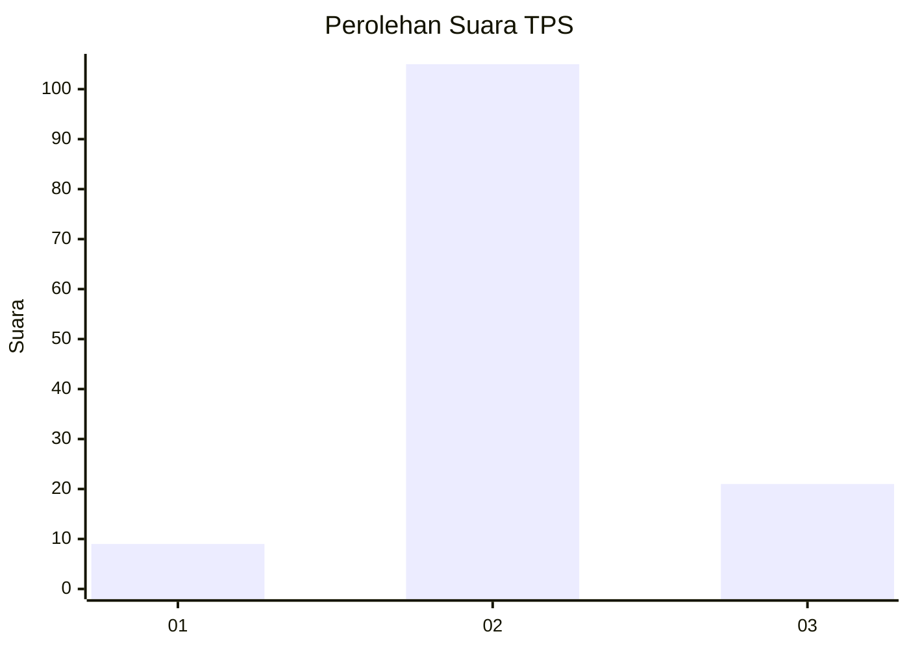

# Hasil

## Grafik

## Tabel

| No. | Nama Paslon    | Suara | Suara (raw) | Persentase |
|:--- |:-------------- | -----:| -----------:| ----------:|
| 1   | ANIES MUHAIMIN | 9     | [9][p-1]    | 6,67       |
| 2   | PRABOWO GIBRAN | 105   | [105][p-2]  | 77,78      |
| 3   | GANJAR MAHFUD  | 21    | [21][p-3]   | 15,56      |

[p-1]: https://github.com/gigit-pemilu/pemilu-2024/blob/main/pilpres/hitung-suara/sub/35-jawa-timur/sub/16-mojokerto/sub/01-jatirejo/sub/2001-tawangrejo/sub/002-tps/sub/paslon-1.txt
[p-2]: https://github.com/gigit-pemilu/pemilu-2024/blob/main/pilpres/hitung-suara/sub/35-jawa-timur/sub/16-mojokerto/sub/01-jatirejo/sub/2001-tawangrejo/sub/002-tps/sub/paslon-2.txt
[p-3]: https://github.com/gigit-pemilu/pemilu-2024/blob/main/pilpres/hitung-suara/sub/35-jawa-timur/sub/16-mojokerto/sub/01-jatirejo/sub/2001-tawangrejo/sub/002-tps/sub/paslon-3.txt

## Foto C Plano

https://sirekap-obj-formc.kpu.go.id/f8f7/pemilu/ppwp/35/16/01/20/01/3516012001002-20240214-205651--8760f2db-01a3-4737-910d-4c5abcd32c95.jpg

https://sirekap-obj-formc.kpu.go.id/f8f7/pemilu/ppwp/35/16/01/20/01/3516012001002-20240214-205729--6efe10c6-cbbf-4243-83bb-3e69b1c95cfe.jpg

https://sirekap-obj-formc.kpu.go.id/f8f7/pemilu/ppwp/35/16/01/20/01/3516012001002-20240214-205949--0f31ce7c-1307-46e7-8b91-d38ed8b2e5b6.jpg

## Metadata

| Key        | Value               |
| ---------- | ------------------- |
| Time Stamp | 2024-02-15 22:30:27 |

## DATA PEMILIH TETAP

Jumlah pemilih dalam DPT: **147**.
 * L: **77**.
 * P: **70**.

## DATA PENGGUNA HAK PILIH

Jumlah pengguna hak pilih dalam DPT: **141**.
 * L: **72**.
 * P: **69**.

Jumlah pengguna hak pilih dalam DPTb: **0**.
 * L: **0**.
 * P: **0**.

Jumlah pengguna hak pilih dalam DPK: **0**.
 * L: **0**.
 * P: **0**.

Jumlah pengguna hak pilih: **141**.
 * L: **72**.
 * P: **69**.

## JUMLAH SUARA SAH DAN TIDAK SAH

JUMLAH SELURUH SUARA SAH: **135**.

JUMLAH SUARA TIDAK SAH: **6**.

JUMLAH SELURUH SUARA SAH DAN SUARA TIDAK SAH: **141**.

