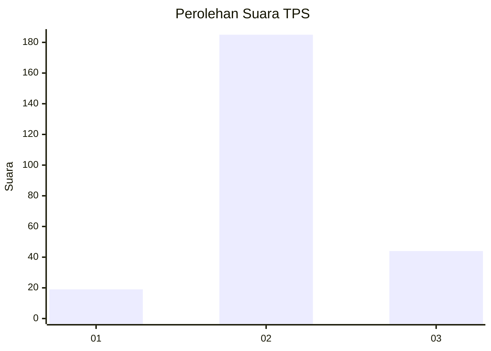

# Hasil

## Grafik

## Tabel

| No. | Nama Paslon    | Suara | Suara (raw) | Persentase |
|:--- |:-------------- | -----:| -----------:| ----------:|
| 1   | ANIES MUHAIMIN | 19    | [19][p-1]   | 7,66       |
| 2   | PRABOWO GIBRAN | 185   | [185][p-2]  | 74,60      |
| 3   | GANJAR MAHFUD  | 44    | [44][p-3]   | 17,74      |

[p-1]: https://github.com/gigit-pemilu/pemilu-2024/blob/main/pilpres/hitung-suara/sub/35-jawa-timur/sub/16-mojokerto/sub/01-jatirejo/sub/2010-jatirejo/sub/006-tps/sub/paslon-1.txt
[p-2]: https://github.com/gigit-pemilu/pemilu-2024/blob/main/pilpres/hitung-suara/sub/35-jawa-timur/sub/16-mojokerto/sub/01-jatirejo/sub/2010-jatirejo/sub/006-tps/sub/paslon-2.txt
[p-3]: https://github.com/gigit-pemilu/pemilu-2024/blob/main/pilpres/hitung-suara/sub/35-jawa-timur/sub/16-mojokerto/sub/01-jatirejo/sub/2010-jatirejo/sub/006-tps/sub/paslon-3.txt

## Foto C Plano

https://sirekap-obj-formc.kpu.go.id/49a6/pemilu/ppwp/35/16/01/20/10/3516012010006-20240217-060530--86a1e639-0aa9-40f9-8964-0431ec783d9b.jpg

https://sirekap-obj-formc.kpu.go.id/49a6/pemilu/ppwp/35/16/01/20/10/3516012010006-20240217-100655--e024e79d-04f4-457f-b0e5-cdab4c54ce53.jpg

https://sirekap-obj-formc.kpu.go.id/49a6/pemilu/ppwp/35/16/01/20/10/3516012010006-20240217-061302--165bd016-7b75-4445-aca5-58f8578e5bb7.jpg

## Metadata

| Key        | Value               |
| ---------- | ------------------- |
| Time Stamp | 2024-02-25 19:00:00 |

