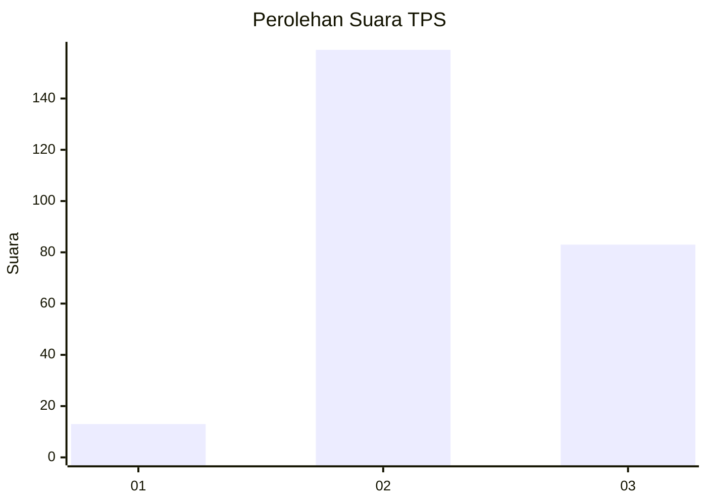
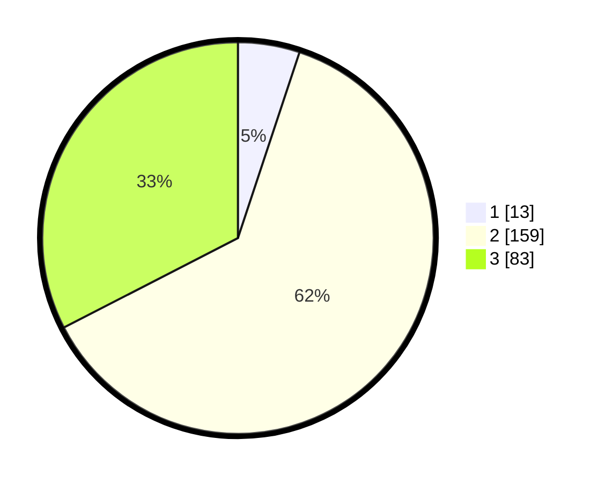

# Hasil

## Grafik

## Tabel

| No. | Nama Paslon    | Suara | Suara (raw) | Persentase |
|:--- |:-------------- | -----:| -----------:| ----------:|
| 1   | ANIES MUHAIMIN | 13    | [13][p-1]   | 5,10       |
| 2   | PRABOWO GIBRAN | 159   | [159][p-2]  | 62,35      |
| 3   | GANJAR MAHFUD  | 83    | [83][p-3]   | 32,55      |

[p-1]: https://github.com/gigit-pemilu/pemilu-2024-35-jawa-timur/blob/main/pilpres/hitung-suara/sub/35-jawa-timur/sub/16-mojokerto/sub/02-gondang/sub/2011-wonoploso/sub/001-tps/sub/paslon-1.txt
[p-2]: https://github.com/gigit-pemilu/pemilu-2024-35-jawa-timur/blob/main/pilpres/hitung-suara/sub/35-jawa-timur/sub/16-mojokerto/sub/02-gondang/sub/2011-wonoploso/sub/001-tps/sub/paslon-2.txt
[p-3]: https://github.com/gigit-pemilu/pemilu-2024-35-jawa-timur/blob/main/pilpres/hitung-suara/sub/35-jawa-timur/sub/16-mojokerto/sub/02-gondang/sub/2011-wonoploso/sub/001-tps/sub/paslon-3.txt

## Foto C Plano

https://sirekap-obj-formc.kpu.go.id/f88b/pemilu/ppwp/35/16/02/20/11/3516022011001-20240215-023648--04dc04ff-dcc5-4ffd-9071-f23979beadb8.jpg

https://sirekap-obj-formc.kpu.go.id/f88b/pemilu/ppwp/35/16/02/20/11/3516022011001-20240215-023748--7c4aebff-7b2c-4ed9-88f6-e68286a904d9.jpg

https://sirekap-obj-formc.kpu.go.id/f88b/pemilu/ppwp/35/16/02/20/11/3516022011001-20240215-023922--55d2c96e-7e8d-49a8-b185-50dd13748d73.jpg

## Metadata

| Key        | Value               |
| ---------- | ------------------- |
| Time Stamp | 2024-02-15 21:01:18 |

