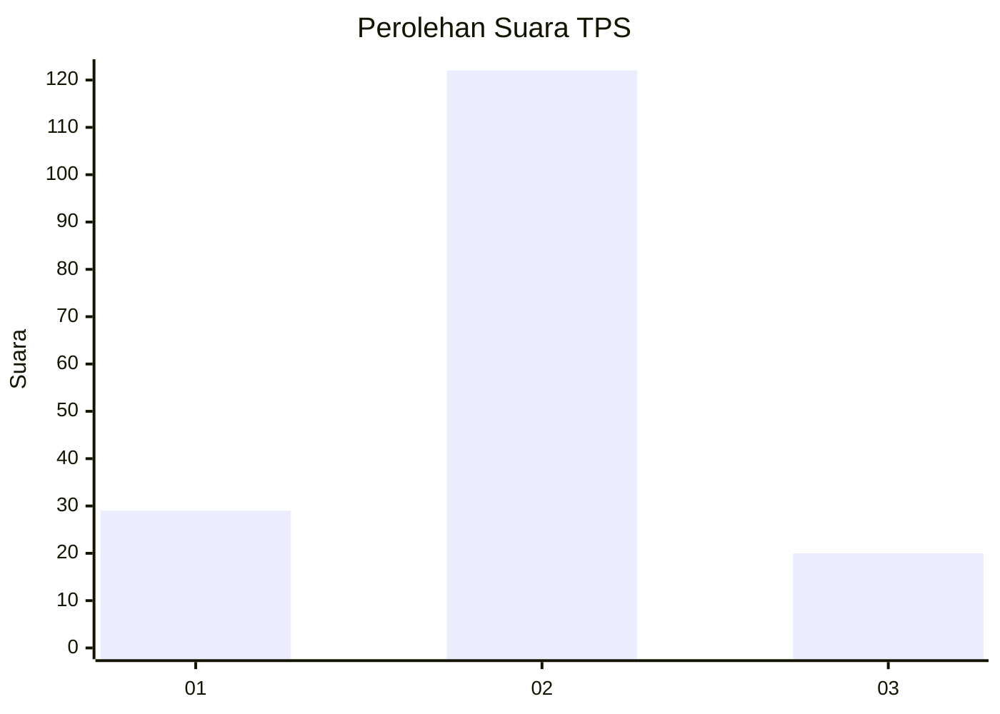
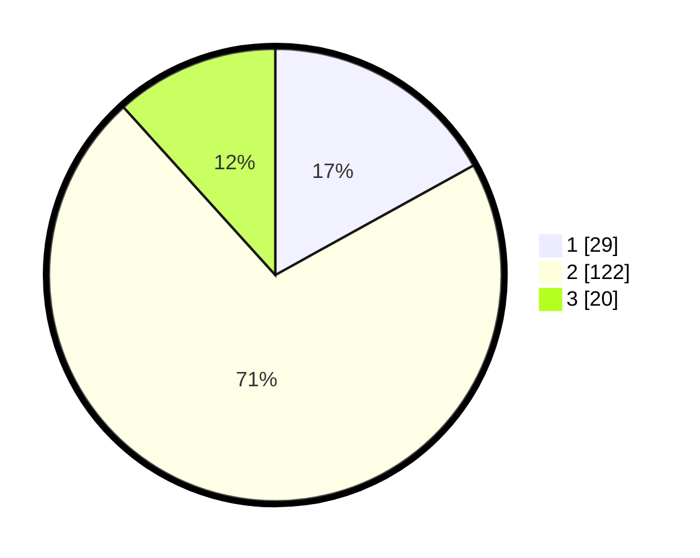

# Hasil

## Grafik

## Tabel

| No. | Nama Paslon    | Suara | Suara (raw) | Persentase |
|:--- |:-------------- | -----:| -----------:| ----------:|
| 1   | ANIES MUHAIMIN | 29    | [29][p-1]   | 16,96      |
| 2   | PRABOWO GIBRAN | 122   | [122][p-2]  | 71,35      |
| 3   | GANJAR MAHFUD  | 20    | [20][p-3]   | 11,70      |

[p-1]: https://github.com/gigit-pemilu/pemilu-2024-35-jawa-timur/blob/main/pilpres/hitung-suara/sub/35-jawa-timur/sub/16-mojokerto/sub/02-gondang/sub/2016-padi/sub/004-tps/sub/paslon-1.txt
[p-2]: https://github.com/gigit-pemilu/pemilu-2024-35-jawa-timur/blob/main/pilpres/hitung-suara/sub/35-jawa-timur/sub/16-mojokerto/sub/02-gondang/sub/2016-padi/sub/004-tps/sub/paslon-2.txt
[p-3]: https://github.com/gigit-pemilu/pemilu-2024-35-jawa-timur/blob/main/pilpres/hitung-suara/sub/35-jawa-timur/sub/16-mojokerto/sub/02-gondang/sub/2016-padi/sub/004-tps/sub/paslon-3.txt

## Foto C Plano

https://sirekap-obj-formc.kpu.go.id/2d91/pemilu/ppwp/35/16/02/20/16/3516022016004-20240215-200436--efadbaea-aef5-4600-90d2-399cb38c6769.jpg

https://sirekap-obj-formc.kpu.go.id/2d91/pemilu/ppwp/35/16/02/20/16/3516022016004-20240215-200441--aebd561f-753c-4eef-a60e-baad67b0999e.jpg

https://sirekap-obj-formc.kpu.go.id/2d91/pemilu/ppwp/35/16/02/20/16/3516022016004-20240215-200445--ef64cb4a-a3ed-416c-b1f1-f4a26b0d8183.jpg

## Metadata

| Key        | Value               |
| ---------- | ------------------- |
| Time Stamp | 2024-02-16 01:00:27 |

