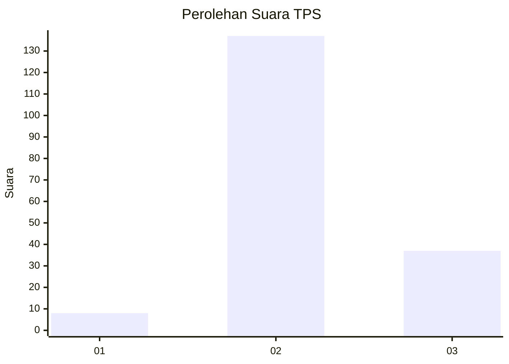

# Hasil

## Grafik

## Tabel

| No. | Nama Paslon    | Suara | Suara (raw) | Persentase |
|:--- |:-------------- | -----:| -----------:| ----------:|
| 1   | ANIES MUHAIMIN | 8     | [8][p-1]    | 4,40       |
| 2   | PRABOWO GIBRAN | 137   | [137][p-2]  | 75,27      |
| 3   | GANJAR MAHFUD  | 37    | [37][p-3]   | 20,33      |

[p-1]: https://github.com/gigit-pemilu/pemilu-2024-35-jawa-timur/blob/main/pilpres/hitung-suara/sub/35-jawa-timur/sub/16-mojokerto/sub/03-pacet/sub/2001-kemiri/sub/003-tps/sub/paslon-1.txt
[p-2]: https://github.com/gigit-pemilu/pemilu-2024-35-jawa-timur/blob/main/pilpres/hitung-suara/sub/35-jawa-timur/sub/16-mojokerto/sub/03-pacet/sub/2001-kemiri/sub/003-tps/sub/paslon-2.txt
[p-3]: https://github.com/gigit-pemilu/pemilu-2024-35-jawa-timur/blob/main/pilpres/hitung-suara/sub/35-jawa-timur/sub/16-mojokerto/sub/03-pacet/sub/2001-kemiri/sub/003-tps/sub/paslon-3.txt

## Foto C Plano

https://sirekap-obj-formc.kpu.go.id/48fb/pemilu/ppwp/35/16/03/20/01/3516032001003-20240215-165637--596c36b4-84a3-4427-ab0d-7a4b0a36be16.jpg

https://sirekap-obj-formc.kpu.go.id/48fb/pemilu/ppwp/35/16/03/20/01/3516032001003-20240215-165918--ef57c37a-7700-4867-b6a5-d24842d73da7.jpg

https://sirekap-obj-formc.kpu.go.id/48fb/pemilu/ppwp/35/16/03/20/01/3516032001003-20240215-165954--b7610a7a-17ff-4503-affb-f292200edfe0.jpg

## Metadata

| Key        | Value               |
| ---------- | ------------------- |
| Time Stamp | 2024-02-15 23:29:50 |

