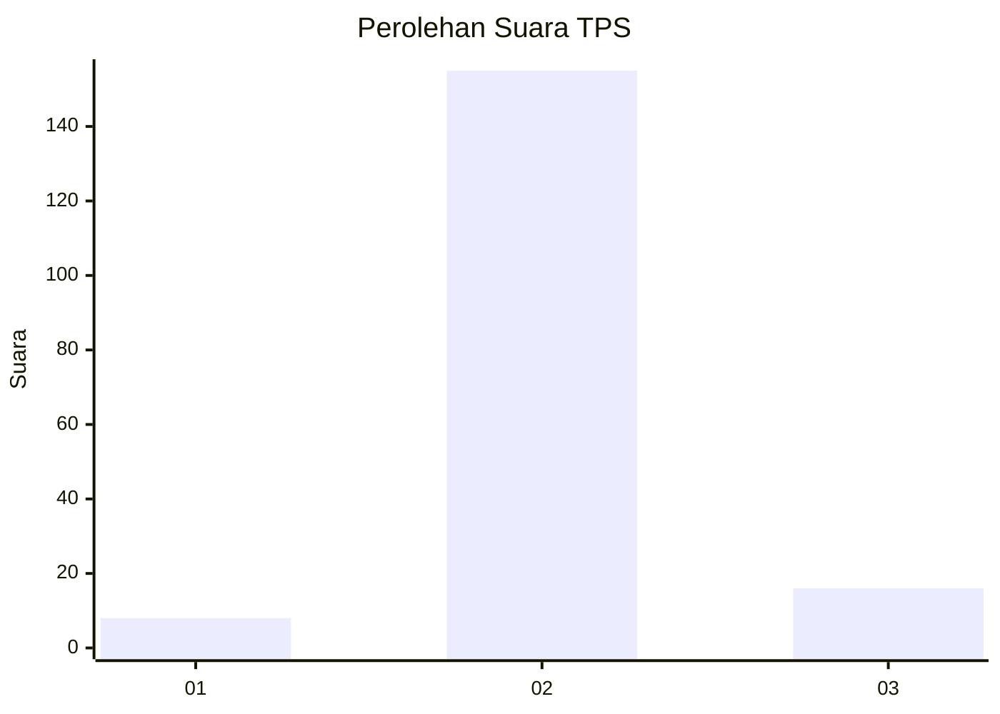
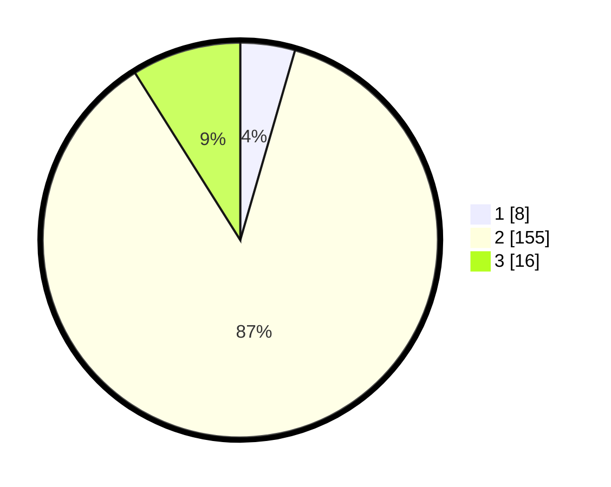

# Hasil

## Grafik

## Tabel

| No. | Nama Paslon    | Suara | Suara (raw) | Persentase |
|:--- |:-------------- | -----:| -----------:| ----------:|
| 1   | ANIES MUHAIMIN | 8     | [8][p-1]    | 4,47       |
| 2   | PRABOWO GIBRAN | 155   | [155][p-2]  | 86,59      |
| 3   | GANJAR MAHFUD  | 16    | [16][p-3]   | 8,94       |

[p-1]: https://github.com/gigit-pemilu/pemilu-2024-35-jawa-timur/blob/main/pilpres/hitung-suara/sub/35-jawa-timur/sub/16-mojokerto/sub/03-pacet/sub/2001-kemiri/sub/010-tps/sub/paslon-1.txt
[p-2]: https://github.com/gigit-pemilu/pemilu-2024-35-jawa-timur/blob/main/pilpres/hitung-suara/sub/35-jawa-timur/sub/16-mojokerto/sub/03-pacet/sub/2001-kemiri/sub/010-tps/sub/paslon-2.txt
[p-3]: https://github.com/gigit-pemilu/pemilu-2024-35-jawa-timur/blob/main/pilpres/hitung-suara/sub/35-jawa-timur/sub/16-mojokerto/sub/03-pacet/sub/2001-kemiri/sub/010-tps/sub/paslon-3.txt

## Foto C Plano

https://sirekap-obj-formc.kpu.go.id/4c54/pemilu/ppwp/35/16/03/20/01/3516032001010-20240215-184532--a74490e0-f36d-48b4-9d95-c45b2e635c53.jpg

https://sirekap-obj-formc.kpu.go.id/4c54/pemilu/ppwp/35/16/03/20/01/3516032001010-20240216-141940--6c9f756e-2751-4ae7-ad8e-e45ac391a2ce.jpg

https://sirekap-obj-formc.kpu.go.id/4c54/pemilu/ppwp/35/16/03/20/01/3516032001010-20240215-190446--4b3df586-d7a6-4fc8-83c7-675e40d6f722.jpg

## Metadata

| Key        | Value               |
| ---------- | ------------------- |
| Time Stamp | 2024-02-16 14:30:33 |

