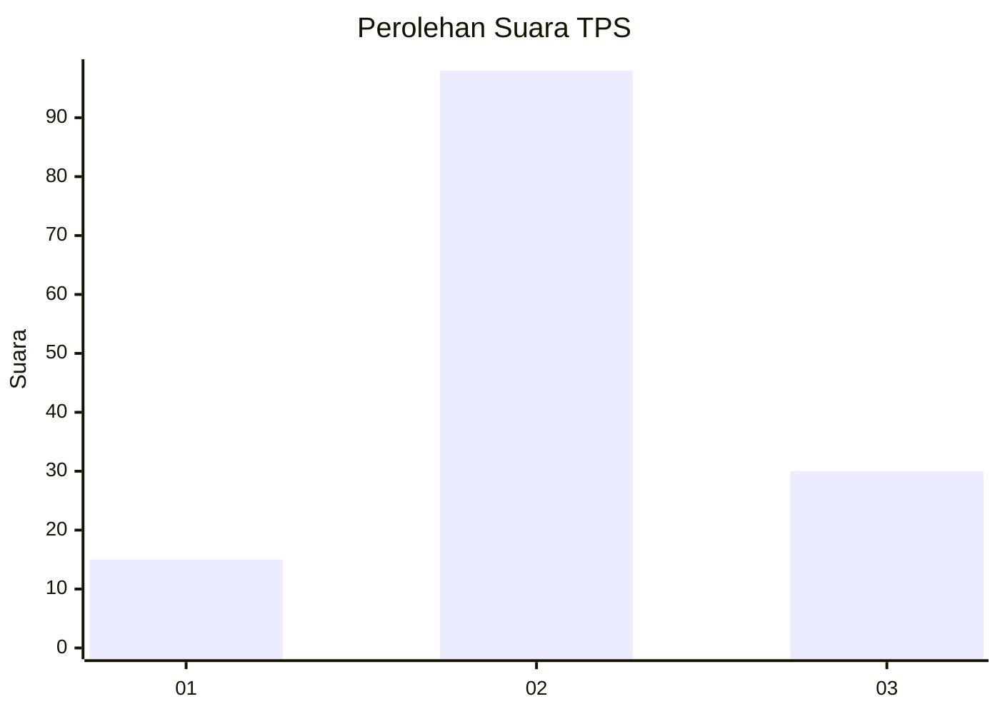
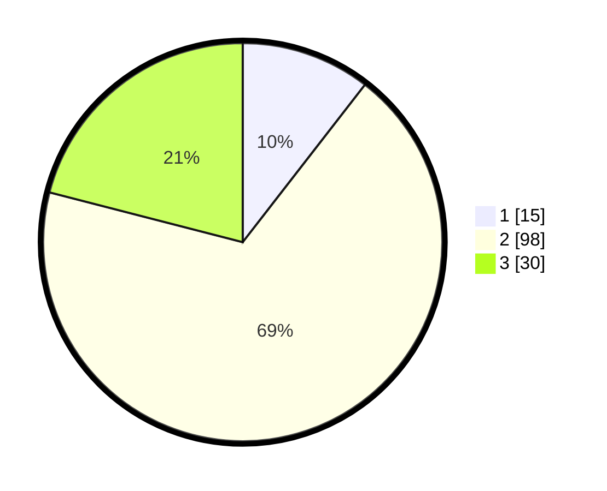

# Hasil

## Grafik

## Tabel

| No. | Nama Paslon    | Suara | Suara (raw) | Persentase |
|:--- |:-------------- | -----:| -----------:| ----------:|
| 1   | ANIES MUHAIMIN | 15    | [15][p-1]   | 10,49      |
| 2   | PRABOWO GIBRAN | 98    | [98][p-2]   | 68,53      |
| 3   | GANJAR MAHFUD  | 30    | [30][p-3]   | 20,98      |

[p-1]: https://github.com/gigit-pemilu/pemilu-2024-35-jawa-timur/blob/main/pilpres/hitung-suara/sub/35-jawa-timur/sub/16-mojokerto/sub/03-pacet/sub/2008-claket/sub/002-tps/sub/paslon-1.txt
[p-2]: https://github.com/gigit-pemilu/pemilu-2024-35-jawa-timur/blob/main/pilpres/hitung-suara/sub/35-jawa-timur/sub/16-mojokerto/sub/03-pacet/sub/2008-claket/sub/002-tps/sub/paslon-2.txt
[p-3]: https://github.com/gigit-pemilu/pemilu-2024-35-jawa-timur/blob/main/pilpres/hitung-suara/sub/35-jawa-timur/sub/16-mojokerto/sub/03-pacet/sub/2008-claket/sub/002-tps/sub/paslon-3.txt

## Foto C Plano

https://sirekap-obj-formc.kpu.go.id/a3b4/pemilu/ppwp/35/16/03/20/08/3516032008002-20240216-102227--bbda656a-e34d-4c20-acab-ec34e45be1a4.jpg

https://sirekap-obj-formc.kpu.go.id/a3b4/pemilu/ppwp/35/16/03/20/08/3516032008002-20240216-225702--8cb67836-0e46-46c4-bc68-df8680280365.jpg

https://sirekap-obj-formc.kpu.go.id/a3b4/pemilu/ppwp/35/16/03/20/08/3516032008002-20240216-225930--92926237-197f-4d4c-bacd-3fa5965354fb.jpg

## Metadata

| Key        | Value               |
| ---------- | ------------------- |
| Time Stamp | 2024-02-19 06:16:00 |

