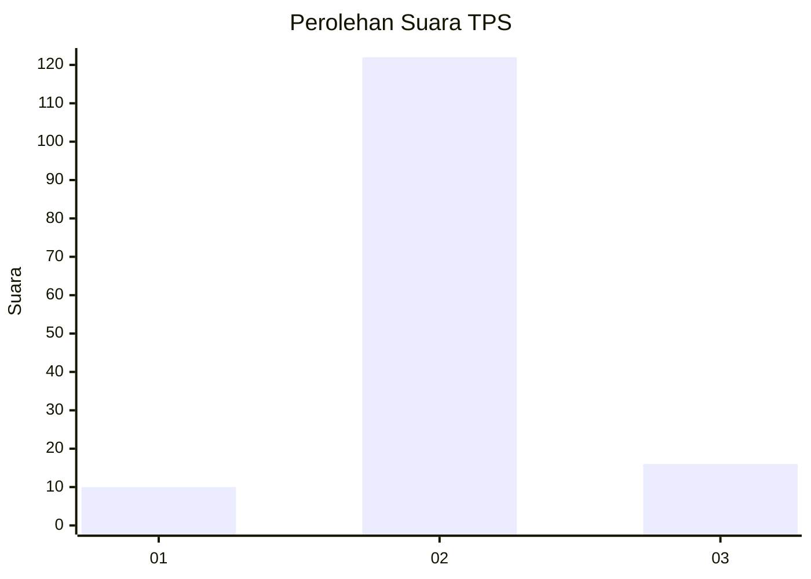
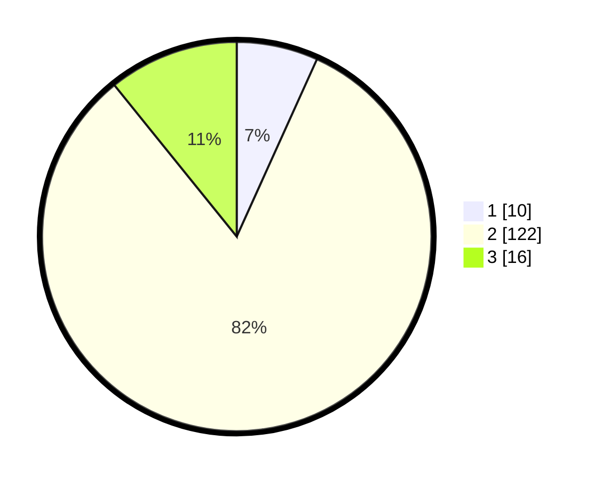

# Hasil

## Grafik

## Tabel

| No. | Nama Paslon    | Suara | Suara (raw) | Persentase |
|:--- |:-------------- | -----:| -----------:| ----------:|
| 1   | ANIES MUHAIMIN | 10    | [10][p-1]   | 6,76       |
| 2   | PRABOWO GIBRAN | 122   | [122][p-2]  | 82,43      |
| 3   | GANJAR MAHFUD  | 16    | [16][p-3]   | 10,81      |

[p-1]: https://github.com/gigit-pemilu/pemilu-2024/blob/main/pilpres/hitung-suara/sub/35-jawa-timur/sub/16-mojokerto/sub/03-pacet/sub/2010-nogosari/sub/002-tps/sub/paslon-1.txt
[p-2]: https://github.com/gigit-pemilu/pemilu-2024/blob/main/pilpres/hitung-suara/sub/35-jawa-timur/sub/16-mojokerto/sub/03-pacet/sub/2010-nogosari/sub/002-tps/sub/paslon-2.txt
[p-3]: https://github.com/gigit-pemilu/pemilu-2024/blob/main/pilpres/hitung-suara/sub/35-jawa-timur/sub/16-mojokerto/sub/03-pacet/sub/2010-nogosari/sub/002-tps/sub/paslon-3.txt

## Foto C Plano

https://sirekap-obj-formc.kpu.go.id/1426/pemilu/ppwp/35/16/03/20/10/3516032010002-20240218-131259--f3c04537-8afd-4eb7-acdf-2154ef387316.jpg

https://sirekap-obj-formc.kpu.go.id/1426/pemilu/ppwp/35/16/03/20/10/3516032010002-20240218-131342--21998197-fda5-4802-9dcd-1828fcb646b5.jpg

https://sirekap-obj-formc.kpu.go.id/1426/pemilu/ppwp/35/16/03/20/10/3516032010002-20240218-131417--629a71bc-fb2b-4643-acc8-b92fe3835cc0.jpg

## Metadata

| Key        | Value               |
| ---------- | ------------------- |
| Time Stamp | 2024-02-24 22:31:28 |

