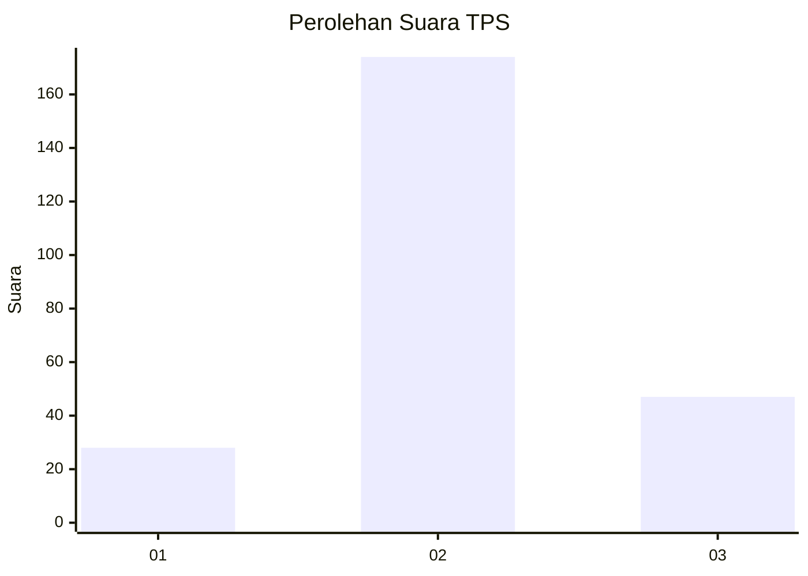
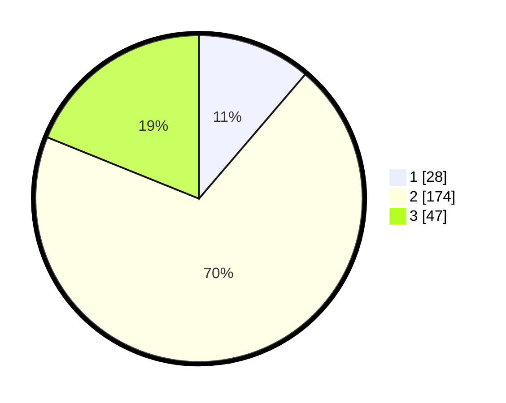

# Hasil

## Grafik

## Tabel

| No. | Nama Paslon    | Suara | Suara (raw) | Persentase |
|:--- |:-------------- | -----:| -----------:| ----------:|
| 1   | ANIES MUHAIMIN | 28    | [28][p-1]   | 11,24      |
| 2   | PRABOWO GIBRAN | 174   | [174][p-2]  | 69,88      |
| 3   | GANJAR MAHFUD  | 47    | [47][p-3]   | 18,88      |

[p-1]: https://github.com/gigit-pemilu/pemilu-2024-35-jawa-timur/blob/main/pilpres/hitung-suara/sub/35-jawa-timur/sub/16-mojokerto/sub/04-trawas/sub/2005-kesiman/sub/001-tps/sub/paslon-1.txt
[p-2]: https://github.com/gigit-pemilu/pemilu-2024-35-jawa-timur/blob/main/pilpres/hitung-suara/sub/35-jawa-timur/sub/16-mojokerto/sub/04-trawas/sub/2005-kesiman/sub/001-tps/sub/paslon-2.txt
[p-3]: https://github.com/gigit-pemilu/pemilu-2024-35-jawa-timur/blob/main/pilpres/hitung-suara/sub/35-jawa-timur/sub/16-mojokerto/sub/04-trawas/sub/2005-kesiman/sub/001-tps/sub/paslon-3.txt

## Foto C Plano

https://sirekap-obj-formc.kpu.go.id/c1dd/pemilu/ppwp/35/16/04/20/05/3516042005001-20240215-035436--288847f7-ebd1-4c7a-bc82-48eadb6a216a.jpg

https://sirekap-obj-formc.kpu.go.id/c1dd/pemilu/ppwp/35/16/04/20/05/3516042005001-20240215-001809--acf4ea43-ee76-4507-8285-abe632796aa8.jpg

https://sirekap-obj-formc.kpu.go.id/c1dd/pemilu/ppwp/35/16/04/20/05/3516042005001-20240215-001812--22b084a1-0822-4fe5-956a-58e0568058ca.jpg

## Metadata

| Key        | Value               |
| ---------- | ------------------- |
| Time Stamp | 2024-02-15 22:30:27 |

