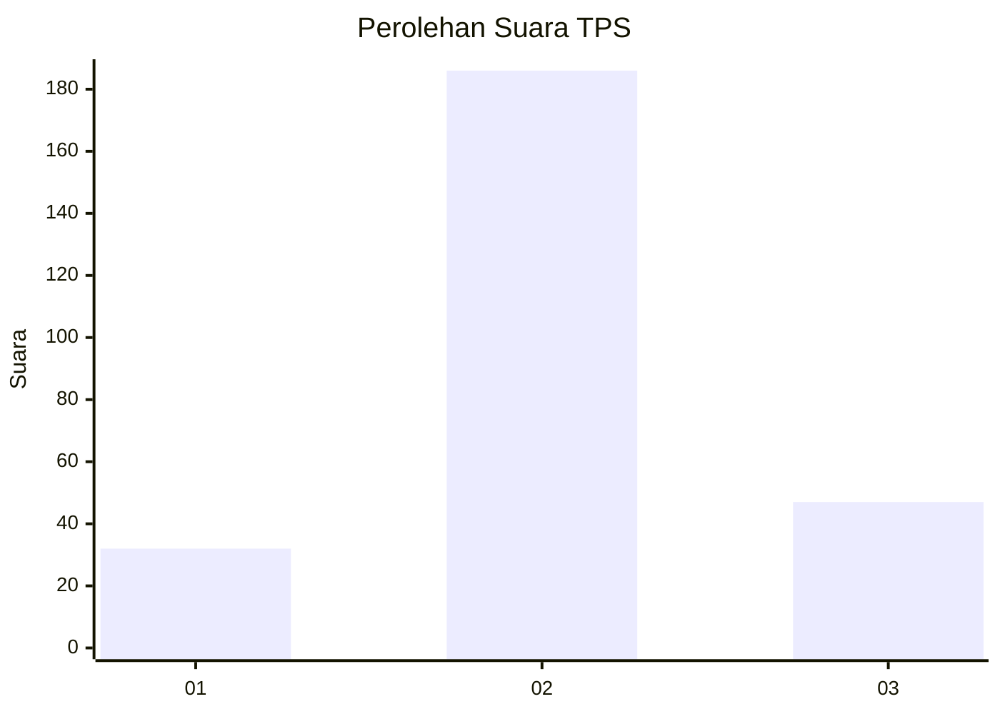
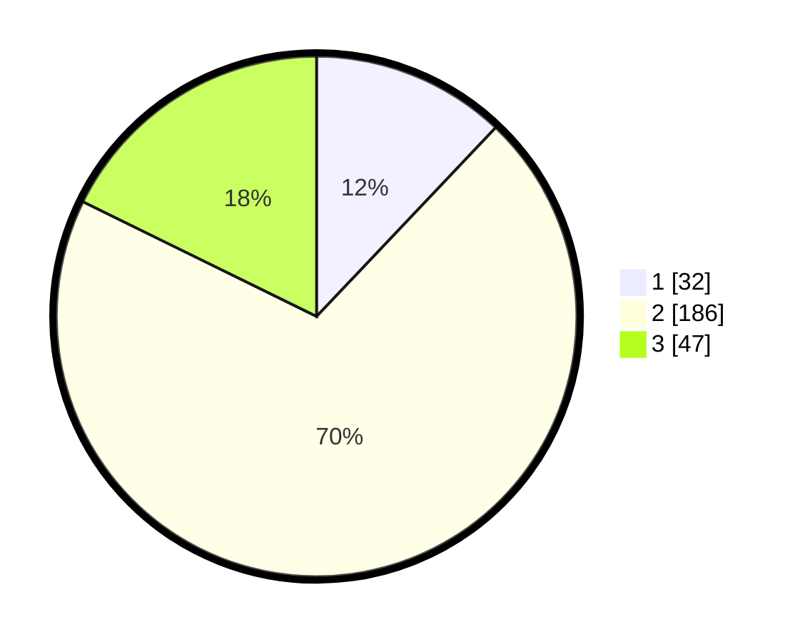

# Hasil

## Grafik

## Tabel

| No. | Nama Paslon    | Suara | Suara (raw) | Persentase |
|:--- |:-------------- | -----:| -----------:| ----------:|
| 1   | ANIES MUHAIMIN | 32    | [32][p-1]   | 12,08      |
| 2   | PRABOWO GIBRAN | 186   | [186][p-2]  | 70,19      |
| 3   | GANJAR MAHFUD  | 47    | [47][p-3]   | 17,74      |

[p-1]: https://github.com/gigit-pemilu/pemilu-2024/blob/main/pilpres/hitung-suara/sub/35-jawa-timur/sub/16-mojokerto/sub/05-ngoro/sub/2007-kunjorowesi/sub/009-tps/sub/paslon-1.txt
[p-2]: https://github.com/gigit-pemilu/pemilu-2024/blob/main/pilpres/hitung-suara/sub/35-jawa-timur/sub/16-mojokerto/sub/05-ngoro/sub/2007-kunjorowesi/sub/009-tps/sub/paslon-2.txt
[p-3]: https://github.com/gigit-pemilu/pemilu-2024/blob/main/pilpres/hitung-suara/sub/35-jawa-timur/sub/16-mojokerto/sub/05-ngoro/sub/2007-kunjorowesi/sub/009-tps/sub/paslon-3.txt

## Foto C Plano

https://sirekap-obj-formc.kpu.go.id/2488/pemilu/ppwp/35/16/05/20/07/3516052007009-20240218-092519--7509409f-d0a6-4b80-9695-8eff7a786a71.jpg

https://sirekap-obj-formc.kpu.go.id/2488/pemilu/ppwp/35/16/05/20/07/3516052007009-20240218-090555--55b89a60-e627-49da-a277-970137404bb9.jpg

https://sirekap-obj-formc.kpu.go.id/2488/pemilu/ppwp/35/16/05/20/07/3516052007009-20240218-161246--08163e33-c143-4554-8a2e-19aaed1980a8.jpg

## Metadata

| Key        | Value               |
| ---------- | ------------------- |
| Time Stamp | 2024-02-24 22:31:28 |

