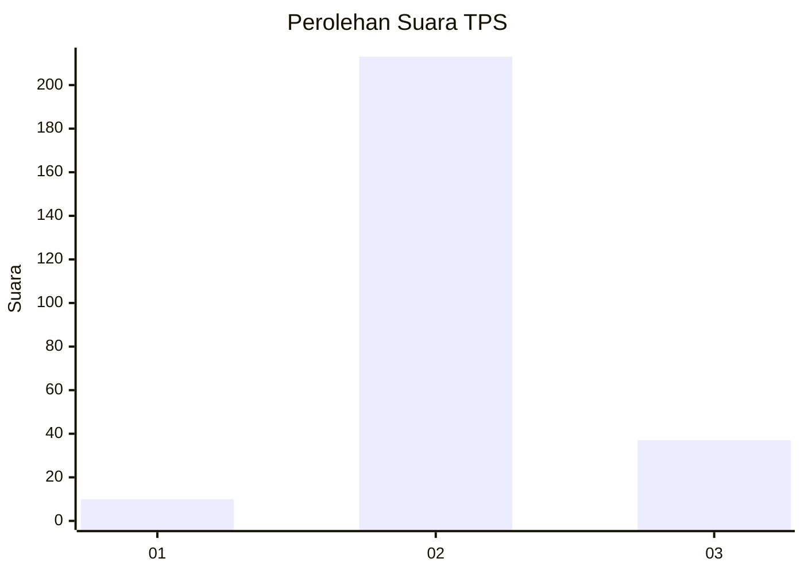
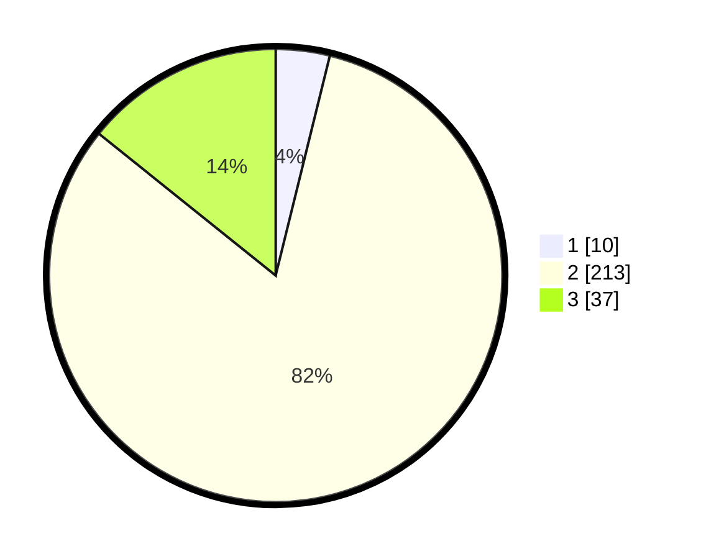

# Hasil

## Grafik

## Tabel

| No. | Nama Paslon    | Suara | Suara (raw) | Persentase |
|:--- |:-------------- | -----:| -----------:| ----------:|
| 1   | ANIES MUHAIMIN | 10    | [10][p-1]   | 3,85       |
| 2   | PRABOWO GIBRAN | 213   | [213][p-2]  | 81,92      |
| 3   | GANJAR MAHFUD  | 37    | [37][p-3]   | 14,23      |

[p-1]: https://github.com/gigit-pemilu/pemilu-2024-35-jawa-timur/blob/main/pilpres/hitung-suara/sub/35-jawa-timur/sub/16-mojokerto/sub/05-ngoro/sub/2008-manduro-manggunggajah/sub/008-tps/sub/paslon-1.txt
[p-2]: https://github.com/gigit-pemilu/pemilu-2024-35-jawa-timur/blob/main/pilpres/hitung-suara/sub/35-jawa-timur/sub/16-mojokerto/sub/05-ngoro/sub/2008-manduro-manggunggajah/sub/008-tps/sub/paslon-2.txt
[p-3]: https://github.com/gigit-pemilu/pemilu-2024-35-jawa-timur/blob/main/pilpres/hitung-suara/sub/35-jawa-timur/sub/16-mojokerto/sub/05-ngoro/sub/2008-manduro-manggunggajah/sub/008-tps/sub/paslon-3.txt

## Foto C Plano

https://sirekap-obj-formc.kpu.go.id/f36c/pemilu/ppwp/35/16/05/20/08/3516052008008-20240217-180933--ee2452a9-3a95-47fb-936e-dbe8c947df4d.jpg

https://sirekap-obj-formc.kpu.go.id/f36c/pemilu/ppwp/35/16/05/20/08/3516052008008-20240217-180534--def8e880-1a88-4aba-98d4-dbfd52c7cc09.jpg

https://sirekap-obj-formc.kpu.go.id/f36c/pemilu/ppwp/35/16/05/20/08/3516052008008-20240217-180618--6f6c5d4e-022a-4a90-aa5a-1907249d806e.jpg

## Metadata

| Key        | Value               |
| ---------- | ------------------- |
| Time Stamp | 2024-02-24 22:31:28 |

