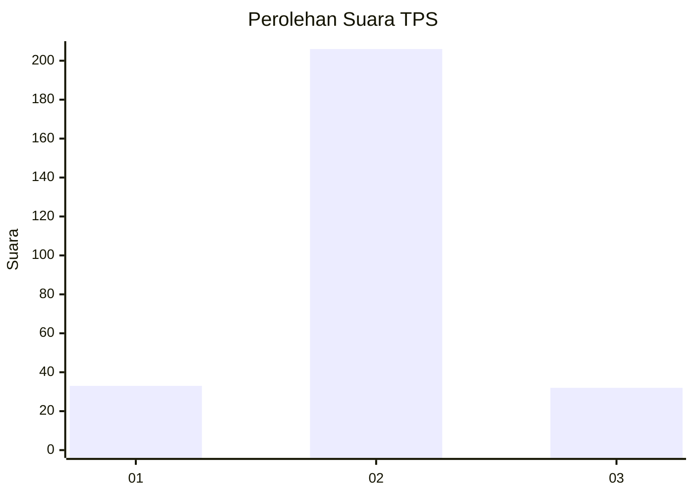
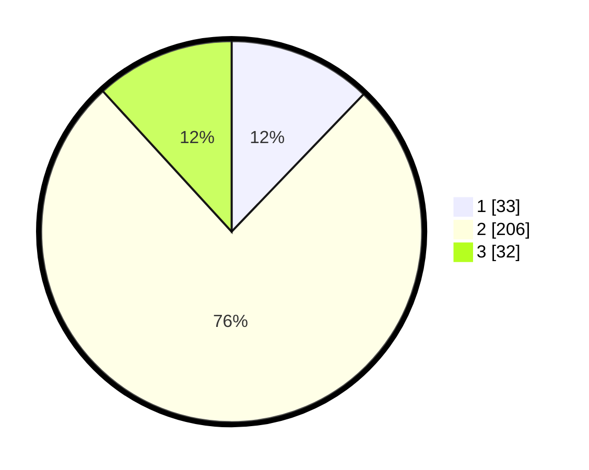

# Hasil

## Grafik

## Tabel

| No. | Nama Paslon    | Suara | Suara (raw) | Persentase |
|:--- |:-------------- | -----:| -----------:| ----------:|
| 1   | ANIES MUHAIMIN | 33    | [33][p-1]   | 12,18      |
| 2   | PRABOWO GIBRAN | 206   | [206][p-2]  | 76,01      |
| 3   | GANJAR MAHFUD  | 32    | [32][p-3]   | 11,81      |

[p-1]: https://github.com/gigit-pemilu/pemilu-2024-35-jawa-timur/blob/main/pilpres/hitung-suara/sub/35-jawa-timur/sub/16-mojokerto/sub/05-ngoro/sub/2010-ngoro/sub/007-tps/sub/paslon-1.txt
[p-2]: https://github.com/gigit-pemilu/pemilu-2024-35-jawa-timur/blob/main/pilpres/hitung-suara/sub/35-jawa-timur/sub/16-mojokerto/sub/05-ngoro/sub/2010-ngoro/sub/007-tps/sub/paslon-2.txt
[p-3]: https://github.com/gigit-pemilu/pemilu-2024-35-jawa-timur/blob/main/pilpres/hitung-suara/sub/35-jawa-timur/sub/16-mojokerto/sub/05-ngoro/sub/2010-ngoro/sub/007-tps/sub/paslon-3.txt

## Foto C Plano

https://sirekap-obj-formc.kpu.go.id/bc8b/pemilu/ppwp/35/16/05/20/10/3516052010007-20240214-175442--0e8b43f1-01ae-492e-86ff-23cf23e26b6b.jpg

https://sirekap-obj-formc.kpu.go.id/bc8b/pemilu/ppwp/35/16/05/20/10/3516052010007-20240214-191138--933d7c22-74f4-435e-8140-66504dfb8c6b.jpg

https://sirekap-obj-formc.kpu.go.id/bc8b/pemilu/ppwp/35/16/05/20/10/3516052010007-20240214-192842--bd206897-c980-4fa9-9464-6fa32136b045.jpg

## Metadata

| Key        | Value               |
| ---------- | ------------------- |
| Time Stamp | 2024-02-14 21:46:01 |

