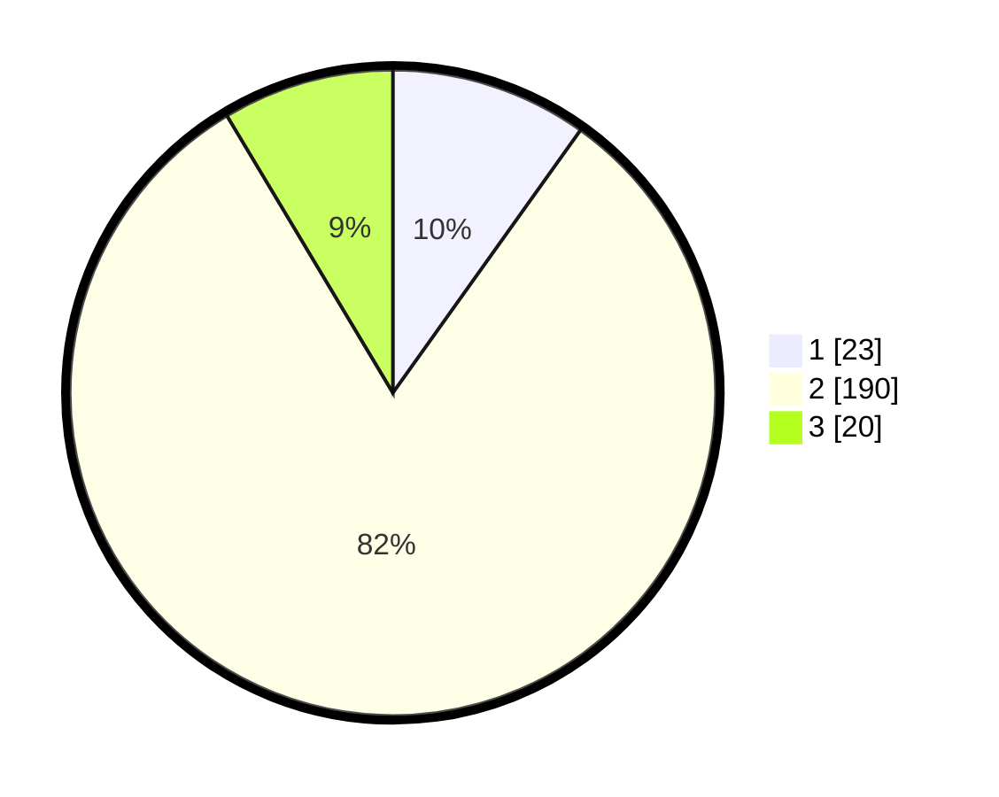

# Hasil

## Grafik

## Tabel

| No. | Nama Paslon    | Suara | Suara (raw) | Persentase |
|:--- |:-------------- | -----:| -----------:| ----------:|
| 1   | ANIES MUHAIMIN | 23    | [23][p-1]   | 9,87       |
| 2   | PRABOWO GIBRAN | 190   | [190][p-2]  | 81,55      |
| 3   | GANJAR MAHFUD  | 20    | [20][p-3]   | 8,58       |

[p-1]: https://github.com/gigit-pemilu/pemilu-2024/blob/main/pilpres/hitung-suara/sub/35-jawa-timur/sub/16-mojokerto/sub/05-ngoro/sub/2016-kembangsri/sub/008-tps/sub/paslon-1.txt
[p-2]: https://github.com/gigit-pemilu/pemilu-2024/blob/main/pilpres/hitung-suara/sub/35-jawa-timur/sub/16-mojokerto/sub/05-ngoro/sub/2016-kembangsri/sub/008-tps/sub/paslon-2.txt
[p-3]: https://github.com/gigit-pemilu/pemilu-2024/blob/main/pilpres/hitung-suara/sub/35-jawa-timur/sub/16-mojokerto/sub/05-ngoro/sub/2016-kembangsri/sub/008-tps/sub/paslon-3.txt

## Foto C Plano

https://sirekap-obj-formc.kpu.go.id/b24c/pemilu/ppwp/35/16/05/20/16/3516052016008-20240215-204233--956c0b19-d56a-4c5a-b77f-d8bb2ffefd99.jpg

https://sirekap-obj-formc.kpu.go.id/b24c/pemilu/ppwp/35/16/05/20/16/3516052016008-20240215-095948--7889b9df-2151-4ac3-848e-06e7c25379ce.jpg

https://sirekap-obj-formc.kpu.go.id/b24c/pemilu/ppwp/35/16/05/20/16/3516052016008-20240214-222102--214fd73b-ea52-42b6-96c8-f28a7088ce65.jpg

## Metadata

| Key        | Value               |
| ---------- | ------------------- |
| Time Stamp | 2024-02-16 16:25:10 |

