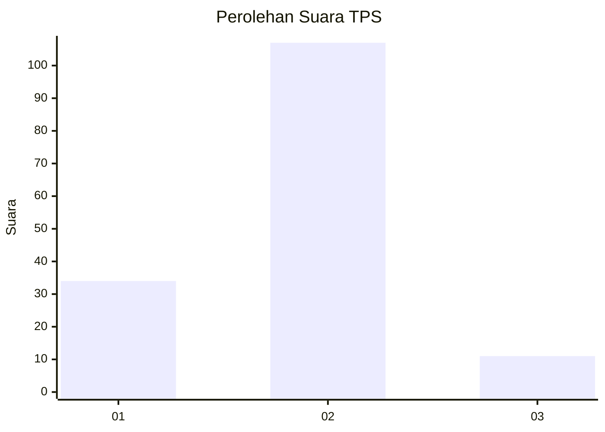
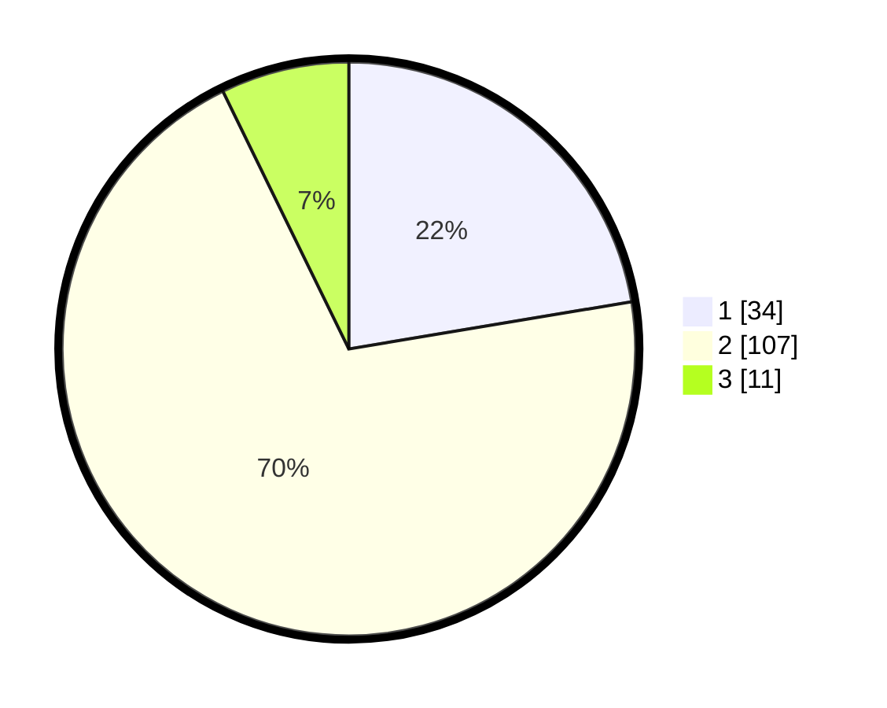

# Hasil

## Grafik

## Tabel

| No. | Nama Paslon    | Suara | Suara (raw) | Persentase |
|:--- |:-------------- | -----:| -----------:| ----------:|
| 1   | ANIES MUHAIMIN | 34    | [34][p-1]   | 22,37      |
| 2   | PRABOWO GIBRAN | 107   | [107][p-2]  | 70,39      |
| 3   | GANJAR MAHFUD  | 11    | [11][p-3]   | 7,24       |

[p-1]: https://github.com/gigit-pemilu/pemilu-2024/blob/main/pilpres/hitung-suara/sub/35-jawa-timur/sub/16-mojokerto/sub/05-ngoro/sub/2018-watesnegoro/sub/023-tps/sub/paslon-1.txt
[p-2]: https://github.com/gigit-pemilu/pemilu-2024/blob/main/pilpres/hitung-suara/sub/35-jawa-timur/sub/16-mojokerto/sub/05-ngoro/sub/2018-watesnegoro/sub/023-tps/sub/paslon-2.txt
[p-3]: https://github.com/gigit-pemilu/pemilu-2024/blob/main/pilpres/hitung-suara/sub/35-jawa-timur/sub/16-mojokerto/sub/05-ngoro/sub/2018-watesnegoro/sub/023-tps/sub/paslon-3.txt

## Foto C Plano

https://sirekap-obj-formc.kpu.go.id/f209/pemilu/ppwp/35/16/05/20/18/3516052018023-20240214-234403--51517dd0-2260-4994-83b6-ff4dfdfd0b5e.jpg

https://sirekap-obj-formc.kpu.go.id/f209/pemilu/ppwp/35/16/05/20/18/3516052018023-20240214-234452--b77d51c6-5af9-4509-b9fb-820285d38e99.jpg

https://sirekap-obj-formc.kpu.go.id/f209/pemilu/ppwp/35/16/05/20/18/3516052018023-20240214-234539--84342fb8-2e71-4420-9262-e8dbf97870ed.jpg

## Metadata

| Key        | Value               |
| ---------- | ------------------- |
| Time Stamp | 2024-02-16 02:00:27 |

