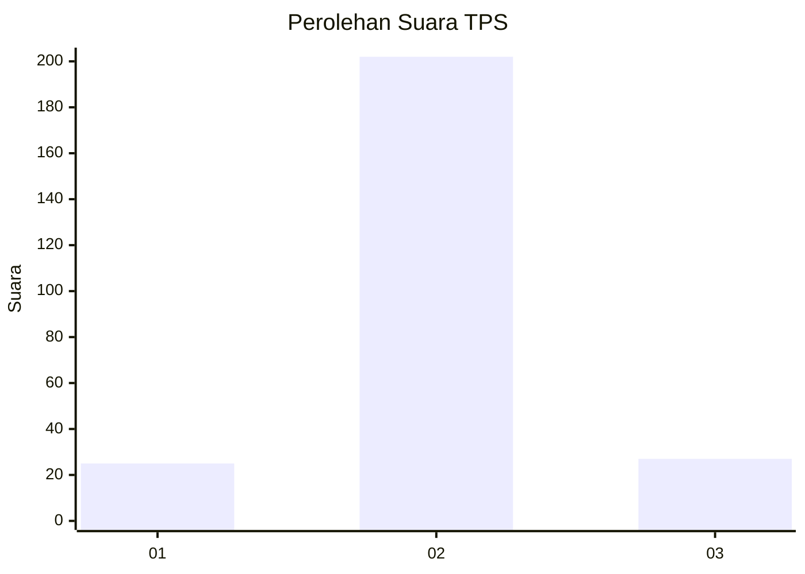
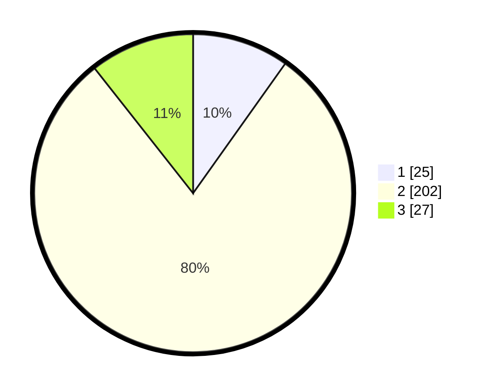

# Hasil

## Grafik

## Tabel

| No. | Nama Paslon    | Suara | Suara (raw) | Persentase |
|:--- |:-------------- | -----:| -----------:| ----------:|
| 1   | ANIES MUHAIMIN | 25    | [25][p-1]   | 9,84       |
| 2   | PRABOWO GIBRAN | 202   | [202][p-2]  | 79,53      |
| 3   | GANJAR MAHFUD  | 27    | [27][p-3]   | 10,63      |

[p-1]: https://github.com/gigit-pemilu/pemilu-2024-35-jawa-timur/blob/main/pilpres/hitung-suara/sub/35-jawa-timur/sub/16-mojokerto/sub/06-pungging/sub/2002-mojorejo/sub/011-tps/sub/paslon-1.txt
[p-2]: https://github.com/gigit-pemilu/pemilu-2024-35-jawa-timur/blob/main/pilpres/hitung-suara/sub/35-jawa-timur/sub/16-mojokerto/sub/06-pungging/sub/2002-mojorejo/sub/011-tps/sub/paslon-2.txt
[p-3]: https://github.com/gigit-pemilu/pemilu-2024-35-jawa-timur/blob/main/pilpres/hitung-suara/sub/35-jawa-timur/sub/16-mojokerto/sub/06-pungging/sub/2002-mojorejo/sub/011-tps/sub/paslon-3.txt

## Foto C Plano

https://sirekap-obj-formc.kpu.go.id/b4ed/pemilu/ppwp/35/16/06/20/02/3516062002011-20240217-165554--4f96634f-ba65-4d86-9e63-bf96e660a1a2.jpg

https://sirekap-obj-formc.kpu.go.id/b4ed/pemilu/ppwp/35/16/06/20/02/3516062002011-20240217-165643--5d58b296-e7af-4302-a224-6d9ff91b48e3.jpg

https://sirekap-obj-formc.kpu.go.id/b4ed/pemilu/ppwp/35/16/06/20/02/3516062002011-20240217-165716--47e91dae-ba85-4460-9779-282a2836a551.jpg

## Metadata

| Key        | Value               |
| ---------- | ------------------- |
| Time Stamp | 2024-02-17 17:00:04 |

## DATA PEMILIH TETAP

Jumlah pemilih dalam DPT: **285**.
 * L: **638**.
 * P: **147**.

## DATA PENGGUNA HAK PILIH

Jumlah pengguna hak pilih dalam DPT: **263**.
 * L: **127**.
 * P: **436**.

Jumlah pengguna hak pilih dalam DPTb: **800**.
 * L: **80**.
 * P: **88**.

Jumlah pengguna hak pilih dalam DPK: **801**.
 * L: **88**.
 * P: **880**.

Jumlah pengguna hak pilih: **264**.
 * L: **628**.
 * P: **136**.

## JUMLAH SUARA SAH DAN TIDAK SAH

JUMLAH SELURUH SUARA SAH: **254**.

JUMLAH SUARA TIDAK SAH: **10**.

JUMLAH SELURUH SUARA SAH DAN SUARA TIDAK SAH: **264**.

