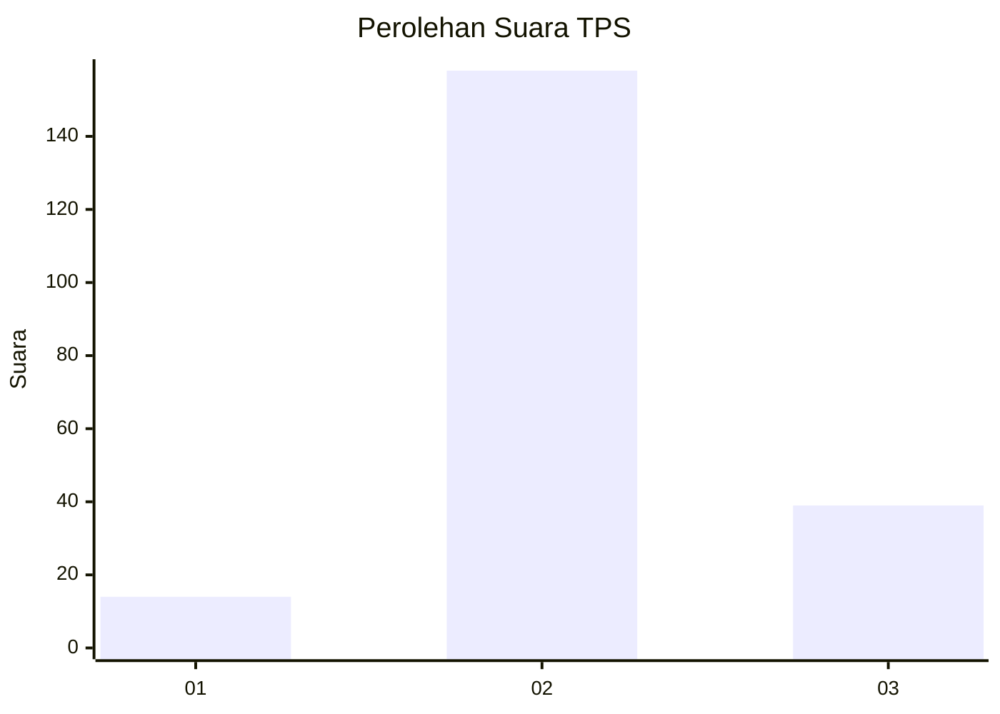
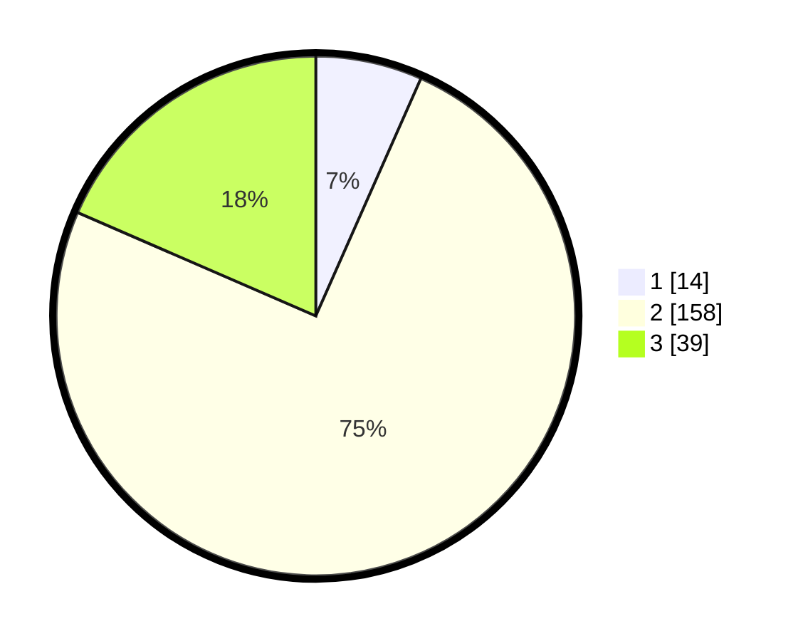

# Hasil

## Grafik

## Tabel

| No. | Nama Paslon    | Suara | Suara (raw) | Persentase |
|:--- |:-------------- | -----:| -----------:| ----------:|
| 1   | ANIES MUHAIMIN | 14    | [14][p-1]   | 6,64       |
| 2   | PRABOWO GIBRAN | 158   | [158][p-2]  | 74,88      |
| 3   | GANJAR MAHFUD  | 39    | [39][p-3]   | 18,48      |

[p-1]: https://github.com/gigit-pemilu/pemilu-2024-35-jawa-timur/blob/main/pilpres/hitung-suara/sub/35-jawa-timur/sub/16-mojokerto/sub/07-kutorejo/sub/2009-gedangan/sub/006-tps/sub/paslon-1.txt
[p-2]: https://github.com/gigit-pemilu/pemilu-2024-35-jawa-timur/blob/main/pilpres/hitung-suara/sub/35-jawa-timur/sub/16-mojokerto/sub/07-kutorejo/sub/2009-gedangan/sub/006-tps/sub/paslon-2.txt
[p-3]: https://github.com/gigit-pemilu/pemilu-2024-35-jawa-timur/blob/main/pilpres/hitung-suara/sub/35-jawa-timur/sub/16-mojokerto/sub/07-kutorejo/sub/2009-gedangan/sub/006-tps/sub/paslon-3.txt

## Foto C Plano

https://sirekap-obj-formc.kpu.go.id/56f8/pemilu/ppwp/35/16/07/20/09/3516072009006-20240219-183621--253ced6c-496a-40a6-b3ed-e2551d016aa8.jpg

https://sirekap-obj-formc.kpu.go.id/56f8/pemilu/ppwp/35/16/07/20/09/3516072009006-20240219-183804--66203d06-3949-4c4c-a5c2-9439dccac0fc.jpg

https://sirekap-obj-formc.kpu.go.id/56f8/pemilu/ppwp/35/16/07/20/09/3516072009006-20240219-184453--0dc821e0-80ae-4d3a-a225-349d6f39af52.jpg

## Metadata

| Key        | Value               |
| ---------- | ------------------- |
| Time Stamp | 2024-02-22 13:00:00 |

## DATA PEMILIH TETAP

Jumlah pemilih dalam DPT: **0**.
 * L: **500**.
 * P: **2**.

## DATA PENGGUNA HAK PILIH

Jumlah pengguna hak pilih dalam DPT: **0**.
 * L: **220**.
 * P: **200**.

Jumlah pengguna hak pilih dalam DPTb: **122**.
 * L: **777**.
 * P: **471**.

Jumlah pengguna hak pilih dalam DPK: **707**.
 * L: **477**.
 * P: **400**.

Jumlah pengguna hak pilih: **400**.
 * L: **474**.
 * P: **476**.

## JUMLAH SUARA SAH DAN TIDAK SAH

JUMLAH SELURUH SUARA SAH: **211**.

JUMLAH SUARA TIDAK SAH: **17**.

JUMLAH SELURUH SUARA SAH DAN SUARA TIDAK SAH: **228**.

