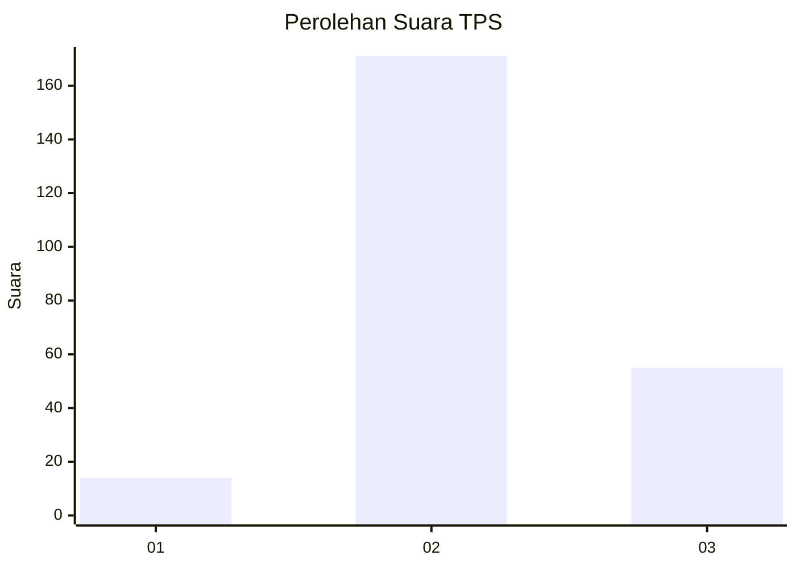
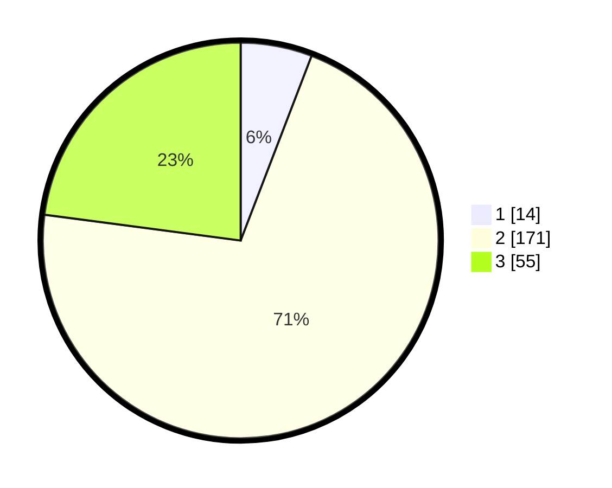

# Hasil

## Grafik

## Tabel

| No. | Nama Paslon    | Suara | Suara (raw) | Persentase |
|:--- |:-------------- | -----:| -----------:| ----------:|
| 1   | ANIES MUHAIMIN | 14    | [14][p-1]   | 5,83       |
| 2   | PRABOWO GIBRAN | 171   | [171][p-2]  | 71,25      |
| 3   | GANJAR MAHFUD  | 55    | [55][p-3]   | 22,92      |

[p-1]: https://github.com/gigit-pemilu/pemilu-2024/blob/main/pilpres/hitung-suara/sub/35-jawa-timur/sub/16-mojokerto/sub/07-kutorejo/sub/2015-kepuhpandak/sub/013-tps/sub/paslon-1.txt
[p-2]: https://github.com/gigit-pemilu/pemilu-2024/blob/main/pilpres/hitung-suara/sub/35-jawa-timur/sub/16-mojokerto/sub/07-kutorejo/sub/2015-kepuhpandak/sub/013-tps/sub/paslon-2.txt
[p-3]: https://github.com/gigit-pemilu/pemilu-2024/blob/main/pilpres/hitung-suara/sub/35-jawa-timur/sub/16-mojokerto/sub/07-kutorejo/sub/2015-kepuhpandak/sub/013-tps/sub/paslon-3.txt

## Foto C Plano

https://sirekap-obj-formc.kpu.go.id/d6e1/pemilu/ppwp/35/16/07/20/15/3516072015013-20240215-010920--05828a23-ca10-4348-b64a-1e93cf1d38f8.jpg

https://sirekap-obj-formc.kpu.go.id/d6e1/pemilu/ppwp/35/16/07/20/15/3516072015013-20240215-012415--bce1f799-9c1c-4214-a03e-a13e34916fa5.jpg

https://sirekap-obj-formc.kpu.go.id/d6e1/pemilu/ppwp/35/16/07/20/15/3516072015013-20240215-012501--12a5141a-1cbc-4be9-bb5a-887c1e864220.jpg

## Metadata

| Key        | Value               |
| ---------- | ------------------- |
| Time Stamp | 2024-02-16 01:30:27 |

