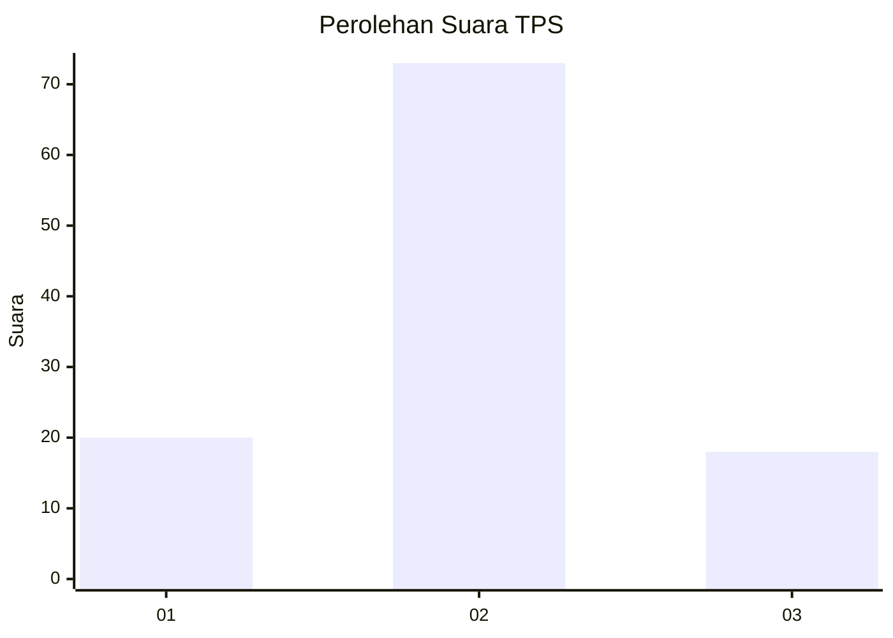
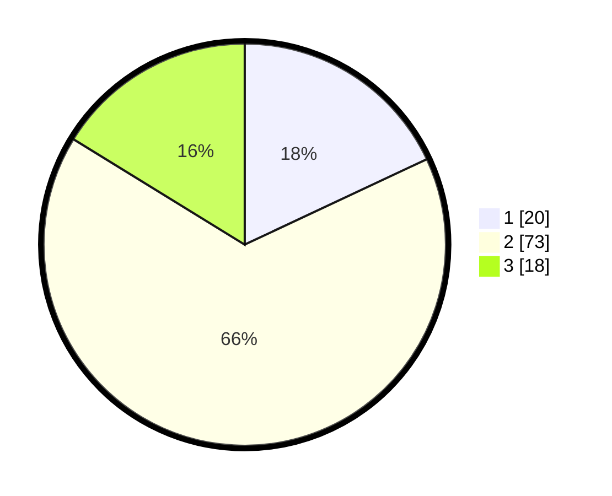

# Hasil

## Grafik

## Tabel

| No. | Nama Paslon    | Suara | Suara (raw) | Persentase |
|:--- |:-------------- | -----:| -----------:| ----------:|
| 1   | ANIES MUHAIMIN | 20    | [20][p-1]   | 18,02      |
| 2   | PRABOWO GIBRAN | 73    | [73][p-2]   | 65,77      |
| 3   | GANJAR MAHFUD  | 18    | [18][p-3]   | 16,22      |

[p-1]: https://github.com/gigit-pemilu/pemilu-2024/blob/main/pilpres/hitung-suara/sub/35-jawa-timur/sub/16-mojokerto/sub/08-mojosari/sub/1007-mojosari/sub/003-tps/sub/paslon-1.txt
[p-2]: https://github.com/gigit-pemilu/pemilu-2024/blob/main/pilpres/hitung-suara/sub/35-jawa-timur/sub/16-mojokerto/sub/08-mojosari/sub/1007-mojosari/sub/003-tps/sub/paslon-2.txt
[p-3]: https://github.com/gigit-pemilu/pemilu-2024/blob/main/pilpres/hitung-suara/sub/35-jawa-timur/sub/16-mojokerto/sub/08-mojosari/sub/1007-mojosari/sub/003-tps/sub/paslon-3.txt

## Foto C Plano

https://sirekap-obj-formc.kpu.go.id/405e/pemilu/ppwp/35/16/08/10/07/3516081007003-20240218-144329--20a038c6-df22-428e-a93d-6eef5187562e.jpg

https://sirekap-obj-formc.kpu.go.id/405e/pemilu/ppwp/35/16/08/10/07/3516081007003-20240214-230729--17a4017f-09a7-4ea6-a557-04f9576e480d.jpg

https://sirekap-obj-formc.kpu.go.id/405e/pemilu/ppwp/35/16/08/10/07/3516081007003-20240218-145155--3621c286-4279-4e14-a612-df55da4944b6.jpg

## Metadata

| Key        | Value               |
| ---------- | ------------------- |
| Time Stamp | 2024-02-19 06:16:00 |

