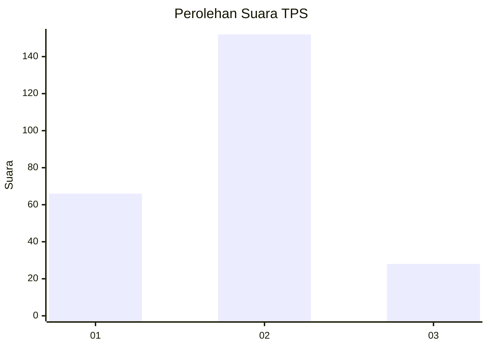
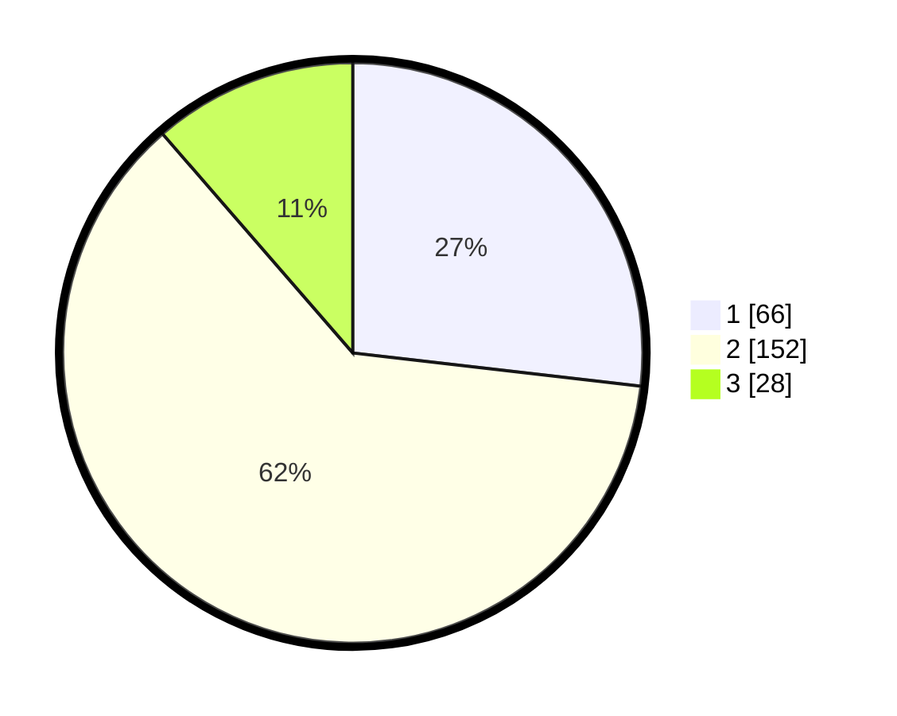

# Hasil

## Grafik

## Tabel

| No. | Nama Paslon    | Suara | Suara (raw) | Persentase |
|:--- |:-------------- | -----:| -----------:| ----------:|
| 1   | ANIES MUHAIMIN | 66    | [66][p-1]   | 26,83      |
| 2   | PRABOWO GIBRAN | 152   | [152][p-2]  | 61,79      |
| 3   | GANJAR MAHFUD  | 28    | [28][p-3]   | 11,38      |

[p-1]: https://github.com/gigit-pemilu/pemilu-2024/blob/main/pilpres/hitung-suara/sub/35-jawa-timur/sub/16-mojokerto/sub/08-mojosari/sub/2016-kebondalem/sub/009-tps/sub/paslon-1.txt
[p-2]: https://github.com/gigit-pemilu/pemilu-2024/blob/main/pilpres/hitung-suara/sub/35-jawa-timur/sub/16-mojokerto/sub/08-mojosari/sub/2016-kebondalem/sub/009-tps/sub/paslon-2.txt
[p-3]: https://github.com/gigit-pemilu/pemilu-2024/blob/main/pilpres/hitung-suara/sub/35-jawa-timur/sub/16-mojokerto/sub/08-mojosari/sub/2016-kebondalem/sub/009-tps/sub/paslon-3.txt

## Foto C Plano

https://sirekap-obj-formc.kpu.go.id/32b0/pemilu/ppwp/35/16/08/20/16/3516082016009-20240217-195436--53846724-1437-414e-8f83-03dfe43da3d1.jpg

https://sirekap-obj-formc.kpu.go.id/32b0/pemilu/ppwp/35/16/08/20/16/3516082016009-20240217-195430--f7eef252-5c72-4e8d-bb5a-f2d1cfc1c158.jpg

https://sirekap-obj-formc.kpu.go.id/32b0/pemilu/ppwp/35/16/08/20/16/3516082016009-20240217-175650--827ff7a3-b941-4b8b-b593-37bba79493fb.jpg

## Metadata

| Key        | Value               |
| ---------- | ------------------- |
| Time Stamp | 2024-02-22 13:00:00 |

## DATA PEMILIH TETAP

Jumlah pemilih dalam DPT: **570**.
 * L: **0**.
 * P: **575**.

## DATA PENGGUNA HAK PILIH

Jumlah pengguna hak pilih dalam DPT: **577**.
 * L: **755**.
 * P: **755**.

Jumlah pengguna hak pilih dalam DPTb: **101**.
 * L: **748**.
 * P: **600**.

Jumlah pengguna hak pilih dalam DPK: **4**.
 * L: **4**.
 * P: **0**.

Jumlah pengguna hak pilih: **255**.
 * L: **116**.
 * P: **139**.

## JUMLAH SUARA SAH DAN TIDAK SAH

JUMLAH SELURUH SUARA SAH: **246**.

JUMLAH SUARA TIDAK SAH: **9**.

JUMLAH SELURUH SUARA SAH DAN SUARA TIDAK SAH: **255**.

