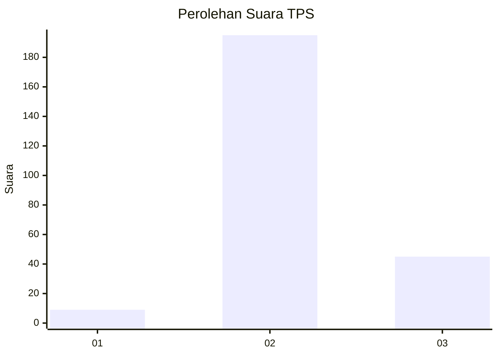

# Hasil

## Grafik

## Tabel

| No. | Nama Paslon    | Suara | Suara (raw) | Persentase |
|:--- |:-------------- | -----:| -----------:| ----------:|
| 1   | ANIES MUHAIMIN | 9     | [9][p-1]    | 3,61       |
| 2   | PRABOWO GIBRAN | 195   | [195][p-2]  | 78,31      |
| 3   | GANJAR MAHFUD  | 45    | [45][p-3]   | 18,07      |

[p-1]: https://github.com/gigit-pemilu/pemilu-2024-35-jawa-timur/blob/main/pilpres/hitung-suara/sub/35-jawa-timur/sub/16-mojokerto/sub/11-puri/sub/2005-ketemasdungus/sub/002-tps/sub/paslon-1.txt
[p-2]: https://github.com/gigit-pemilu/pemilu-2024-35-jawa-timur/blob/main/pilpres/hitung-suara/sub/35-jawa-timur/sub/16-mojokerto/sub/11-puri/sub/2005-ketemasdungus/sub/002-tps/sub/paslon-2.txt
[p-3]: https://github.com/gigit-pemilu/pemilu-2024-35-jawa-timur/blob/main/pilpres/hitung-suara/sub/35-jawa-timur/sub/16-mojokerto/sub/11-puri/sub/2005-ketemasdungus/sub/002-tps/sub/paslon-3.txt

## Foto C Plano

https://sirekap-obj-formc.kpu.go.id/76fe/pemilu/ppwp/35/16/11/20/05/3516112005002-20240214-155401--21e22b68-86b0-4a7f-951a-9c1bb5d3ad45.jpg

https://sirekap-obj-formc.kpu.go.id/76fe/pemilu/ppwp/35/16/11/20/05/3516112005002-20240215-203244--de050444-b0e4-4f87-8601-39a581074721.jpg

https://sirekap-obj-formc.kpu.go.id/76fe/pemilu/ppwp/35/16/11/20/05/3516112005002-20240215-204309--9c4c7e3d-5716-40a6-8ab4-cc969222efb7.jpg

## Metadata

| Key        | Value               |
| ---------- | ------------------- |
| Time Stamp | 2024-02-16 00:00:26 |

