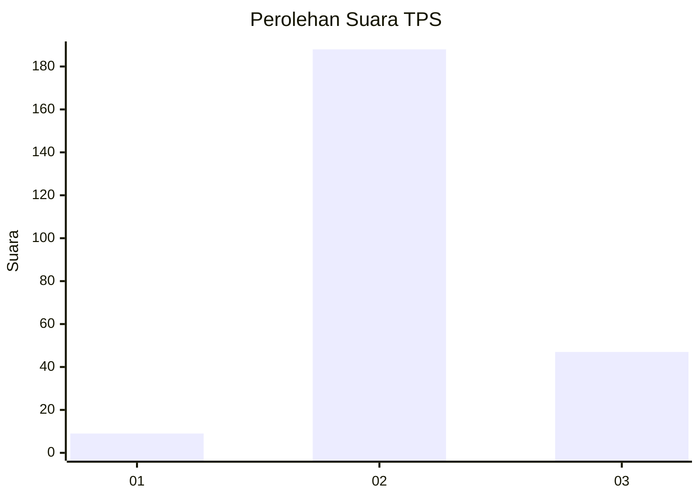
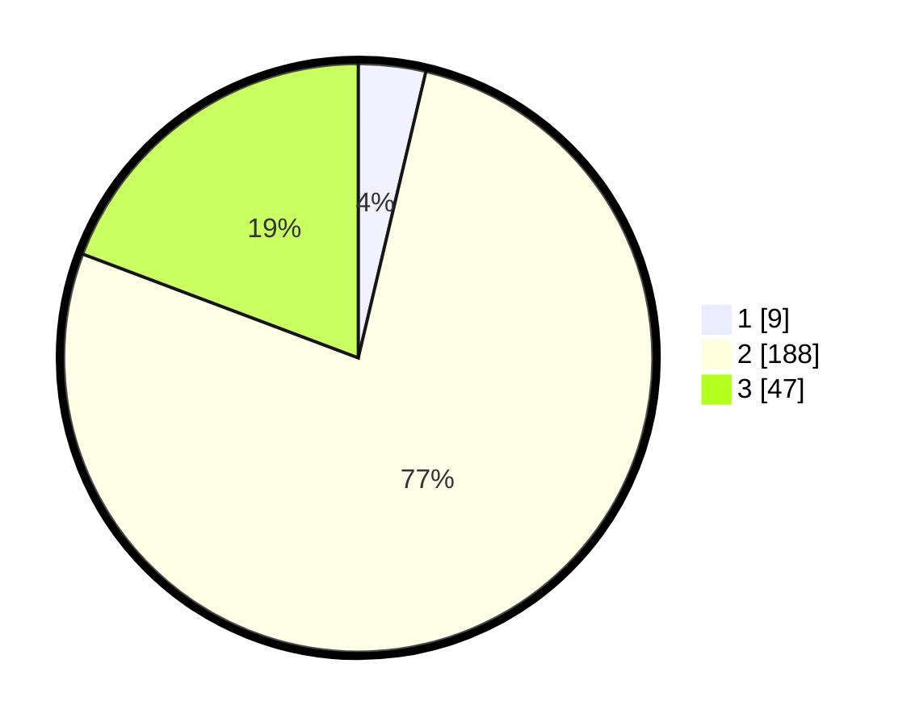

# Hasil

## Grafik

## Tabel

| No. | Nama Paslon    | Suara | Suara (raw) | Persentase |
|:--- |:-------------- | -----:| -----------:| ----------:|
| 1   | ANIES MUHAIMIN | 9     | [9][p-1]    | 3,69       |
| 2   | PRABOWO GIBRAN | 188   | [188][p-2]  | 77,05      |
| 3   | GANJAR MAHFUD  | 47    | [47][p-3]   | 19,26      |

[p-1]: https://github.com/gigit-pemilu/pemilu-2024-35-jawa-timur/blob/main/pilpres/hitung-suara/sub/35-jawa-timur/sub/16-mojokerto/sub/12-trowulan/sub/2005-pakis/sub/002-tps/sub/paslon-1.txt
[p-2]: https://github.com/gigit-pemilu/pemilu-2024-35-jawa-timur/blob/main/pilpres/hitung-suara/sub/35-jawa-timur/sub/16-mojokerto/sub/12-trowulan/sub/2005-pakis/sub/002-tps/sub/paslon-2.txt
[p-3]: https://github.com/gigit-pemilu/pemilu-2024-35-jawa-timur/blob/main/pilpres/hitung-suara/sub/35-jawa-timur/sub/16-mojokerto/sub/12-trowulan/sub/2005-pakis/sub/002-tps/sub/paslon-3.txt

## Foto C Plano

https://sirekap-obj-formc.kpu.go.id/0be9/pemilu/ppwp/35/16/12/20/05/3516122005002-20240218-100605--a4e0b07b-2a46-4dad-ae87-16495fc26eb6.jpg

https://sirekap-obj-formc.kpu.go.id/0be9/pemilu/ppwp/35/16/12/20/05/3516122005002-20240218-100447--5b4121af-a5ae-47e7-b690-4ee7988bc0d0.jpg

https://sirekap-obj-formc.kpu.go.id/0be9/pemilu/ppwp/35/16/12/20/05/3516122005002-20240218-100339--f9c9db82-d327-416e-9711-9f69dece229c.jpg

## Metadata

| Key        | Value               |
| ---------- | ------------------- |
| Time Stamp | 2024-02-26 10:00:00 |

