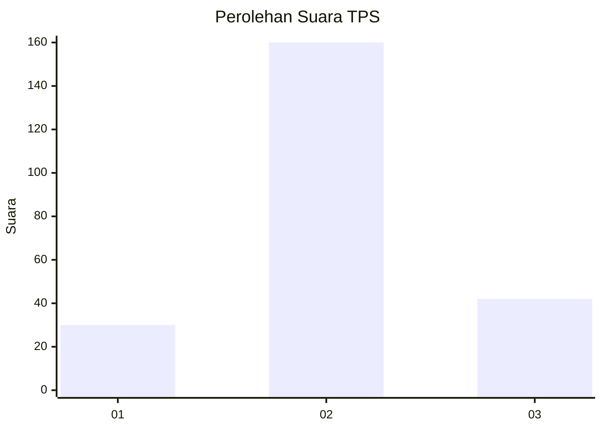
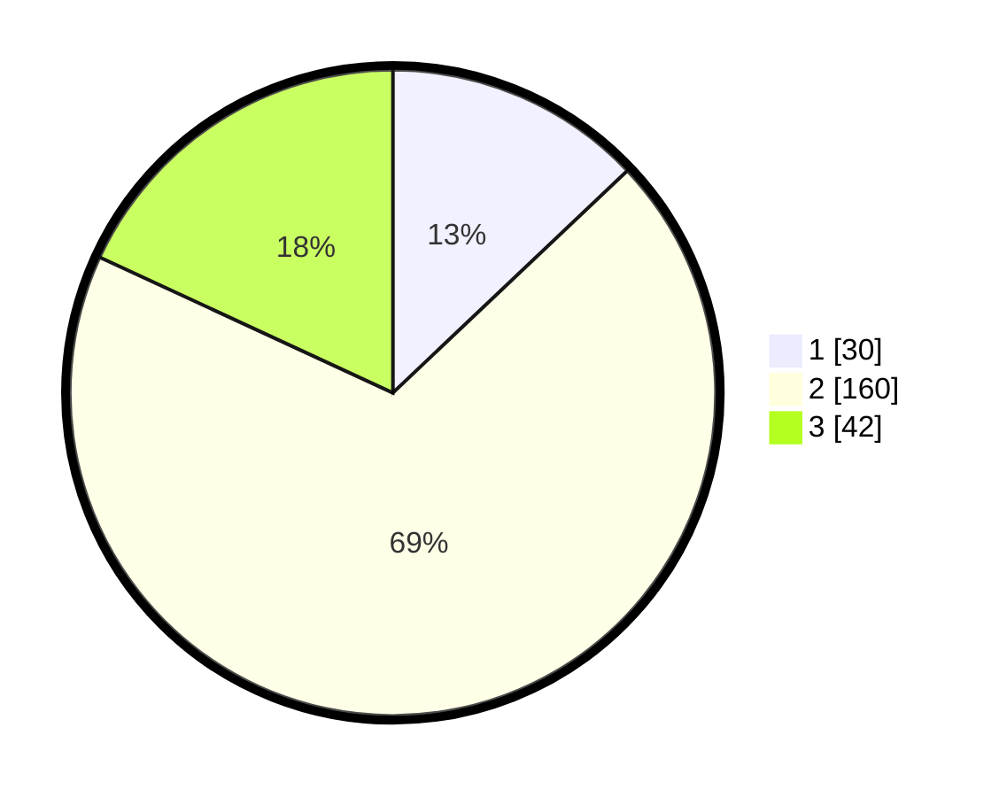

# Hasil

## Grafik

## Tabel

| No. | Nama Paslon    | Suara | Suara (raw) | Persentase |
|:--- |:-------------- | -----:| -----------:| ----------:|
| 1   | ANIES MUHAIMIN | 30    | [30][p-1]   | 12,93      |
| 2   | PRABOWO GIBRAN | 160   | [160][p-2]  | 68,97      |
| 3   | GANJAR MAHFUD  | 42    | [42][p-3]   | 18,10      |

[p-1]: https://github.com/gigit-pemilu/pemilu-2024-35-jawa-timur/blob/main/pilpres/hitung-suara/sub/35-jawa-timur/sub/16-mojokerto/sub/13-sooko/sub/2001-gemekan/sub/005-tps/sub/paslon-1.txt
[p-2]: https://github.com/gigit-pemilu/pemilu-2024-35-jawa-timur/blob/main/pilpres/hitung-suara/sub/35-jawa-timur/sub/16-mojokerto/sub/13-sooko/sub/2001-gemekan/sub/005-tps/sub/paslon-2.txt
[p-3]: https://github.com/gigit-pemilu/pemilu-2024-35-jawa-timur/blob/main/pilpres/hitung-suara/sub/35-jawa-timur/sub/16-mojokerto/sub/13-sooko/sub/2001-gemekan/sub/005-tps/sub/paslon-3.txt

## Foto C Plano

https://sirekap-obj-formc.kpu.go.id/7585/pemilu/ppwp/35/16/13/20/01/3516132001005-20240216-104423--67e050f1-f234-4613-a556-b13de780c52e.jpg

https://sirekap-obj-formc.kpu.go.id/7585/pemilu/ppwp/35/16/13/20/01/3516132001005-20240216-104321--33b955ff-e1cf-46b1-89e9-ca24580210d7.jpg

https://sirekap-obj-formc.kpu.go.id/7585/pemilu/ppwp/35/16/13/20/01/3516132001005-20240216-104914--ca16fbcf-b8ee-4552-a2d8-caed86358928.jpg

## Metadata

| Key        | Value               |
| ---------- | ------------------- |
| Time Stamp | 2024-02-16 16:25:10 |

## DATA PEMILIH TETAP

Jumlah pemilih dalam DPT: **269**.
 * L: **240**.
 * P: **124**.

## DATA PENGGUNA HAK PILIH

Jumlah pengguna hak pilih dalam DPT: **231**.
 * L: **427**.
 * P: **503**.

Jumlah pengguna hak pilih dalam DPTb: **3**.
 * L: **887**.
 * P: **82**.

Jumlah pengguna hak pilih dalam DPK: **2**.
 * L: **801**.
 * P: **1**.

Jumlah pengguna hak pilih: **236**.
 * L: **125**.
 * P: **172**.

## JUMLAH SUARA SAH DAN TIDAK SAH

JUMLAH SELURUH SUARA SAH: **232**.

JUMLAH SUARA TIDAK SAH: **4**.

JUMLAH SELURUH SUARA SAH DAN SUARA TIDAK SAH: **236**.

