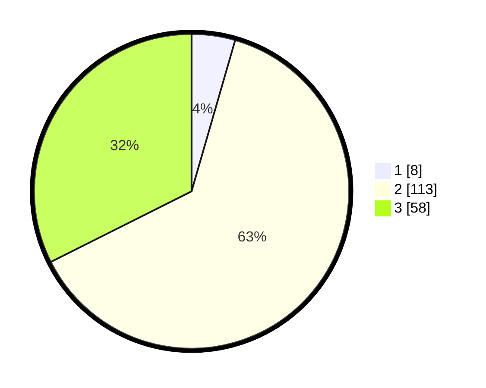

# Hasil

## Grafik

## Tabel

| No. | Nama Paslon    | Suara | Suara (raw) | Persentase |
|:--- |:-------------- | -----:| -----------:| ----------:|
| 1   | ANIES MUHAIMIN | 8     | [8][p-1]    | 4,47       |
| 2   | PRABOWO GIBRAN | 113   | [113][p-2]  | 63,13      |
| 3   | GANJAR MAHFUD  | 58    | [58][p-3]   | 32,40      |

[p-1]: https://github.com/gigit-pemilu/pemilu-2024/blob/main/pilpres/hitung-suara/sub/35-jawa-timur/sub/16-mojokerto/sub/13-sooko/sub/2004-kedungmaling/sub/002-tps/sub/paslon-1.txt
[p-2]: https://github.com/gigit-pemilu/pemilu-2024/blob/main/pilpres/hitung-suara/sub/35-jawa-timur/sub/16-mojokerto/sub/13-sooko/sub/2004-kedungmaling/sub/002-tps/sub/paslon-2.txt
[p-3]: https://github.com/gigit-pemilu/pemilu-2024/blob/main/pilpres/hitung-suara/sub/35-jawa-timur/sub/16-mojokerto/sub/13-sooko/sub/2004-kedungmaling/sub/002-tps/sub/paslon-3.txt

## Foto C Plano

https://sirekap-obj-formc.kpu.go.id/9741/pemilu/ppwp/35/16/13/20/04/3516132004002-20240214-141859--dd22e409-1d0b-44b1-a93c-ba914356591a.jpg

https://sirekap-obj-formc.kpu.go.id/9741/pemilu/ppwp/35/16/13/20/04/3516132004002-20240214-141743--02ed24e2-90ec-49d2-9cb3-ab2addca7924.jpg

https://sirekap-obj-formc.kpu.go.id/9741/pemilu/ppwp/35/16/13/20/04/3516132004002-20240214-141855--5dbcc853-d2d8-48b8-a107-51d2fb85063f.jpg

## Metadata

| Key        | Value               |
| ---------- | ------------------- |
| Time Stamp | 2024-02-16 01:00:27 |

