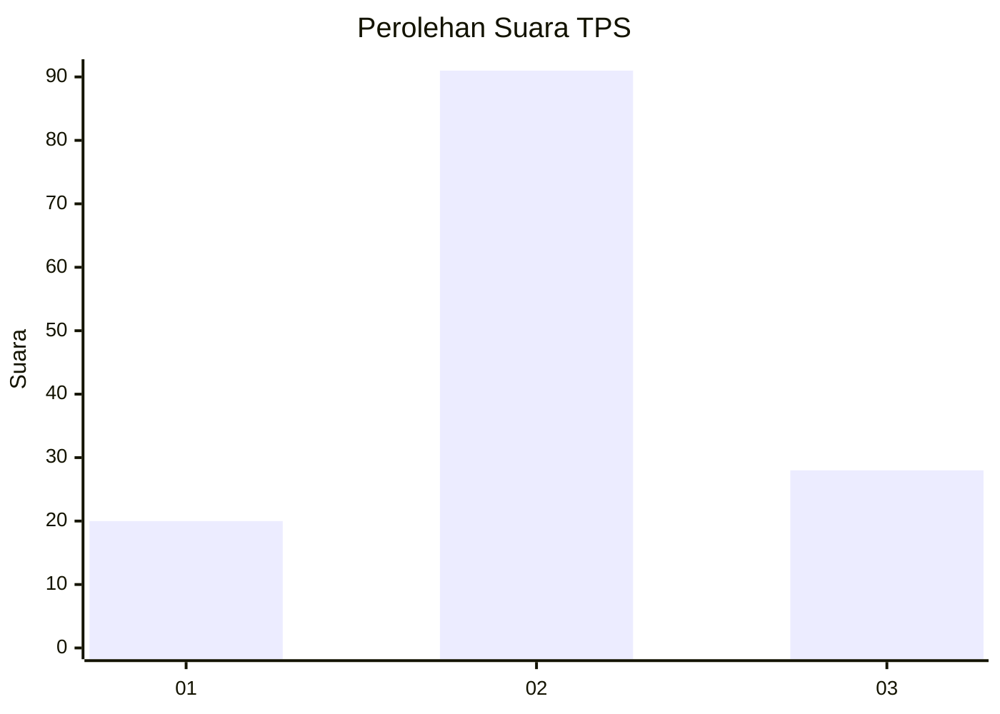
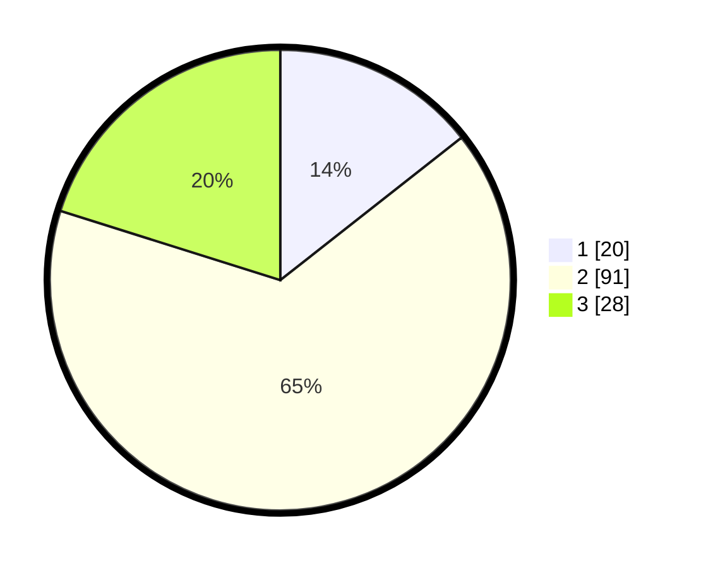

# Hasil

## Grafik

## Tabel

| No. | Nama Paslon    | Suara | Suara (raw) | Persentase |
|:--- |:-------------- | -----:| -----------:| ----------:|
| 1   | ANIES MUHAIMIN | 20    | [20][p-1]   | 14,39      |
| 2   | PRABOWO GIBRAN | 91    | [91][p-2]   | 65,47      |
| 3   | GANJAR MAHFUD  | 28    | [28][p-3]   | 20,14      |

[p-1]: https://github.com/gigit-pemilu/pemilu-2024-35-jawa-timur/blob/main/pilpres/hitung-suara/sub/35-jawa-timur/sub/16-mojokerto/sub/13-sooko/sub/2010-sooko/sub/007-tps/sub/paslon-1.txt
[p-2]: https://github.com/gigit-pemilu/pemilu-2024-35-jawa-timur/blob/main/pilpres/hitung-suara/sub/35-jawa-timur/sub/16-mojokerto/sub/13-sooko/sub/2010-sooko/sub/007-tps/sub/paslon-2.txt
[p-3]: https://github.com/gigit-pemilu/pemilu-2024-35-jawa-timur/blob/main/pilpres/hitung-suara/sub/35-jawa-timur/sub/16-mojokerto/sub/13-sooko/sub/2010-sooko/sub/007-tps/sub/paslon-3.txt

## Foto C Plano

https://sirekap-obj-formc.kpu.go.id/c4ae/pemilu/ppwp/35/16/13/20/10/3516132010007-20240216-081644--49bba7be-58ed-4687-aa2a-a16e380a74e9.jpg

https://sirekap-obj-formc.kpu.go.id/c4ae/pemilu/ppwp/35/16/13/20/10/3516132010007-20240214-155058--3a1be833-d9aa-452f-8c2c-7c7eb39da258.jpg

https://sirekap-obj-formc.kpu.go.id/c4ae/pemilu/ppwp/35/16/13/20/10/3516132010007-20240214-155256--f239d3f4-0a5d-4d9d-ad87-39ccbb52857c.jpg

## Metadata

| Key        | Value               |
| ---------- | ------------------- |
| Time Stamp | 2024-02-16 08:30:27 |

