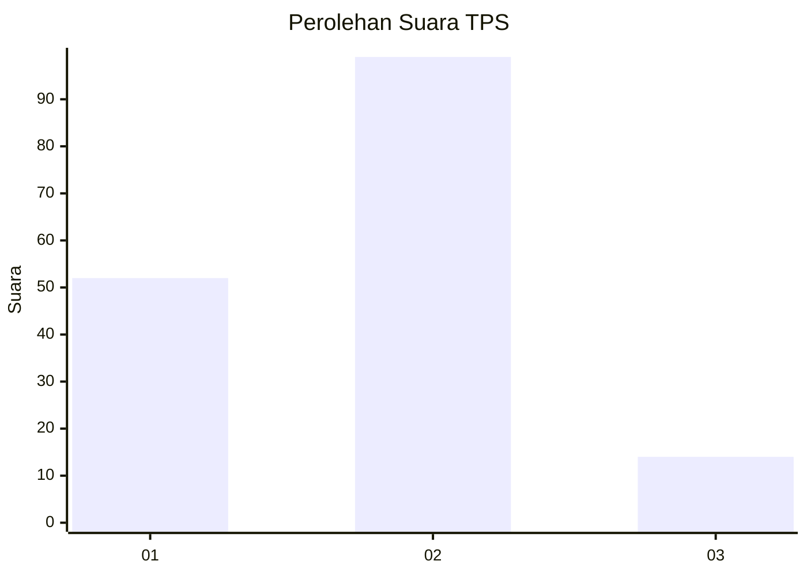
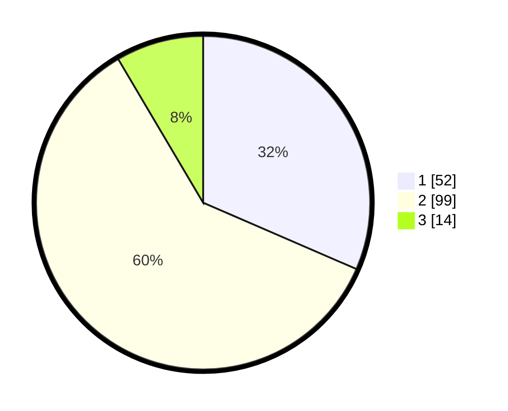

# Hasil

## Grafik

## Tabel

| No. | Nama Paslon    | Suara | Suara (raw) | Persentase |
|:--- |:-------------- | -----:| -----------:| ----------:|
| 1   | ANIES MUHAIMIN | 52    | [52][p-1]   | 31,52      |
| 2   | PRABOWO GIBRAN | 99    | [99][p-2]   | 60,00      |
| 3   | GANJAR MAHFUD  | 14    | [14][p-3]   | 8,48       |

[p-1]: https://github.com/gigit-pemilu/pemilu-2024-35-jawa-timur/blob/main/pilpres/hitung-suara/sub/35-jawa-timur/sub/16-mojokerto/sub/14-gedeg/sub/2003-gempolkerep/sub/005-tps/sub/paslon-1.txt
[p-2]: https://github.com/gigit-pemilu/pemilu-2024-35-jawa-timur/blob/main/pilpres/hitung-suara/sub/35-jawa-timur/sub/16-mojokerto/sub/14-gedeg/sub/2003-gempolkerep/sub/005-tps/sub/paslon-2.txt
[p-3]: https://github.com/gigit-pemilu/pemilu-2024-35-jawa-timur/blob/main/pilpres/hitung-suara/sub/35-jawa-timur/sub/16-mojokerto/sub/14-gedeg/sub/2003-gempolkerep/sub/005-tps/sub/paslon-3.txt

## Foto C Plano

https://sirekap-obj-formc.kpu.go.id/7ea3/pemilu/ppwp/35/16/14/20/03/3516142003005-20240214-234855--21f15faf-c2bd-4f1a-8661-9b2b11c10a00.jpg

https://sirekap-obj-formc.kpu.go.id/7ea3/pemilu/ppwp/35/16/14/20/03/3516142003005-20240215-003946--e50c03de-f5e1-4868-ac79-fc55853b7207.jpg

https://sirekap-obj-formc.kpu.go.id/7ea3/pemilu/ppwp/35/16/14/20/03/3516142003005-20240215-004026--e1c6677a-0727-42b5-8689-304f7ec55ffd.jpg

## Metadata

| Key        | Value               |
| ---------- | ------------------- |
| Time Stamp | 2024-02-15 23:29:50 |

