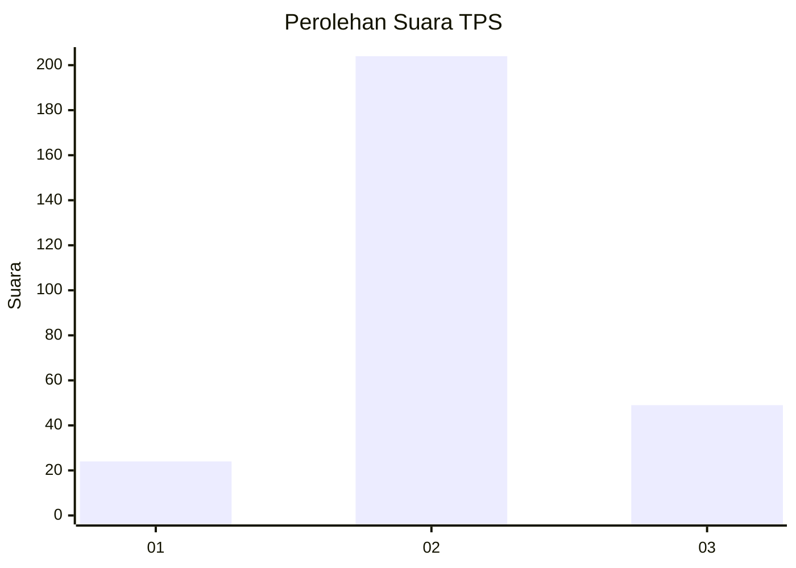
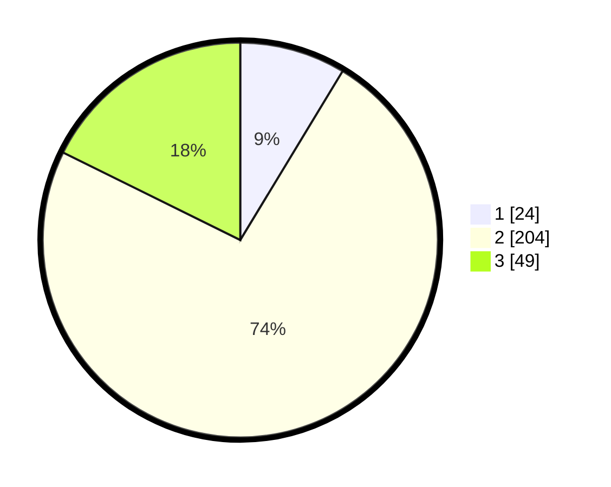

# Hasil

## Grafik

## Tabel

| No. | Nama Paslon    | Suara | Suara (raw) | Persentase |
|:--- |:-------------- | -----:| -----------:| ----------:|
| 1   | ANIES MUHAIMIN | 24    | [24][p-1]   | 8,66       |
| 2   | PRABOWO GIBRAN | 204   | [204][p-2]  | 73,65      |
| 3   | GANJAR MAHFUD  | 49    | [49][p-3]   | 17,69      |

[p-1]: https://github.com/gigit-pemilu/pemilu-2024/blob/main/pilpres/hitung-suara/sub/35-jawa-timur/sub/16-mojokerto/sub/14-gedeg/sub/2007-kemantren/sub/005-tps/sub/paslon-1.txt
[p-2]: https://github.com/gigit-pemilu/pemilu-2024/blob/main/pilpres/hitung-suara/sub/35-jawa-timur/sub/16-mojokerto/sub/14-gedeg/sub/2007-kemantren/sub/005-tps/sub/paslon-2.txt
[p-3]: https://github.com/gigit-pemilu/pemilu-2024/blob/main/pilpres/hitung-suara/sub/35-jawa-timur/sub/16-mojokerto/sub/14-gedeg/sub/2007-kemantren/sub/005-tps/sub/paslon-3.txt

## Foto C Plano

https://sirekap-obj-formc.kpu.go.id/457d/pemilu/ppwp/35/16/14/20/07/3516142007005-20240218-000441--93b3767d-8262-4ab0-bfc5-06345c765e49.jpg

https://sirekap-obj-formc.kpu.go.id/457d/pemilu/ppwp/35/16/14/20/07/3516142007005-20240218-002453--4a40cc7b-ac38-460f-8f23-e1b55d0b02da.jpg

https://sirekap-obj-formc.kpu.go.id/457d/pemilu/ppwp/35/16/14/20/07/3516142007005-20240218-003144--d35ad752-560f-471c-829a-f2c217e06e92.jpg

## Metadata

| Key        | Value               |
| ---------- | ------------------- |
| Time Stamp | 2024-02-19 20:00:00 |

## DATA PEMILIH TETAP

Jumlah pemilih dalam DPT: **255**.
 * L: **122**.
 * P: **133**.

## DATA PENGGUNA HAK PILIH

Jumlah pengguna hak pilih dalam DPT: **252**.
 * L: **117**.
 * P: **135**.

Jumlah pengguna hak pilih dalam DPTb: **0**.
 * L: **0**.
 * P: **0**.

Jumlah pengguna hak pilih dalam DPK: **27**.
 * L: **14**.
 * P: **13**.

Jumlah pengguna hak pilih: **279**.
 * L: **131**.
 * P: **148**.

## JUMLAH SUARA SAH DAN TIDAK SAH

JUMLAH SELURUH SUARA SAH: **277**.

JUMLAH SUARA TIDAK SAH: **2**.

JUMLAH SELURUH SUARA SAH DAN SUARA TIDAK SAH: **279**.

