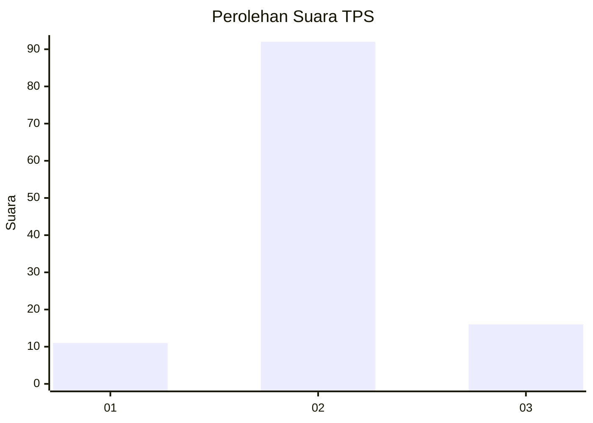
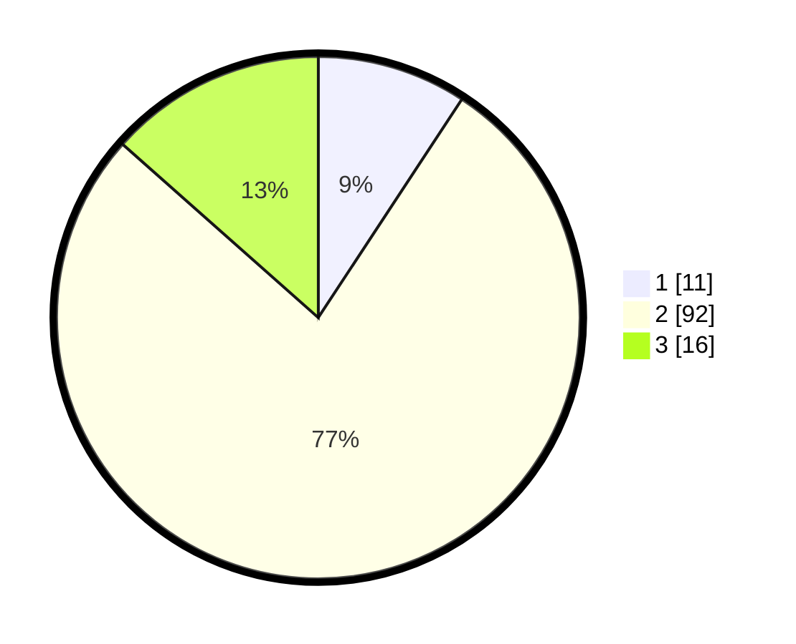

# Hasil

## Grafik

## Tabel

| No. | Nama Paslon    | Suara | Suara (raw) | Persentase |
|:--- |:-------------- | -----:| -----------:| ----------:|
| 1   | ANIES MUHAIMIN | 11    | [11][p-1]   | 9,24       |
| 2   | PRABOWO GIBRAN | 92    | [92][p-2]   | 77,31      |
| 3   | GANJAR MAHFUD  | 16    | [16][p-3]   | 13,45      |

[p-1]: https://github.com/gigit-pemilu/pemilu-2024/blob/main/pilpres/hitung-suara/sub/35-jawa-timur/sub/16-mojokerto/sub/14-gedeg/sub/2009-sidoharjo/sub/016-tps/sub/paslon-1.txt
[p-2]: https://github.com/gigit-pemilu/pemilu-2024/blob/main/pilpres/hitung-suara/sub/35-jawa-timur/sub/16-mojokerto/sub/14-gedeg/sub/2009-sidoharjo/sub/016-tps/sub/paslon-2.txt
[p-3]: https://github.com/gigit-pemilu/pemilu-2024/blob/main/pilpres/hitung-suara/sub/35-jawa-timur/sub/16-mojokerto/sub/14-gedeg/sub/2009-sidoharjo/sub/016-tps/sub/paslon-3.txt

## Foto C Plano

https://sirekap-obj-formc.kpu.go.id/26d0/pemilu/ppwp/35/16/14/20/09/3516142009016-20240215-204551--83207987-cff6-4a18-84f1-5169629261c6.jpg

https://sirekap-obj-formc.kpu.go.id/26d0/pemilu/ppwp/35/16/14/20/09/3516142009016-20240215-194922--237bd4bc-d309-4408-ad16-9422648b3255.jpg

https://sirekap-obj-formc.kpu.go.id/26d0/pemilu/ppwp/35/16/14/20/09/3516142009016-20240215-195144--9d33cc13-c139-4963-b927-0b67acd9d971.jpg

## Metadata

| Key        | Value               |
| ---------- | ------------------- |
| Time Stamp | 2024-02-16 00:30:27 |

