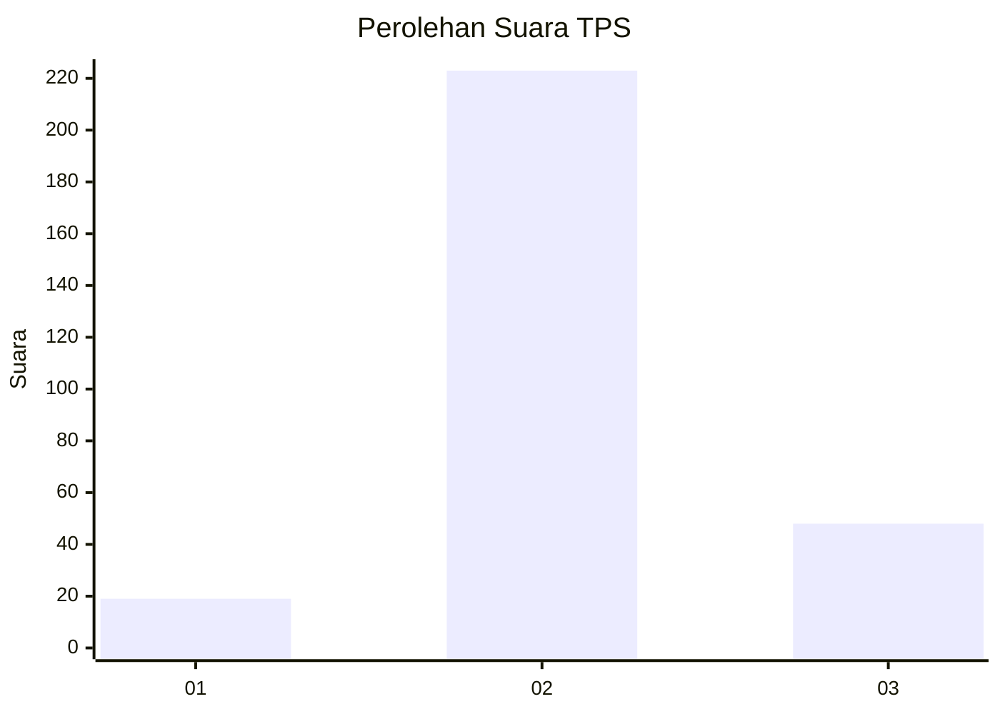
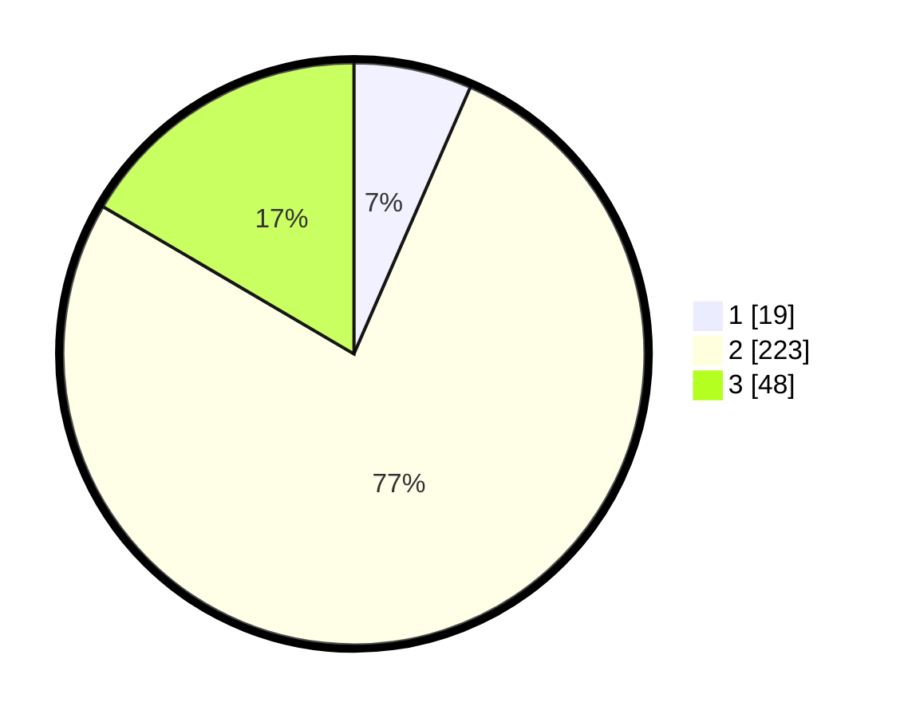

# Hasil

## Grafik

## Tabel

| No. | Nama Paslon    | Suara | Suara (raw) | Persentase |
|:--- |:-------------- | -----:| -----------:| ----------:|
| 1   | ANIES MUHAIMIN | 19    | [19][p-1]   | 6,55       |
| 2   | PRABOWO GIBRAN | 223   | [223][p-2]  | 76,90      |
| 3   | GANJAR MAHFUD  | 48    | [48][p-3]   | 16,55      |

[p-1]: https://github.com/gigit-pemilu/pemilu-2024/blob/main/pilpres/hitung-suara/sub/35-jawa-timur/sub/16-mojokerto/sub/15-kemlagi/sub/2014-tanjungan/sub/004-tps/sub/paslon-1.txt
[p-2]: https://github.com/gigit-pemilu/pemilu-2024/blob/main/pilpres/hitung-suara/sub/35-jawa-timur/sub/16-mojokerto/sub/15-kemlagi/sub/2014-tanjungan/sub/004-tps/sub/paslon-2.txt
[p-3]: https://github.com/gigit-pemilu/pemilu-2024/blob/main/pilpres/hitung-suara/sub/35-jawa-timur/sub/16-mojokerto/sub/15-kemlagi/sub/2014-tanjungan/sub/004-tps/sub/paslon-3.txt

## Foto C Plano

https://sirekap-obj-formc.kpu.go.id/201d/pemilu/ppwp/35/16/15/20/14/3516152014004-20240216-042943--91ec6462-ee88-44de-a6b3-19b77da8522b.jpg

https://sirekap-obj-formc.kpu.go.id/201d/pemilu/ppwp/35/16/15/20/14/3516152014004-20240216-045121--1a1ee42c-69e8-4cff-af43-440fb7b97c05.jpg

https://sirekap-obj-formc.kpu.go.id/201d/pemilu/ppwp/35/16/15/20/14/3516152014004-20240216-184612--e10629aa-bb16-47a4-aa15-9c1672dab2ff.jpg

## Metadata

| Key        | Value               |
| ---------- | ------------------- |
| Time Stamp | 2024-02-19 06:16:00 |

## DATA PEMILIH TETAP

Jumlah pemilih dalam DPT: **295**.
 * L: **145**.
 * P: **150**.

## DATA PENGGUNA HAK PILIH

Jumlah pengguna hak pilih dalam DPT: **263**.
 * L: **124**.
 * P: **139**.

Jumlah pengguna hak pilih dalam DPTb: **2**.
 * L: **0**.
 * P: **2**.

Jumlah pengguna hak pilih dalam DPK: **35**.
 * L: **19**.
 * P: **16**.

Jumlah pengguna hak pilih: **300**.
 * L: **143**.
 * P: **157**.

## JUMLAH SUARA SAH DAN TIDAK SAH

JUMLAH SELURUH SUARA SAH: **290**.

JUMLAH SUARA TIDAK SAH: **10**.

JUMLAH SELURUH SUARA SAH DAN SUARA TIDAK SAH: **300**.

