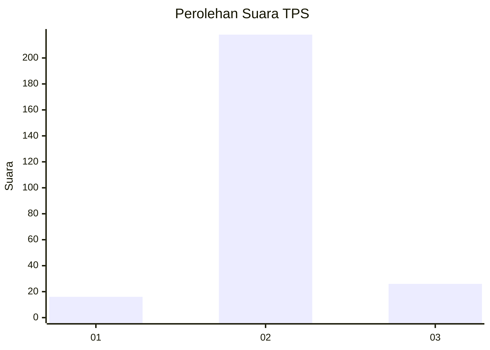
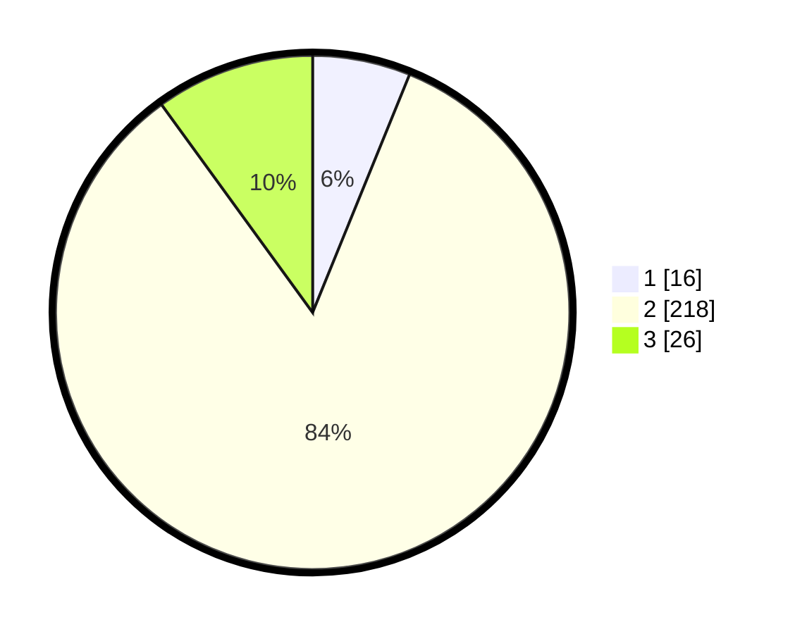

# Hasil

## Grafik

## Tabel

| No. | Nama Paslon    | Suara | Suara (raw) | Persentase |
|:--- |:-------------- | -----:| -----------:| ----------:|
| 1   | ANIES MUHAIMIN | 16    | [16][p-1]   | 6,15       |
| 2   | PRABOWO GIBRAN | 218   | [218][p-2]  | 83,85      |
| 3   | GANJAR MAHFUD  | 26    | [26][p-3]   | 10,00      |

[p-1]: https://github.com/gigit-pemilu/pemilu-2024-35-jawa-timur/blob/main/pilpres/hitung-suara/sub/35-jawa-timur/sub/16-mojokerto/sub/15-kemlagi/sub/2016-mojodadi/sub/002-tps/sub/paslon-1.txt
[p-2]: https://github.com/gigit-pemilu/pemilu-2024-35-jawa-timur/blob/main/pilpres/hitung-suara/sub/35-jawa-timur/sub/16-mojokerto/sub/15-kemlagi/sub/2016-mojodadi/sub/002-tps/sub/paslon-2.txt
[p-3]: https://github.com/gigit-pemilu/pemilu-2024-35-jawa-timur/blob/main/pilpres/hitung-suara/sub/35-jawa-timur/sub/16-mojokerto/sub/15-kemlagi/sub/2016-mojodadi/sub/002-tps/sub/paslon-3.txt

## Foto C Plano

https://sirekap-obj-formc.kpu.go.id/d363/pemilu/ppwp/35/16/15/20/16/3516152016002-20240218-213106--c85b5e1f-793d-4da2-8d2f-ff1c6fcb5cba.jpg

https://sirekap-obj-formc.kpu.go.id/d363/pemilu/ppwp/35/16/15/20/16/3516152016002-20240218-214911--acfd07e2-985c-4ddc-944e-9ebfd536b99c.jpg

https://sirekap-obj-formc.kpu.go.id/d363/pemilu/ppwp/35/16/15/20/16/3516152016002-20240218-214909--dc210927-5fda-4134-9991-54020f7f2a73.jpg

## Metadata

| Key        | Value               |
| ---------- | ------------------- |
| Time Stamp | 2024-02-19 15:00:00 |

## DATA PEMILIH TETAP

Jumlah pemilih dalam DPT: **288**.
 * L: **542**.
 * P: **446**.

## DATA PENGGUNA HAK PILIH

Jumlah pengguna hak pilih dalam DPT: **262**.
 * L: **530**.
 * P: **632**.

Jumlah pengguna hak pilih dalam DPTb: **4**.
 * L: **0**.
 * P: **1**.

Jumlah pengguna hak pilih dalam DPK: **2**.
 * L: **4**.
 * P: **1**.

Jumlah pengguna hak pilih: **265**.
 * L: **631**.
 * P: **434**.

## JUMLAH SUARA SAH DAN TIDAK SAH

JUMLAH SELURUH SUARA SAH: **260**.

JUMLAH SUARA TIDAK SAH: **5**.

JUMLAH SELURUH SUARA SAH DAN SUARA TIDAK SAH: **265**.

