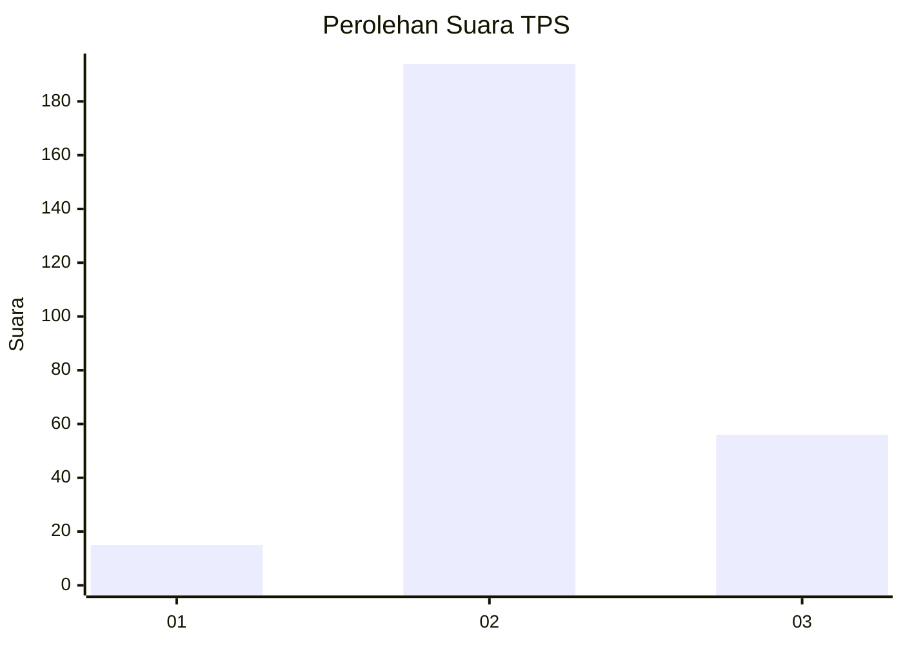

# Hasil

## Grafik

## Tabel

| No. | Nama Paslon    | Suara | Suara (raw) | Persentase |
|:--- |:-------------- | -----:| -----------:| ----------:|
| 1   | ANIES MUHAIMIN | 15    | [15][p-1]   | 5,66       |
| 2   | PRABOWO GIBRAN | 194   | [194][p-2]  | 73,21      |
| 3   | GANJAR MAHFUD  | 56    | [56][p-3]   | 21,13      |

[p-1]: https://github.com/gigit-pemilu/pemilu-2024/blob/main/pilpres/hitung-suara/sub/35-jawa-timur/sub/16-mojokerto/sub/16-jetis/sub/2004-ngabar/sub/006-tps/sub/paslon-1.txt
[p-2]: https://github.com/gigit-pemilu/pemilu-2024/blob/main/pilpres/hitung-suara/sub/35-jawa-timur/sub/16-mojokerto/sub/16-jetis/sub/2004-ngabar/sub/006-tps/sub/paslon-2.txt
[p-3]: https://github.com/gigit-pemilu/pemilu-2024/blob/main/pilpres/hitung-suara/sub/35-jawa-timur/sub/16-mojokerto/sub/16-jetis/sub/2004-ngabar/sub/006-tps/sub/paslon-3.txt

## Foto C Plano

https://sirekap-obj-formc.kpu.go.id/c32e/pemilu/ppwp/35/16/16/20/04/3516162004006-20240218-100649--6eb0aab6-a384-4f25-ab58-63c9ea4034f6.jpg

https://sirekap-obj-formc.kpu.go.id/c32e/pemilu/ppwp/35/16/16/20/04/3516162004006-20240218-103221--4be9ecba-9b63-4b34-ba2d-41e616022316.jpg

https://sirekap-obj-formc.kpu.go.id/c32e/pemilu/ppwp/35/16/16/20/04/3516162004006-20240218-101110--ad8fd181-75e0-417e-ac97-0778295e72bc.jpg

## Metadata

| Key        | Value               |
| ---------- | ------------------- |
| Time Stamp | 2024-02-19 06:16:00 |

