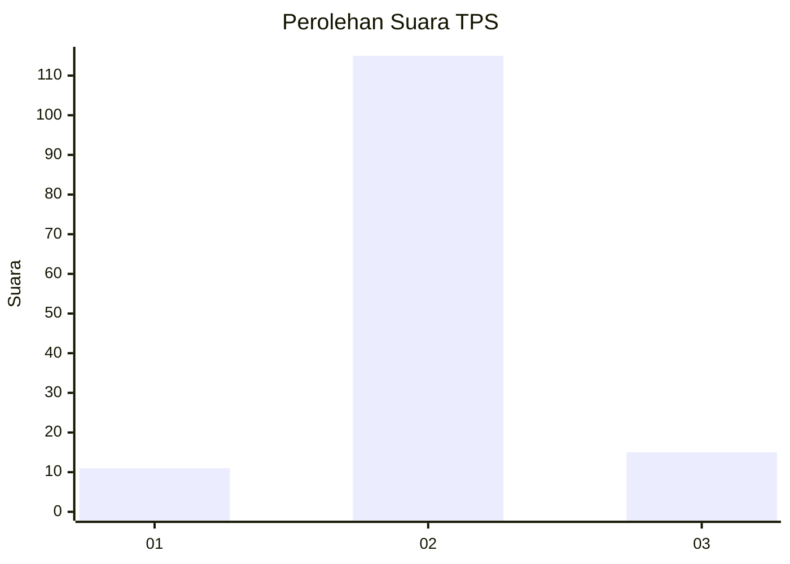
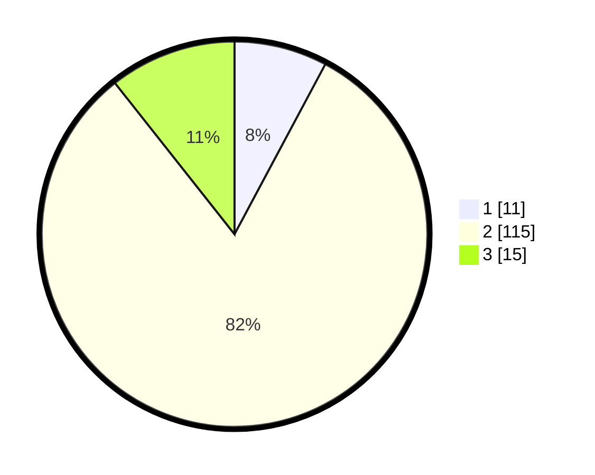

# Hasil

## Grafik

## Tabel

| No. | Nama Paslon    | Suara | Suara (raw) | Persentase |
|:--- |:-------------- | -----:| -----------:| ----------:|
| 1   | ANIES MUHAIMIN | 11    | [11][p-1]   | 7,80       |
| 2   | PRABOWO GIBRAN | 115   | [115][p-2]  | 81,56      |
| 3   | GANJAR MAHFUD  | 15    | [15][p-3]   | 10,64      |

[p-1]: https://github.com/gigit-pemilu/pemilu-2024-35-jawa-timur/blob/main/pilpres/hitung-suara/sub/35-jawa-timur/sub/16-mojokerto/sub/16-jetis/sub/2010-bendung/sub/012-tps/sub/paslon-1.txt
[p-2]: https://github.com/gigit-pemilu/pemilu-2024-35-jawa-timur/blob/main/pilpres/hitung-suara/sub/35-jawa-timur/sub/16-mojokerto/sub/16-jetis/sub/2010-bendung/sub/012-tps/sub/paslon-2.txt
[p-3]: https://github.com/gigit-pemilu/pemilu-2024-35-jawa-timur/blob/main/pilpres/hitung-suara/sub/35-jawa-timur/sub/16-mojokerto/sub/16-jetis/sub/2010-bendung/sub/012-tps/sub/paslon-3.txt

## Foto C Plano

https://sirekap-obj-formc.kpu.go.id/daa1/pemilu/ppwp/35/16/16/20/10/3516162010012-20240219-141823--5556b674-1158-46f8-9438-5d28c3c0d453.jpg

https://sirekap-obj-formc.kpu.go.id/daa1/pemilu/ppwp/35/16/16/20/10/3516162010012-20240219-151954--4cb67ead-07e4-4344-ac74-59b618828962.jpg

https://sirekap-obj-formc.kpu.go.id/daa1/pemilu/ppwp/35/16/16/20/10/3516162010012-20240219-152029--d0f7ad86-947e-42b0-8e4f-a9fdeea738dd.jpg

## Metadata

| Key        | Value               |
| ---------- | ------------------- |
| Time Stamp | 2024-02-19 21:00:00 |

