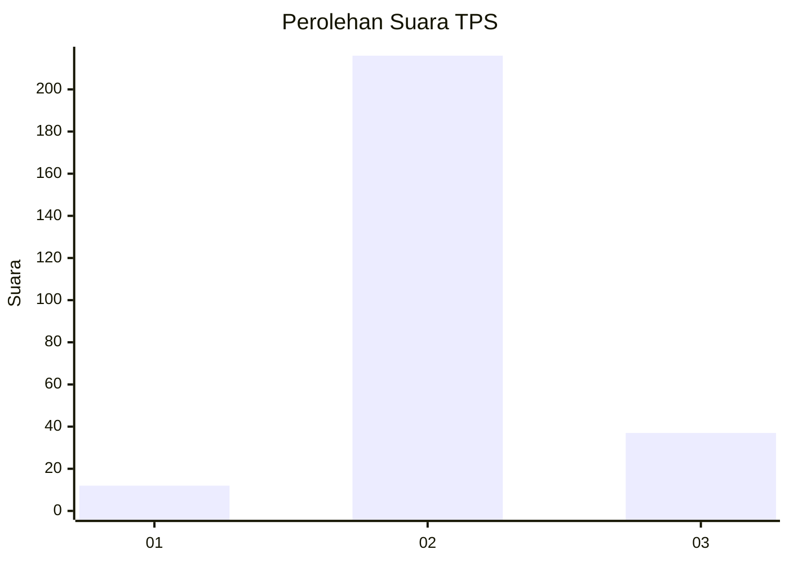
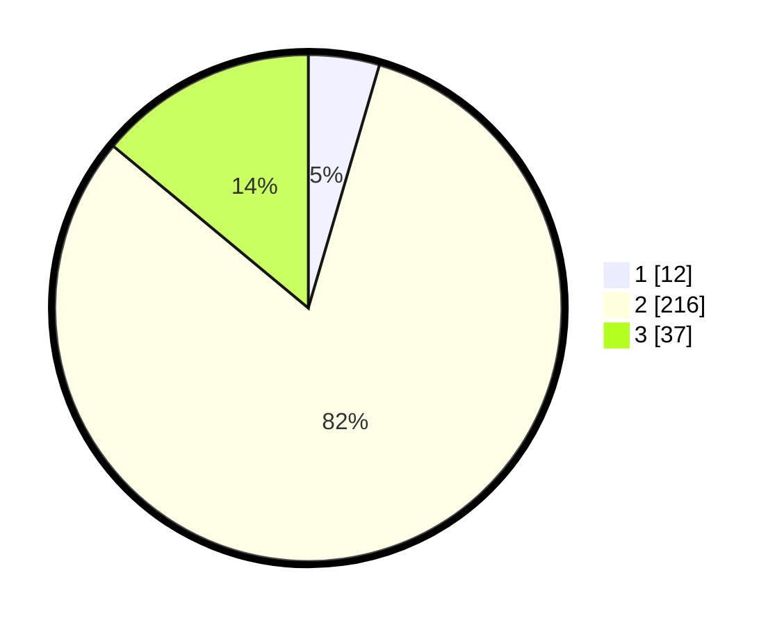

# Hasil

## Grafik

## Tabel

| No. | Nama Paslon    | Suara | Suara (raw) | Persentase |
|:--- |:-------------- | -----:| -----------:| ----------:|
| 1   | ANIES MUHAIMIN | 12    | [12][p-1]   | 4,53       |
| 2   | PRABOWO GIBRAN | 216   | [216][p-2]  | 81,51      |
| 3   | GANJAR MAHFUD  | 37    | [37][p-3]   | 13,96      |

[p-1]: https://github.com/gigit-pemilu/pemilu-2024/blob/main/pilpres/hitung-suara/sub/35-jawa-timur/sub/16-mojokerto/sub/17-dawarblandong/sub/2002-simongagrok/sub/013-tps/sub/paslon-1.txt
[p-2]: https://github.com/gigit-pemilu/pemilu-2024/blob/main/pilpres/hitung-suara/sub/35-jawa-timur/sub/16-mojokerto/sub/17-dawarblandong/sub/2002-simongagrok/sub/013-tps/sub/paslon-2.txt
[p-3]: https://github.com/gigit-pemilu/pemilu-2024/blob/main/pilpres/hitung-suara/sub/35-jawa-timur/sub/16-mojokerto/sub/17-dawarblandong/sub/2002-simongagrok/sub/013-tps/sub/paslon-3.txt

## Foto C Plano

https://sirekap-obj-formc.kpu.go.id/55c8/pemilu/ppwp/35/16/17/20/02/3516172002013-20240215-170937--c6ed234d-4244-42da-9729-fcabb8e311a3.jpg

https://sirekap-obj-formc.kpu.go.id/55c8/pemilu/ppwp/35/16/17/20/02/3516172002013-20240215-101224--5c0e443d-1f02-4371-9519-3209ce160a1e.jpg

https://sirekap-obj-formc.kpu.go.id/55c8/pemilu/ppwp/35/16/17/20/02/3516172002013-20240216-102441--0770f3b0-4b09-474b-878e-6882c3be6713.jpg

## Metadata

| Key        | Value               |
| ---------- | ------------------- |
| Time Stamp | 2024-02-16 10:30:29 |

