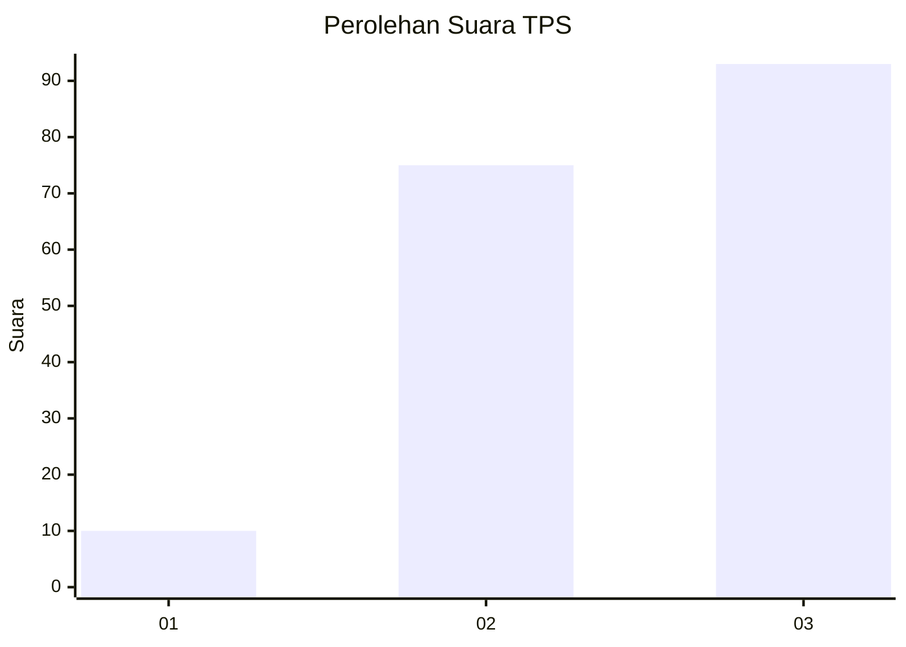
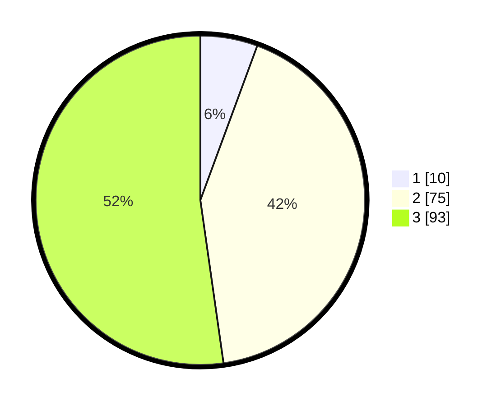

# Hasil

## Grafik

## Tabel

| No. | Nama Paslon    | Suara | Suara (raw) | Persentase |
|:--- |:-------------- | -----:| -----------:| ----------:|
| 1   | ANIES MUHAIMIN | 10    | [10][p-1]   | 5,62       |
| 2   | PRABOWO GIBRAN | 75    | [75][p-2]   | 42,13      |
| 3   | GANJAR MAHFUD  | 93    | [93][p-3]   | 52,25      |

[p-1]: https://github.com/gigit-pemilu/pemilu-2024-35-jawa-timur/blob/main/pilpres/hitung-suara/sub/35-jawa-timur/sub/16-mojokerto/sub/17-dawarblandong/sub/2004-talunblandong/sub/002-tps/sub/paslon-1.txt
[p-2]: https://github.com/gigit-pemilu/pemilu-2024-35-jawa-timur/blob/main/pilpres/hitung-suara/sub/35-jawa-timur/sub/16-mojokerto/sub/17-dawarblandong/sub/2004-talunblandong/sub/002-tps/sub/paslon-2.txt
[p-3]: https://github.com/gigit-pemilu/pemilu-2024-35-jawa-timur/blob/main/pilpres/hitung-suara/sub/35-jawa-timur/sub/16-mojokerto/sub/17-dawarblandong/sub/2004-talunblandong/sub/002-tps/sub/paslon-3.txt

## Foto C Plano

https://sirekap-obj-formc.kpu.go.id/6b1b/pemilu/ppwp/35/16/17/20/04/3516172004002-20240215-004036--9554ed2e-fb2b-406d-8f5d-e51b09262c16.jpg

https://sirekap-obj-formc.kpu.go.id/6b1b/pemilu/ppwp/35/16/17/20/04/3516172004002-20240218-192241--6980e7da-7f55-43aa-8c8c-673978a80829.jpg

https://sirekap-obj-formc.kpu.go.id/6b1b/pemilu/ppwp/35/16/17/20/04/3516172004002-20240215-004346--c72cf1d8-bcb2-4e4c-ad66-f76140c49c21.jpg

## Metadata

| Key        | Value               |
| ---------- | ------------------- |
| Time Stamp | 2024-02-19 06:16:00 |

