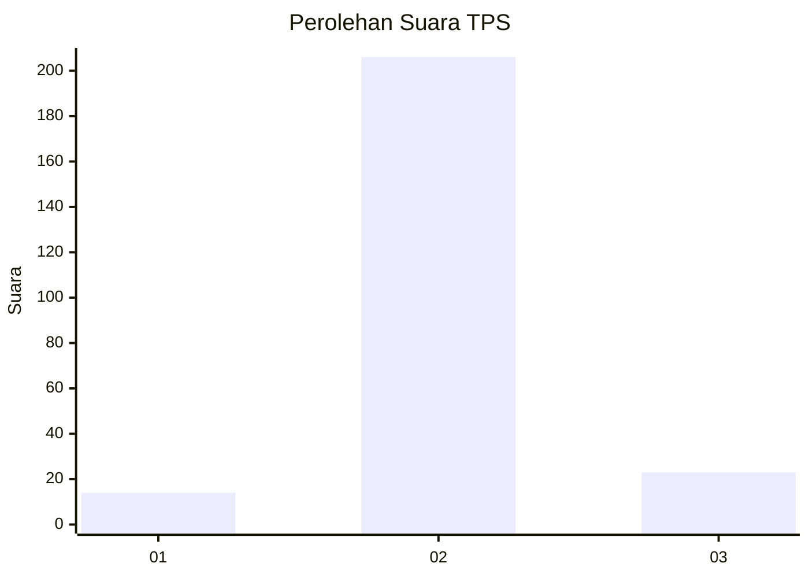
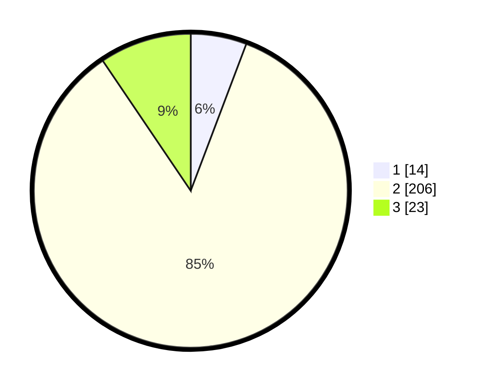

# Hasil

## Grafik

## Tabel

| No. | Nama Paslon    | Suara | Suara (raw) | Persentase |
|:--- |:-------------- | -----:| -----------:| ----------:|
| 1   | ANIES MUHAIMIN | 14    | [14][p-1]   | 5,76       |
| 2   | PRABOWO GIBRAN | 206   | [206][p-2]  | 84,77      |
| 3   | GANJAR MAHFUD  | 23    | [23][p-3]   | 9,47       |

[p-1]: https://github.com/gigit-pemilu/pemilu-2024-35-jawa-timur/blob/main/pilpres/hitung-suara/sub/35-jawa-timur/sub/16-mojokerto/sub/18-mojoanyar/sub/2012-kwatu/sub/002-tps/sub/paslon-1.txt
[p-2]: https://github.com/gigit-pemilu/pemilu-2024-35-jawa-timur/blob/main/pilpres/hitung-suara/sub/35-jawa-timur/sub/16-mojokerto/sub/18-mojoanyar/sub/2012-kwatu/sub/002-tps/sub/paslon-2.txt
[p-3]: https://github.com/gigit-pemilu/pemilu-2024-35-jawa-timur/blob/main/pilpres/hitung-suara/sub/35-jawa-timur/sub/16-mojokerto/sub/18-mojoanyar/sub/2012-kwatu/sub/002-tps/sub/paslon-3.txt

## Foto C Plano

https://sirekap-obj-formc.kpu.go.id/4a8e/pemilu/ppwp/35/16/18/20/12/3516182012002-20240214-193505--d4aa9bc3-b452-4fa4-8b94-fd7f0bb07c92.jpg

https://sirekap-obj-formc.kpu.go.id/4a8e/pemilu/ppwp/35/16/18/20/12/3516182012002-20240214-185435--777a36f4-694c-4dc2-853e-68308c9b69c6.jpg

https://sirekap-obj-formc.kpu.go.id/4a8e/pemilu/ppwp/35/16/18/20/12/3516182012002-20240214-185536--fb4a751c-f081-4122-89b4-4841da12e059.jpg

## Metadata

| Key        | Value               |
| ---------- | ------------------- |
| Time Stamp | 2024-02-16 00:00:26 |

