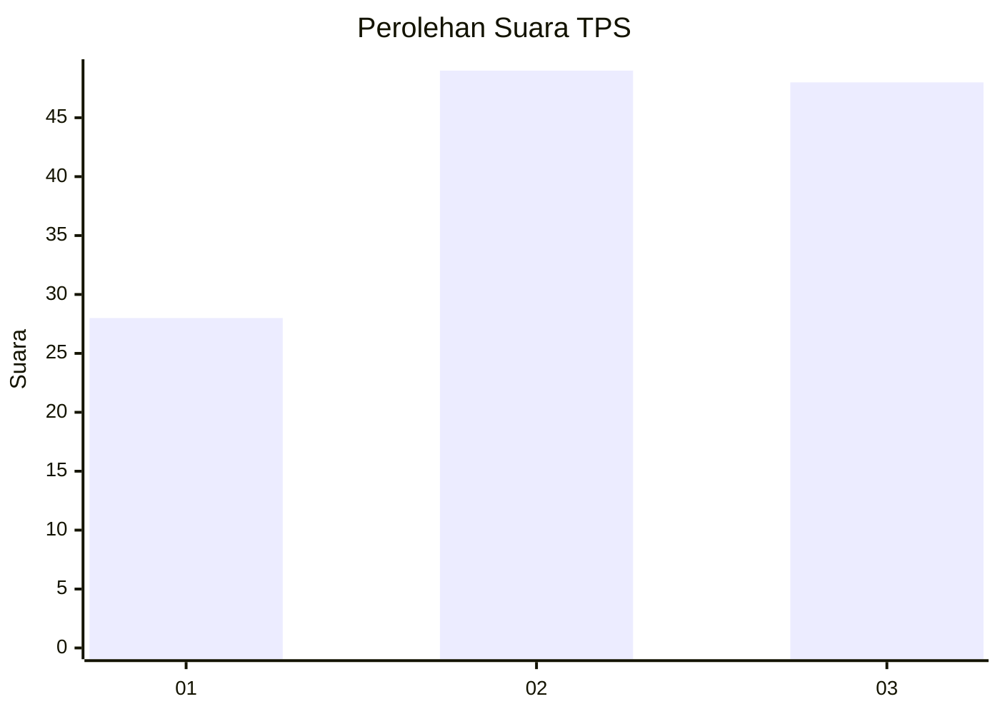
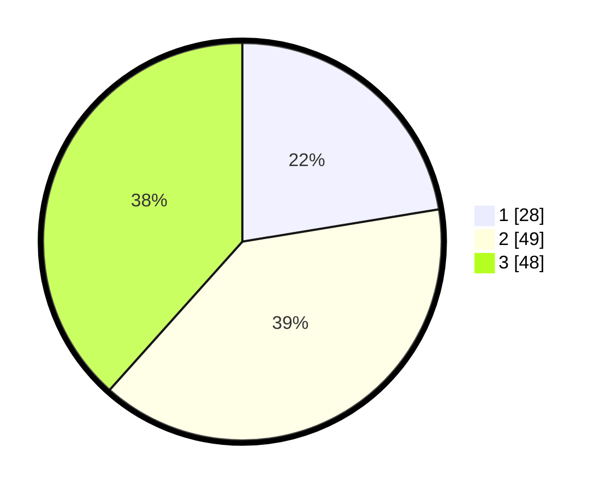

# Hasil

## Grafik

## Tabel

| No. | Nama Paslon    | Suara | Suara (raw) | Persentase |
|:--- |:-------------- | -----:| -----------:| ----------:|
| 1   | ANIES MUHAIMIN | 28    | [28][p-1]   | 22,40      |
| 2   | PRABOWO GIBRAN | 49    | [49][p-2]   | 39,20      |
| 3   | GANJAR MAHFUD  | 48    | [48][p-3]   | 38,40      |

[p-1]: https://github.com/gigit-pemilu/pemilu-2024/blob/main/pilpres/hitung-suara/sub/35-jawa-timur/sub/17-jombang/sub/03-ngoro/sub/2009-sidowarek/sub/019-tps/sub/paslon-1.txt
[p-2]: https://github.com/gigit-pemilu/pemilu-2024/blob/main/pilpres/hitung-suara/sub/35-jawa-timur/sub/17-jombang/sub/03-ngoro/sub/2009-sidowarek/sub/019-tps/sub/paslon-2.txt
[p-3]: https://github.com/gigit-pemilu/pemilu-2024/blob/main/pilpres/hitung-suara/sub/35-jawa-timur/sub/17-jombang/sub/03-ngoro/sub/2009-sidowarek/sub/019-tps/sub/paslon-3.txt

## Foto C Plano

https://sirekap-obj-formc.kpu.go.id/8598/pemilu/ppwp/35/17/03/20/09/3517032009019-20240221-223017--91992b76-1380-49df-ac21-3cce019cd6f3.jpg

https://sirekap-obj-formc.kpu.go.id/8598/pemilu/ppwp/35/17/03/20/09/3517032009019-20240220-094347--2ce4a17e-4817-420f-9014-97a01708ade5.jpg

https://sirekap-obj-formc.kpu.go.id/8598/pemilu/ppwp/35/17/03/20/09/3517032009019-20240220-094605--34fe4cf1-34c6-4070-a57a-261c0614962a.jpg

## Metadata

| Key        | Value               |
| ---------- | ------------------- |
| Time Stamp | 2024-02-21 23:00:00 |

