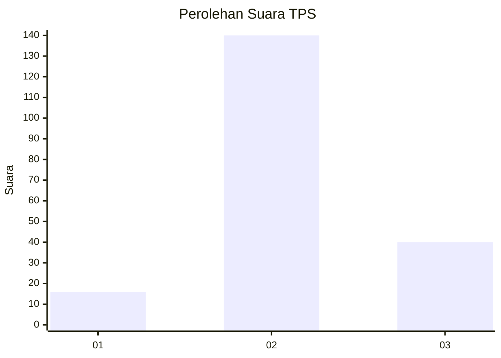
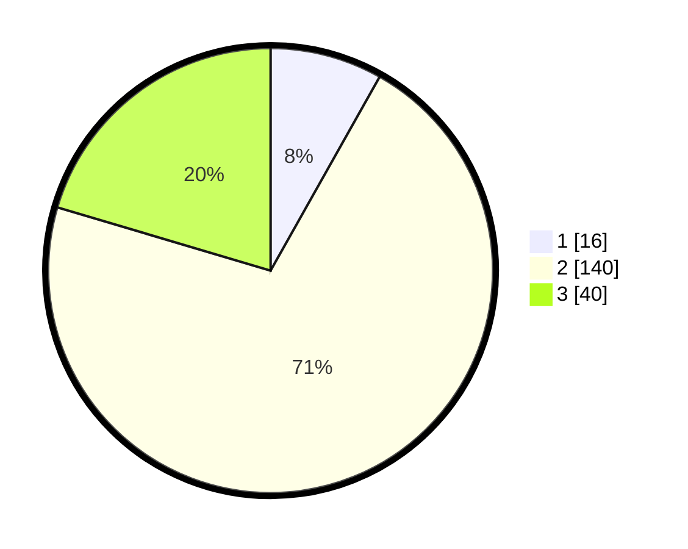

# Hasil

## Grafik

## Tabel

| No. | Nama Paslon    | Suara | Suara (raw) | Persentase |
|:--- |:-------------- | -----:| -----------:| ----------:|
| 1   | ANIES MUHAIMIN | 16    | [16][p-1]   | 8,16       |
| 2   | PRABOWO GIBRAN | 140   | [140][p-2]  | 71,43      |
| 3   | GANJAR MAHFUD  | 40    | [40][p-3]   | 20,41      |

[p-1]: https://github.com/gigit-pemilu/pemilu-2024/blob/main/pilpres/hitung-suara/sub/35-jawa-timur/sub/17-jombang/sub/03-ngoro/sub/2013-sugihwaras/sub/007-tps/sub/paslon-1.txt
[p-2]: https://github.com/gigit-pemilu/pemilu-2024/blob/main/pilpres/hitung-suara/sub/35-jawa-timur/sub/17-jombang/sub/03-ngoro/sub/2013-sugihwaras/sub/007-tps/sub/paslon-2.txt
[p-3]: https://github.com/gigit-pemilu/pemilu-2024/blob/main/pilpres/hitung-suara/sub/35-jawa-timur/sub/17-jombang/sub/03-ngoro/sub/2013-sugihwaras/sub/007-tps/sub/paslon-3.txt

## Foto C Plano

https://sirekap-obj-formc.kpu.go.id/4cf8/pemilu/ppwp/35/17/03/20/13/3517032013007-20240219-190358--405289a7-3481-4172-b6a8-d272e437cd65.jpg

https://sirekap-obj-formc.kpu.go.id/4cf8/pemilu/ppwp/35/17/03/20/13/3517032013007-20240219-190500--eb3762e2-6863-4550-89a3-8f73ee1775f8.jpg

https://sirekap-obj-formc.kpu.go.id/4cf8/pemilu/ppwp/35/17/03/20/13/3517032013007-20240219-190602--2d919136-81b0-46e6-be9a-51956bfec62c.jpg

## Metadata

| Key        | Value               |
| ---------- | ------------------- |
| Time Stamp | 2024-02-21 14:00:00 |

