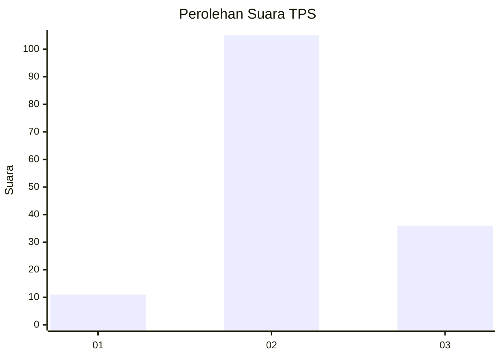
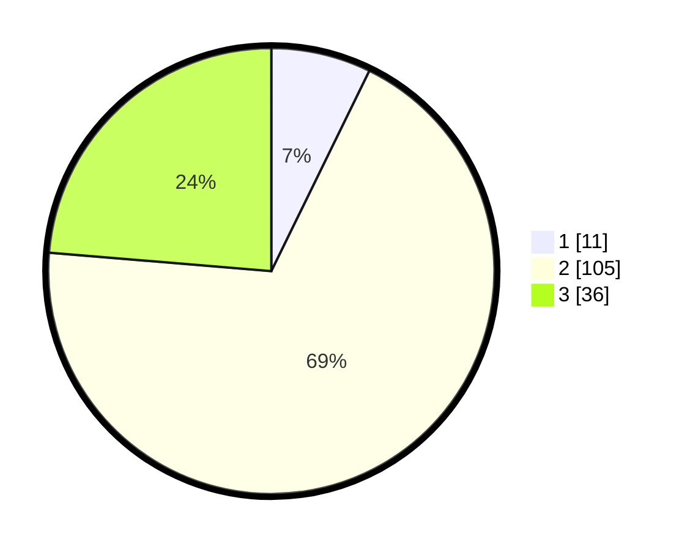

# Hasil

## Grafik

## Tabel

| No. | Nama Paslon    | Suara | Suara (raw) | Persentase |
|:--- |:-------------- | -----:| -----------:| ----------:|
| 1   | ANIES MUHAIMIN | 11    | [11][p-1]   | 7,24       |
| 2   | PRABOWO GIBRAN | 105   | [105][p-2]  | 69,08      |
| 3   | GANJAR MAHFUD  | 36    | [36][p-3]   | 23,68      |

[p-1]: https://github.com/gigit-pemilu/pemilu-2024-35-jawa-timur/blob/main/pilpres/hitung-suara/sub/35-jawa-timur/sub/17-jombang/sub/05-wonosalam/sub/2001-galengdowo/sub/005-tps/sub/paslon-1.txt
[p-2]: https://github.com/gigit-pemilu/pemilu-2024-35-jawa-timur/blob/main/pilpres/hitung-suara/sub/35-jawa-timur/sub/17-jombang/sub/05-wonosalam/sub/2001-galengdowo/sub/005-tps/sub/paslon-2.txt
[p-3]: https://github.com/gigit-pemilu/pemilu-2024-35-jawa-timur/blob/main/pilpres/hitung-suara/sub/35-jawa-timur/sub/17-jombang/sub/05-wonosalam/sub/2001-galengdowo/sub/005-tps/sub/paslon-3.txt

## Foto C Plano

https://sirekap-obj-formc.kpu.go.id/e262/pemilu/ppwp/35/17/05/20/01/3517052001005-20240217-210319--6b757678-1863-4ce0-8b96-bad51e0a34d5.jpg

https://sirekap-obj-formc.kpu.go.id/e262/pemilu/ppwp/35/17/05/20/01/3517052001005-20240214-141939--b122c5cf-cf1c-4d99-8bd3-9d99243048d9.jpg

https://sirekap-obj-formc.kpu.go.id/e262/pemilu/ppwp/35/17/05/20/01/3517052001005-20240217-193336--5b8c951b-031b-4183-84b8-6c9cb2592d21.jpg

## Metadata

| Key        | Value               |
| ---------- | ------------------- |
| Time Stamp | 2024-02-21 14:00:00 |

