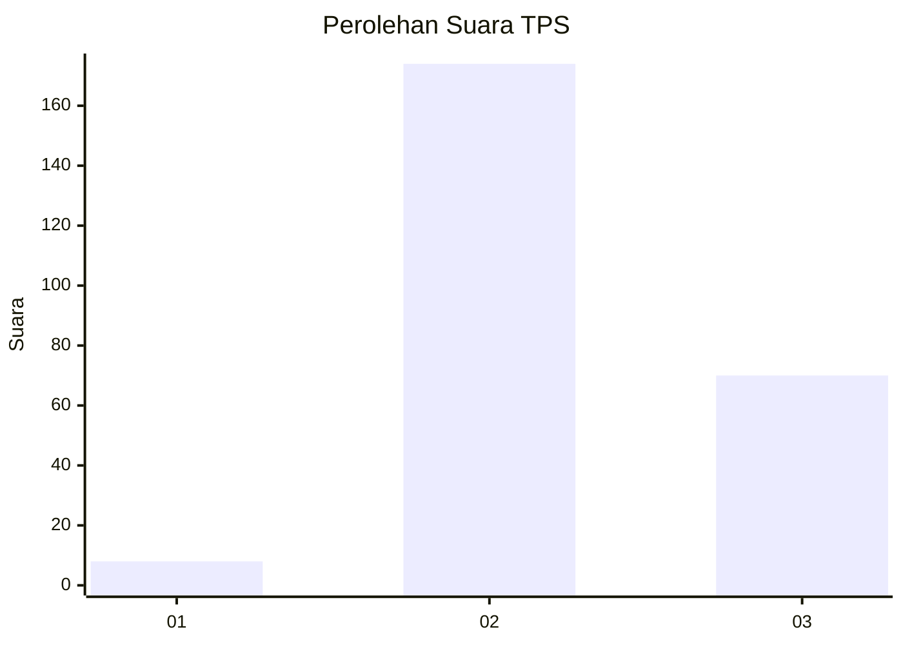
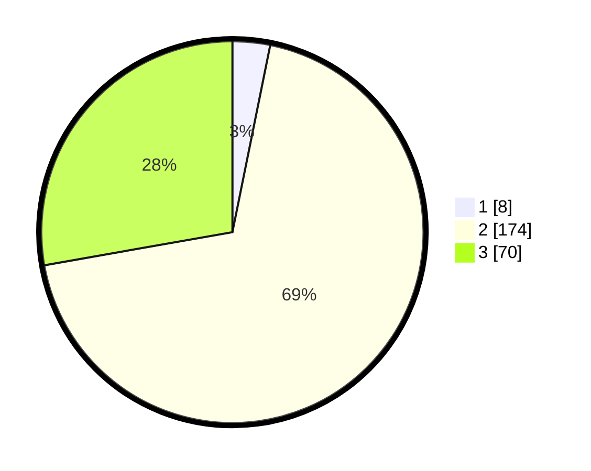

# Hasil

## Grafik

## Tabel

| No. | Nama Paslon    | Suara | Suara (raw) | Persentase |
|:--- |:-------------- | -----:| -----------:| ----------:|
| 1   | ANIES MUHAIMIN | 8     | [8][p-1]    | 3,17       |
| 2   | PRABOWO GIBRAN | 174   | [174][p-2]  | 69,05      |
| 3   | GANJAR MAHFUD  | 70    | [70][p-3]   | 27,78      |

[p-1]: https://github.com/gigit-pemilu/pemilu-2024/blob/main/pilpres/hitung-suara/sub/35-jawa-timur/sub/17-jombang/sub/05-wonosalam/sub/2005-wonosalam/sub/017-tps/sub/paslon-1.txt
[p-2]: https://github.com/gigit-pemilu/pemilu-2024/blob/main/pilpres/hitung-suara/sub/35-jawa-timur/sub/17-jombang/sub/05-wonosalam/sub/2005-wonosalam/sub/017-tps/sub/paslon-2.txt
[p-3]: https://github.com/gigit-pemilu/pemilu-2024/blob/main/pilpres/hitung-suara/sub/35-jawa-timur/sub/17-jombang/sub/05-wonosalam/sub/2005-wonosalam/sub/017-tps/sub/paslon-3.txt

## Foto C Plano

https://sirekap-obj-formc.kpu.go.id/4b52/pemilu/ppwp/35/17/05/20/05/3517052005017-20240214-221959--edab54bf-4c7d-4aac-b17f-337dce2b4cb5.jpg

https://sirekap-obj-formc.kpu.go.id/4b52/pemilu/ppwp/35/17/05/20/05/3517052005017-20240214-224843--3fb9e2df-a7b4-4810-ac7a-173af0dfc097.jpg

https://sirekap-obj-formc.kpu.go.id/4b52/pemilu/ppwp/35/17/05/20/05/3517052005017-20240214-225127--c9def1e8-846b-4e4e-89a8-27c6c33f2962.jpg

## Metadata

| Key        | Value               |
| ---------- | ------------------- |
| Time Stamp | 2024-02-16 16:25:10 |

