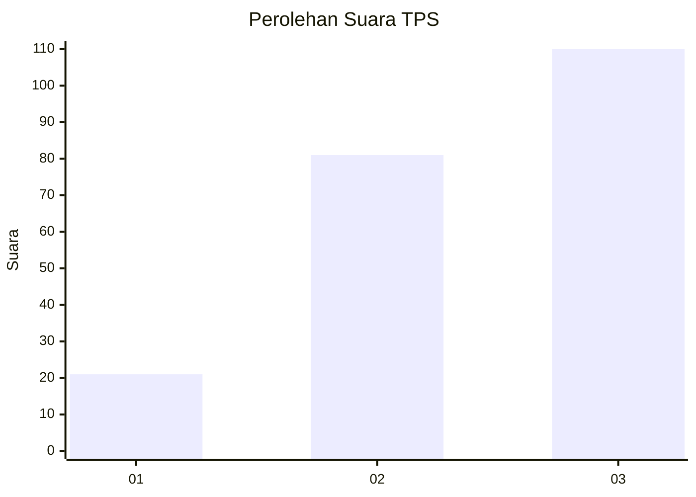
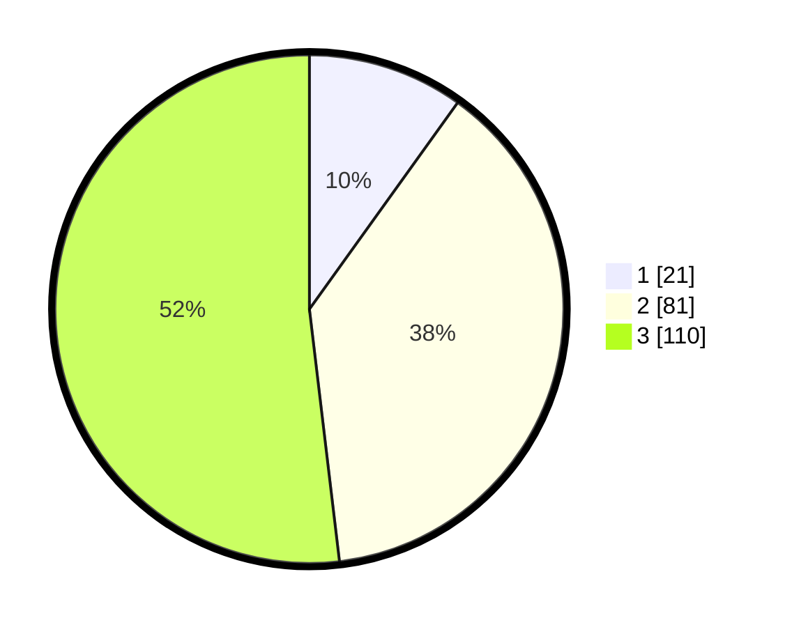

# Hasil

## Grafik

## Tabel

| No. | Nama Paslon    | Suara | Suara (raw) | Persentase |
|:--- |:-------------- | -----:| -----------:| ----------:|
| 1   | ANIES MUHAIMIN | 21    | [21][p-1]   | 9,91       |
| 2   | PRABOWO GIBRAN | 81    | [81][p-2]   | 38,21      |
| 3   | GANJAR MAHFUD  | 110   | [110][p-3]  | 51,89      |

[p-1]: https://github.com/gigit-pemilu/pemilu-2024/blob/main/pilpres/hitung-suara/sub/35-jawa-timur/sub/17-jombang/sub/05-wonosalam/sub/2006-carangwulung/sub/004-tps/sub/paslon-1.txt
[p-2]: https://github.com/gigit-pemilu/pemilu-2024/blob/main/pilpres/hitung-suara/sub/35-jawa-timur/sub/17-jombang/sub/05-wonosalam/sub/2006-carangwulung/sub/004-tps/sub/paslon-2.txt
[p-3]: https://github.com/gigit-pemilu/pemilu-2024/blob/main/pilpres/hitung-suara/sub/35-jawa-timur/sub/17-jombang/sub/05-wonosalam/sub/2006-carangwulung/sub/004-tps/sub/paslon-3.txt

## Foto C Plano

https://sirekap-obj-formc.kpu.go.id/8cbb/pemilu/ppwp/35/17/05/20/06/3517052006004-20240214-221932--b9e46b96-857d-407c-96d2-ce7f07fa7216.jpg

https://sirekap-obj-formc.kpu.go.id/8cbb/pemilu/ppwp/35/17/05/20/06/3517052006004-20240214-222114--628ac6d2-9299-42f0-91a8-5734f2aa907f.jpg

https://sirekap-obj-formc.kpu.go.id/8cbb/pemilu/ppwp/35/17/05/20/06/3517052006004-20240215-033546--634b46e4-fe2e-497b-8c9d-120160b260de.jpg

## Metadata

| Key        | Value               |
| ---------- | ------------------- |
| Time Stamp | 2024-02-16 16:25:10 |

