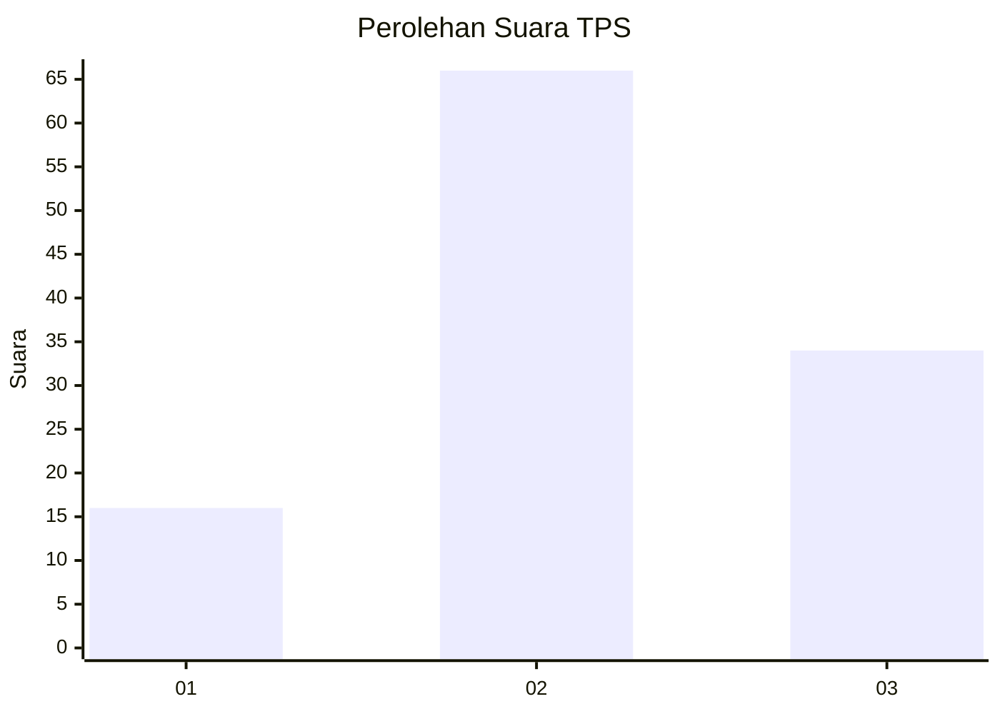
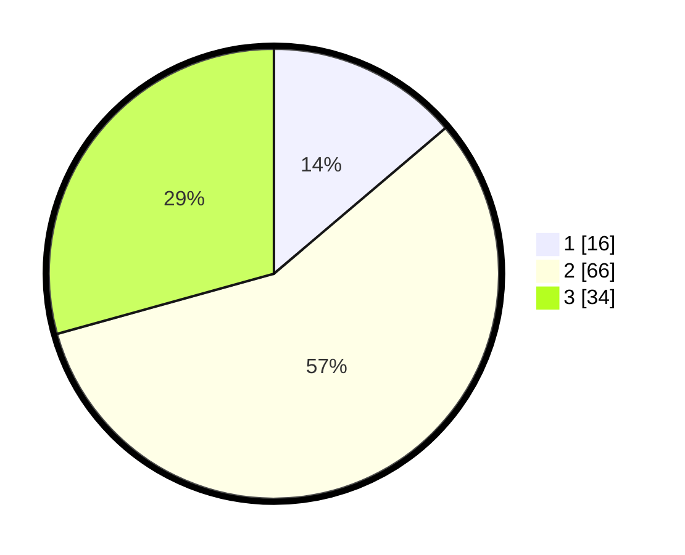

# Hasil

## Grafik

## Tabel

| No. | Nama Paslon    | Suara | Suara (raw) | Persentase |
|:--- |:-------------- | -----:| -----------:| ----------:|
| 1   | ANIES MUHAIMIN | 16    | [16][p-1]   | 13,79      |
| 2   | PRABOWO GIBRAN | 66    | [66][p-2]   | 56,90      |
| 3   | GANJAR MAHFUD  | 34    | [34][p-3]   | 29,31      |

[p-1]: https://github.com/gigit-pemilu/pemilu-2024-35-jawa-timur/blob/main/pilpres/hitung-suara/sub/35-jawa-timur/sub/17-jombang/sub/05-wonosalam/sub/2007-wonokerto/sub/001-tps/sub/paslon-1.txt
[p-2]: https://github.com/gigit-pemilu/pemilu-2024-35-jawa-timur/blob/main/pilpres/hitung-suara/sub/35-jawa-timur/sub/17-jombang/sub/05-wonosalam/sub/2007-wonokerto/sub/001-tps/sub/paslon-2.txt
[p-3]: https://github.com/gigit-pemilu/pemilu-2024-35-jawa-timur/blob/main/pilpres/hitung-suara/sub/35-jawa-timur/sub/17-jombang/sub/05-wonosalam/sub/2007-wonokerto/sub/001-tps/sub/paslon-3.txt

## Foto C Plano

https://sirekap-obj-formc.kpu.go.id/6a29/pemilu/ppwp/35/17/05/20/07/3517052007001-20240214-141332--b4747586-e3a1-42ce-841d-0e58dbcff6d7.jpg

https://sirekap-obj-formc.kpu.go.id/6a29/pemilu/ppwp/35/17/05/20/07/3517052007001-20240214-141720--582d9033-22ea-4aad-8293-85ac4bc2ce4b.jpg

https://sirekap-obj-formc.kpu.go.id/6a29/pemilu/ppwp/35/17/05/20/07/3517052007001-20240218-114919--c3c3869d-1fc9-4897-9a51-d40011b0d2ac.jpg

## Metadata

| Key        | Value               |
| ---------- | ------------------- |
| Time Stamp | 2024-02-19 06:16:00 |

