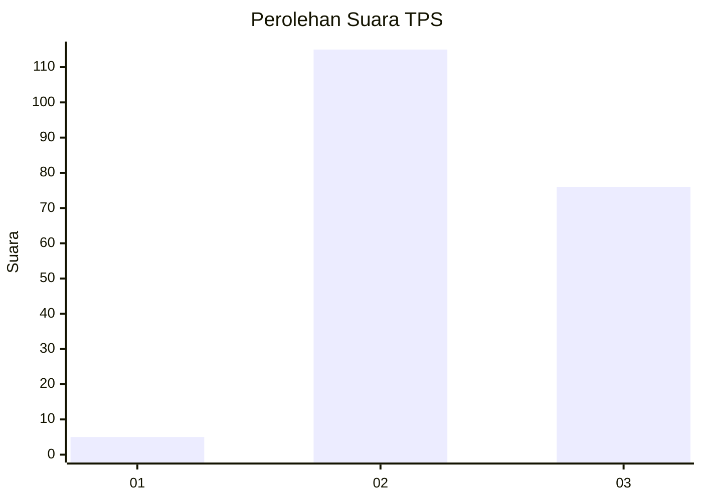
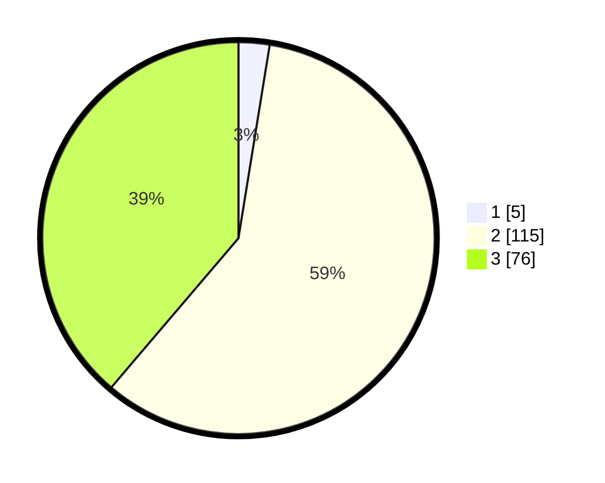

# Hasil

## Grafik

## Tabel

| No. | Nama Paslon    | Suara | Suara (raw) | Persentase |
|:--- |:-------------- | -----:| -----------:| ----------:|
| 1   | ANIES MUHAIMIN | 5     | [5][p-1]    | 2,55       |
| 2   | PRABOWO GIBRAN | 115   | [115][p-2]  | 58,67      |
| 3   | GANJAR MAHFUD  | 76    | [76][p-3]   | 38,78      |

[p-1]: https://github.com/gigit-pemilu/pemilu-2024/blob/main/pilpres/hitung-suara/sub/35-jawa-timur/sub/17-jombang/sub/05-wonosalam/sub/2008-sumberjo/sub/005-tps/sub/paslon-1.txt
[p-2]: https://github.com/gigit-pemilu/pemilu-2024/blob/main/pilpres/hitung-suara/sub/35-jawa-timur/sub/17-jombang/sub/05-wonosalam/sub/2008-sumberjo/sub/005-tps/sub/paslon-2.txt
[p-3]: https://github.com/gigit-pemilu/pemilu-2024/blob/main/pilpres/hitung-suara/sub/35-jawa-timur/sub/17-jombang/sub/05-wonosalam/sub/2008-sumberjo/sub/005-tps/sub/paslon-3.txt

## Foto C Plano

https://sirekap-obj-formc.kpu.go.id/8f55/pemilu/ppwp/35/17/05/20/08/3517052008005-20240218-163937--098defda-c017-4bb8-a4cd-30bb162991c7.jpg

https://sirekap-obj-formc.kpu.go.id/8f55/pemilu/ppwp/35/17/05/20/08/3517052008005-20240218-163423--4d983f18-1d30-4506-b265-a12fbbdc01f2.jpg

https://sirekap-obj-formc.kpu.go.id/8f55/pemilu/ppwp/35/17/05/20/08/3517052008005-20240215-024648--d38498cd-1e88-4b84-b913-962677f82d4f.jpg

## Metadata

| Key        | Value               |
| ---------- | ------------------- |
| Time Stamp | 2024-02-24 22:31:28 |

