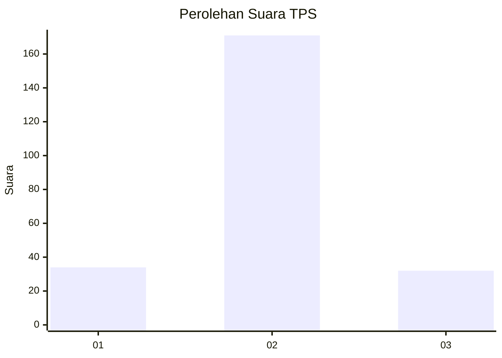

# Hasil

## Grafik

## Tabel

| No. | Nama Paslon    | Suara | Suara (raw) | Persentase |
|:--- |:-------------- | -----:| -----------:| ----------:|
| 1   | ANIES MUHAIMIN | 34    | [34][p-1]   | 14,35      |
| 2   | PRABOWO GIBRAN | 171   | [171][p-2]  | 72,15      |
| 3   | GANJAR MAHFUD  | 32    | [32][p-3]   | 13,50      |

[p-1]: https://github.com/gigit-pemilu/pemilu-2024/blob/main/pilpres/hitung-suara/sub/35-jawa-timur/sub/17-jombang/sub/08-diwek/sub/2008-kwaron/sub/005-tps/sub/paslon-1.txt
[p-2]: https://github.com/gigit-pemilu/pemilu-2024/blob/main/pilpres/hitung-suara/sub/35-jawa-timur/sub/17-jombang/sub/08-diwek/sub/2008-kwaron/sub/005-tps/sub/paslon-2.txt
[p-3]: https://github.com/gigit-pemilu/pemilu-2024/blob/main/pilpres/hitung-suara/sub/35-jawa-timur/sub/17-jombang/sub/08-diwek/sub/2008-kwaron/sub/005-tps/sub/paslon-3.txt

## Foto C Plano

https://sirekap-obj-formc.kpu.go.id/ccd1/pemilu/ppwp/35/17/08/20/08/3517082008005-20240214-190750--2a7d3203-cadb-46bb-82ba-8fae440bc8ab.jpg

https://sirekap-obj-formc.kpu.go.id/ccd1/pemilu/ppwp/35/17/08/20/08/3517082008005-20240214-190614--cad1a6ce-fc90-40d2-bac3-be98601075fd.jpg

https://sirekap-obj-formc.kpu.go.id/ccd1/pemilu/ppwp/35/17/08/20/08/3517082008005-20240214-190805--c1e431e9-3201-4da6-ae01-0e9b88948f90.jpg

## Metadata

| Key        | Value               |
| ---------- | ------------------- |
| Time Stamp | 2024-02-15 15:00:29 |

## DATA PEMILIH TETAP

Jumlah pemilih dalam DPT: **260**.
 * L: **225**.
 * P: **35**.

## DATA PENGGUNA HAK PILIH

Jumlah pengguna hak pilih dalam DPT: **228**.
 * L: **203**.
 * P: **225**.

Jumlah pengguna hak pilih dalam DPTb: **853**.
 * L: **800**.
 * P: **23**.

Jumlah pengguna hak pilih dalam DPK: **802**.
 * L: **807**.
 * P: **3**.

Jumlah pengguna hak pilih: **243**.
 * L: **604**.
 * P: **439**.

## JUMLAH SUARA SAH DAN TIDAK SAH

JUMLAH SELURUH SUARA SAH: **237**.

JUMLAH SUARA TIDAK SAH: **6**.

JUMLAH SELURUH SUARA SAH DAN SUARA TIDAK SAH: **243**.

