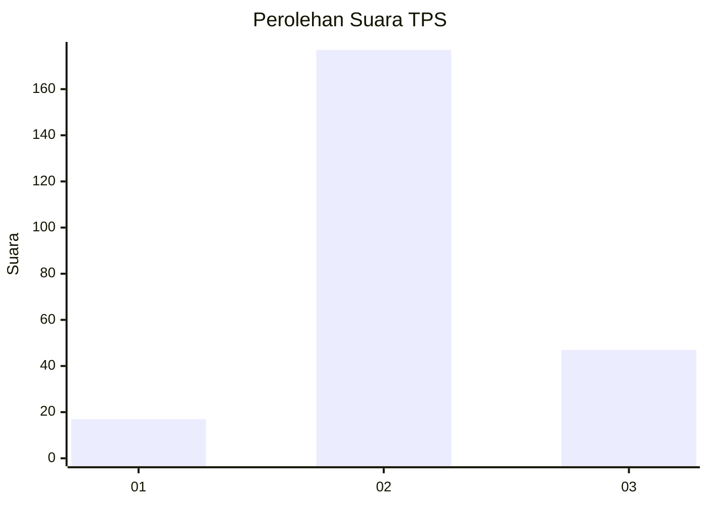
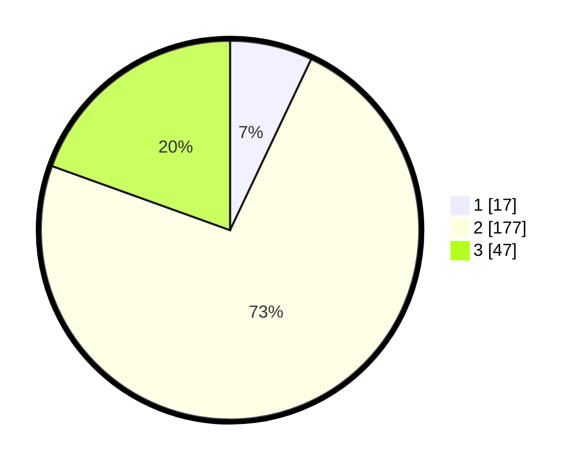

# Hasil

## Grafik

## Tabel

| No. | Nama Paslon    | Suara | Suara (raw) | Persentase |
|:--- |:-------------- | -----:| -----------:| ----------:|
| 1   | ANIES MUHAIMIN | 17    | [17][p-1]   | 7,05       |
| 2   | PRABOWO GIBRAN | 177   | [177][p-2]  | 73,44      |
| 3   | GANJAR MAHFUD  | 47    | [47][p-3]   | 19,50      |

[p-1]: https://github.com/gigit-pemilu/pemilu-2024/blob/main/pilpres/hitung-suara/sub/35-jawa-timur/sub/17-jombang/sub/08-diwek/sub/2010-pundong/sub/003-tps/sub/paslon-1.txt
[p-2]: https://github.com/gigit-pemilu/pemilu-2024/blob/main/pilpres/hitung-suara/sub/35-jawa-timur/sub/17-jombang/sub/08-diwek/sub/2010-pundong/sub/003-tps/sub/paslon-2.txt
[p-3]: https://github.com/gigit-pemilu/pemilu-2024/blob/main/pilpres/hitung-suara/sub/35-jawa-timur/sub/17-jombang/sub/08-diwek/sub/2010-pundong/sub/003-tps/sub/paslon-3.txt

## Foto C Plano

https://sirekap-obj-formc.kpu.go.id/1773/pemilu/ppwp/35/17/08/20/10/3517082010003-20240216-021142--24ee6b4d-6498-424a-a1c9-c921d3f2a432.jpg

https://sirekap-obj-formc.kpu.go.id/1773/pemilu/ppwp/35/17/08/20/10/3517082010003-20240214-203401--55b4d853-99c6-44cc-84a6-38ecebbbf6d0.jpg

https://sirekap-obj-formc.kpu.go.id/1773/pemilu/ppwp/35/17/08/20/10/3517082010003-20240214-201522--a7d429ff-41f9-4b65-8ec8-ac8fdcda40c1.jpg

## Metadata

| Key        | Value               |
| ---------- | ------------------- |
| Time Stamp | 2024-02-16 02:30:27 |

