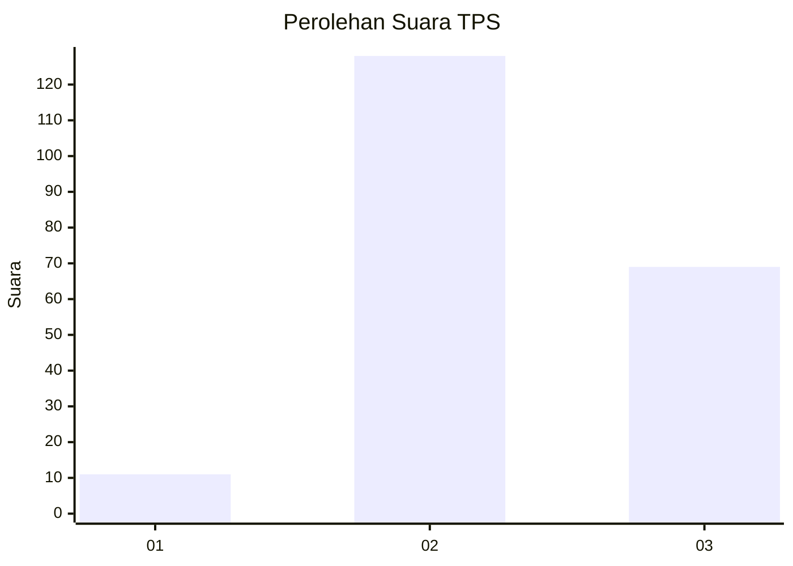
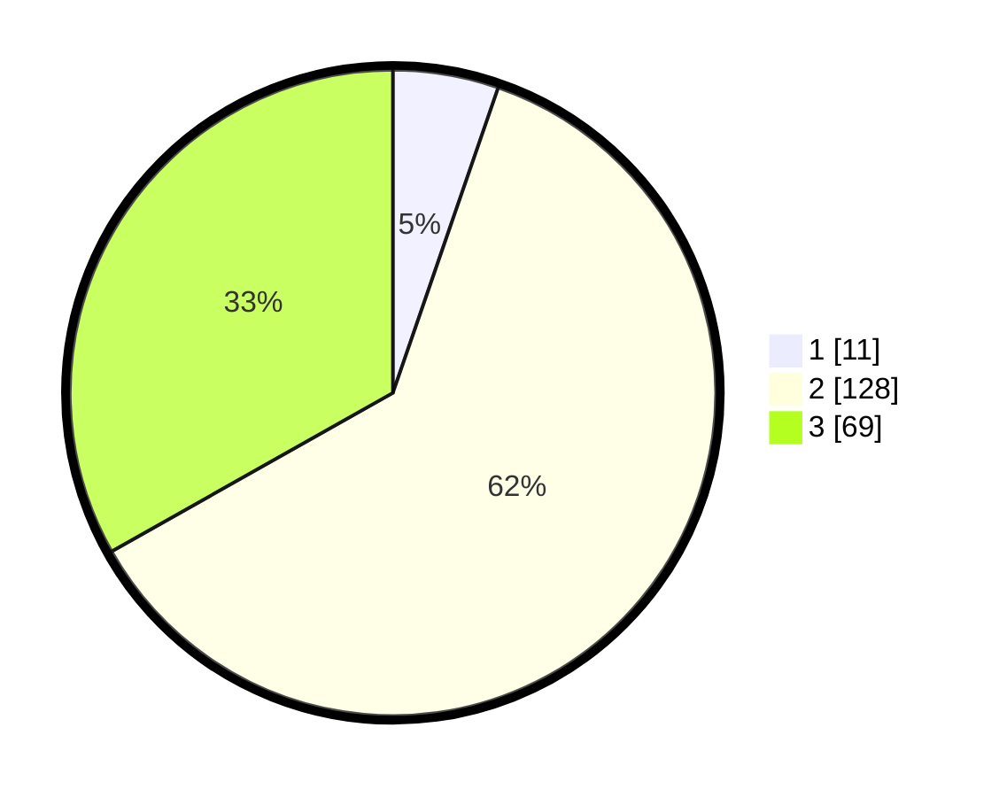

# Hasil

## Grafik

## Tabel

| No. | Nama Paslon    | Suara | Suara (raw) | Persentase |
|:--- |:-------------- | -----:| -----------:| ----------:|
| 1   | ANIES MUHAIMIN | 11    | [11][p-1]   | 5,29       |
| 2   | PRABOWO GIBRAN | 128   | [128][p-2]  | 61,54      |
| 3   | GANJAR MAHFUD  | 69    | [69][p-3]   | 33,17      |

[p-1]: https://github.com/gigit-pemilu/pemilu-2024/blob/main/pilpres/hitung-suara/sub/35-jawa-timur/sub/17-jombang/sub/09-jombang/sub/2013-candimulyo/sub/003-tps/sub/paslon-1.txt
[p-2]: https://github.com/gigit-pemilu/pemilu-2024/blob/main/pilpres/hitung-suara/sub/35-jawa-timur/sub/17-jombang/sub/09-jombang/sub/2013-candimulyo/sub/003-tps/sub/paslon-2.txt
[p-3]: https://github.com/gigit-pemilu/pemilu-2024/blob/main/pilpres/hitung-suara/sub/35-jawa-timur/sub/17-jombang/sub/09-jombang/sub/2013-candimulyo/sub/003-tps/sub/paslon-3.txt

## Foto C Plano

https://sirekap-obj-formc.kpu.go.id/ebb4/pemilu/ppwp/35/17/09/20/13/3517092013003-20240215-000910--d2214cf3-9d83-49c7-8955-3d1f7fcbb3e7.jpg

https://sirekap-obj-formc.kpu.go.id/ebb4/pemilu/ppwp/35/17/09/20/13/3517092013003-20240215-000950--99ef80fe-9e68-4124-af0a-fe640a32bcdb.jpg

https://sirekap-obj-formc.kpu.go.id/ebb4/pemilu/ppwp/35/17/09/20/13/3517092013003-20240215-001040--42876518-4a77-4f12-85d6-6f77eb8c38d2.jpg

## Metadata

| Key        | Value               |
| ---------- | ------------------- |
| Time Stamp | 2024-02-15 16:00:26 |

