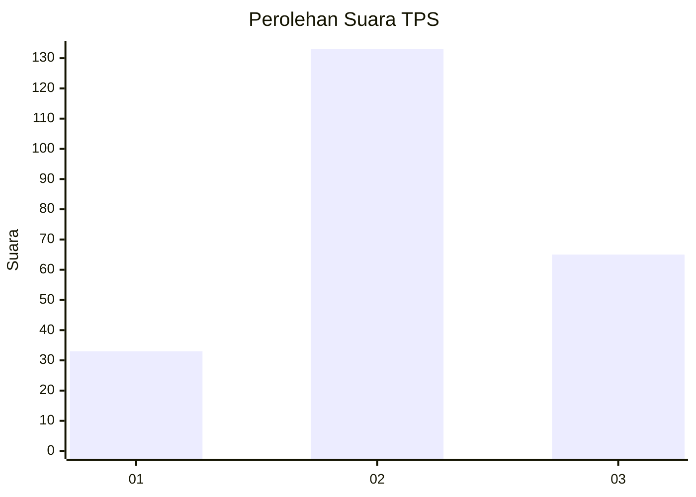
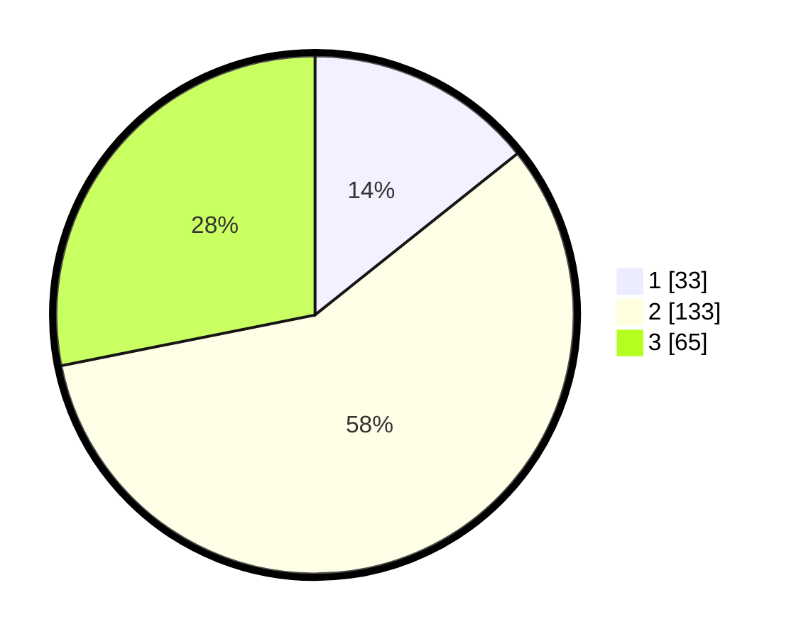

# Hasil

## Grafik

## Tabel

| No. | Nama Paslon    | Suara | Suara (raw) | Persentase |
|:--- |:-------------- | -----:| -----------:| ----------:|
| 1   | ANIES MUHAIMIN | 33    | [33][p-1]   | 14,29      |
| 2   | PRABOWO GIBRAN | 133   | [133][p-2]  | 57,58      |
| 3   | GANJAR MAHFUD  | 65    | [65][p-3]   | 28,14      |

[p-1]: https://github.com/gigit-pemilu/pemilu-2024/blob/main/pilpres/hitung-suara/sub/35-jawa-timur/sub/17-jombang/sub/09-jombang/sub/2013-candimulyo/sub/017-tps/sub/paslon-1.txt
[p-2]: https://github.com/gigit-pemilu/pemilu-2024/blob/main/pilpres/hitung-suara/sub/35-jawa-timur/sub/17-jombang/sub/09-jombang/sub/2013-candimulyo/sub/017-tps/sub/paslon-2.txt
[p-3]: https://github.com/gigit-pemilu/pemilu-2024/blob/main/pilpres/hitung-suara/sub/35-jawa-timur/sub/17-jombang/sub/09-jombang/sub/2013-candimulyo/sub/017-tps/sub/paslon-3.txt

## Foto C Plano

https://sirekap-obj-formc.kpu.go.id/3b07/pemilu/ppwp/35/17/09/20/13/3517092013017-20240216-194005--b6d9c34a-47f9-43d5-a974-58716d13a5ce.jpg

https://sirekap-obj-formc.kpu.go.id/3b07/pemilu/ppwp/35/17/09/20/13/3517092013017-20240215-000129--dfb23e66-6658-4c45-bf0c-78ffcce6b273.jpg

https://sirekap-obj-formc.kpu.go.id/3b07/pemilu/ppwp/35/17/09/20/13/3517092013017-20240216-194009--6ab5b112-d13d-4ea7-9fae-a79e252664eb.jpg

## Metadata

| Key        | Value               |
| ---------- | ------------------- |
| Time Stamp | 2024-02-24 22:31:28 |

