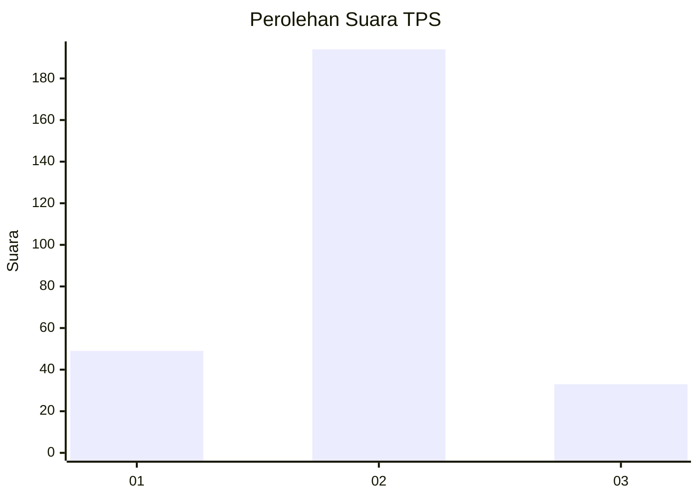
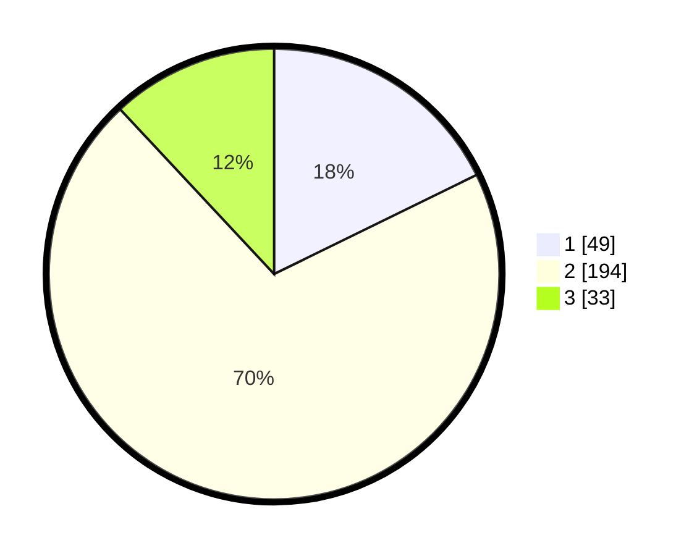

# Hasil

## Grafik

## Tabel

| No. | Nama Paslon    | Suara | Suara (raw) | Persentase |
|:--- |:-------------- | -----:| -----------:| ----------:|
| 1   | ANIES MUHAIMIN | 49    | [49][p-1]   | 17,75      |
| 2   | PRABOWO GIBRAN | 194   | [194][p-2]  | 70,29      |
| 3   | GANJAR MAHFUD  | 33    | [33][p-3]   | 11,96      |

[p-1]: https://github.com/gigit-pemilu/pemilu-2024/blob/main/pilpres/hitung-suara/sub/35-jawa-timur/sub/17-jombang/sub/09-jombang/sub/2014-tambakrejo/sub/017-tps/sub/paslon-1.txt
[p-2]: https://github.com/gigit-pemilu/pemilu-2024/blob/main/pilpres/hitung-suara/sub/35-jawa-timur/sub/17-jombang/sub/09-jombang/sub/2014-tambakrejo/sub/017-tps/sub/paslon-2.txt
[p-3]: https://github.com/gigit-pemilu/pemilu-2024/blob/main/pilpres/hitung-suara/sub/35-jawa-timur/sub/17-jombang/sub/09-jombang/sub/2014-tambakrejo/sub/017-tps/sub/paslon-3.txt

## Foto C Plano

https://sirekap-obj-formc.kpu.go.id/4d7b/pemilu/ppwp/35/17/09/20/14/3517092014017-20240218-180910--801310fc-c4ee-4b6b-b273-dffc1be92bf5.jpg

https://sirekap-obj-formc.kpu.go.id/4d7b/pemilu/ppwp/35/17/09/20/14/3517092014017-20240218-193546--ed03734a-33ad-44f1-ac14-d2adee09adb3.jpg

https://sirekap-obj-formc.kpu.go.id/4d7b/pemilu/ppwp/35/17/09/20/14/3517092014017-20240218-193646--559ab1ac-40ab-4a1a-adf7-976b2ca884ed.jpg

## Metadata

| Key        | Value               |
| ---------- | ------------------- |
| Time Stamp | 2024-02-19 06:16:00 |

## DATA PEMILIH TETAP

Jumlah pemilih dalam DPT: **298**.
 * L: **138**.
 * P: **160**.

## DATA PENGGUNA HAK PILIH

Jumlah pengguna hak pilih dalam DPT: **250**.
 * L: **108**.
 * P: **142**.

Jumlah pengguna hak pilih dalam DPTb: **18**.
 * L: **1**.
 * P: **17**.

Jumlah pengguna hak pilih dalam DPK: **6**.
 * L: **4**.
 * P: **2**.

Jumlah pengguna hak pilih: **274**.
 * L: **113**.
 * P: **161**.

## JUMLAH SUARA SAH DAN TIDAK SAH

JUMLAH SELURUH SUARA SAH: **270**.

JUMLAH SUARA TIDAK SAH: **4**.

JUMLAH SELURUH SUARA SAH DAN SUARA TIDAK SAH: **274**.

