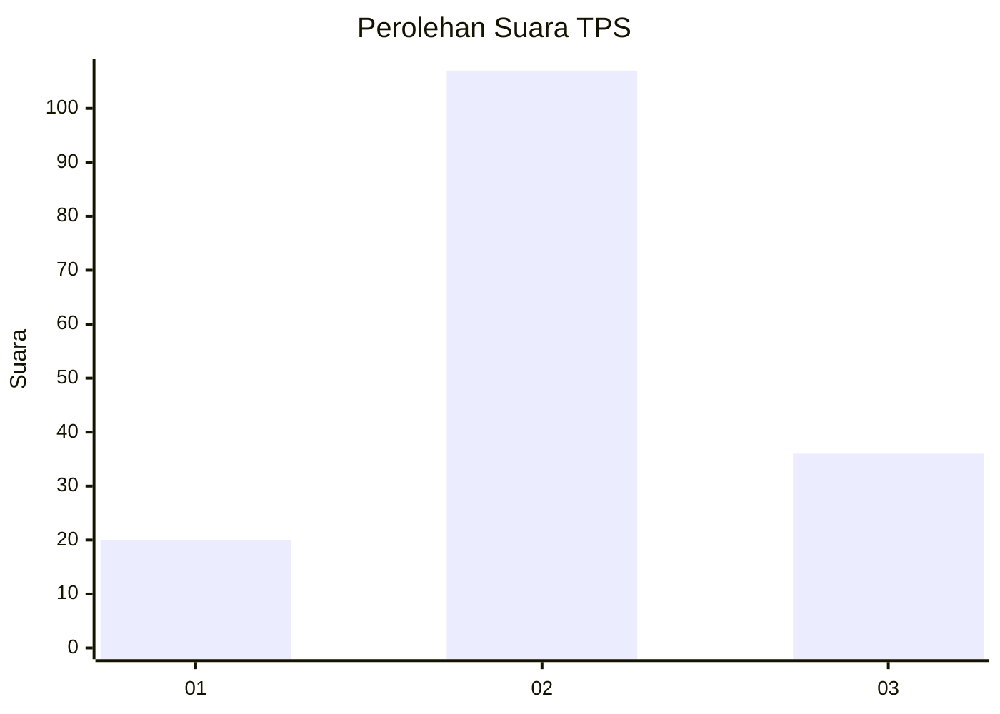
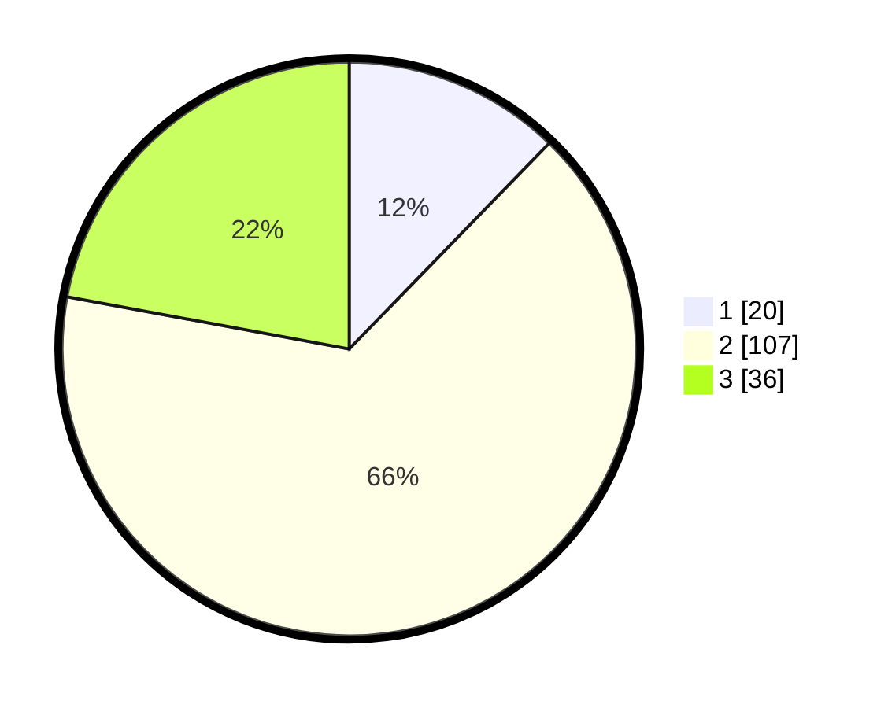

# Hasil

## Grafik

## Tabel

| No. | Nama Paslon    | Suara | Suara (raw) | Persentase |
|:--- |:-------------- | -----:| -----------:| ----------:|
| 1   | ANIES MUHAIMIN | 20    | [20][p-1]   | 12,27      |
| 2   | PRABOWO GIBRAN | 107   | [107][p-2]  | 65,64      |
| 3   | GANJAR MAHFUD  | 36    | [36][p-3]   | 22,09      |

[p-1]: https://github.com/gigit-pemilu/pemilu-2024-35-jawa-timur/blob/main/pilpres/hitung-suara/sub/35-jawa-timur/sub/17-jombang/sub/10-peterongan/sub/2012-ngrandulor/sub/004-tps/sub/paslon-1.txt
[p-2]: https://github.com/gigit-pemilu/pemilu-2024-35-jawa-timur/blob/main/pilpres/hitung-suara/sub/35-jawa-timur/sub/17-jombang/sub/10-peterongan/sub/2012-ngrandulor/sub/004-tps/sub/paslon-2.txt
[p-3]: https://github.com/gigit-pemilu/pemilu-2024-35-jawa-timur/blob/main/pilpres/hitung-suara/sub/35-jawa-timur/sub/17-jombang/sub/10-peterongan/sub/2012-ngrandulor/sub/004-tps/sub/paslon-3.txt

## Foto C Plano

https://sirekap-obj-formc.kpu.go.id/6e9b/pemilu/ppwp/35/17/10/20/12/3517102012004-20240214-205012--4ae63880-4ea1-4496-87c0-a6466b9380b5.jpg

https://sirekap-obj-formc.kpu.go.id/6e9b/pemilu/ppwp/35/17/10/20/12/3517102012004-20240214-204949--fb546d47-6b39-4538-b7d5-c6696669298a.jpg

https://sirekap-obj-formc.kpu.go.id/6e9b/pemilu/ppwp/35/17/10/20/12/3517102012004-20240214-205033--3c89de3a-1d66-4849-89eb-78e1a4813d5f.jpg

## Metadata

| Key        | Value               |
| ---------- | ------------------- |
| Time Stamp | 2024-02-20 15:00:00 |

## DATA PEMILIH TETAP

Jumlah pemilih dalam DPT: **202**.
 * L: **407**.
 * P: **96**.

## DATA PENGGUNA HAK PILIH

Jumlah pengguna hak pilih dalam DPT: **675**.
 * L: **93**.
 * P: **52**.

Jumlah pengguna hak pilih dalam DPTb: **80**.
 * L: **801**.
 * P: **2**.

Jumlah pengguna hak pilih dalam DPK: **80**.
 * L: **8**.
 * P: **0**.

Jumlah pengguna hak pilih: **435**.
 * L: **49**.
 * P: **34**.

## JUMLAH SUARA SAH DAN TIDAK SAH

JUMLAH SELURUH SUARA SAH: **163**.

JUMLAH SUARA TIDAK SAH: **15**.

JUMLAH SELURUH SUARA SAH DAN SUARA TIDAK SAH: **178**.

