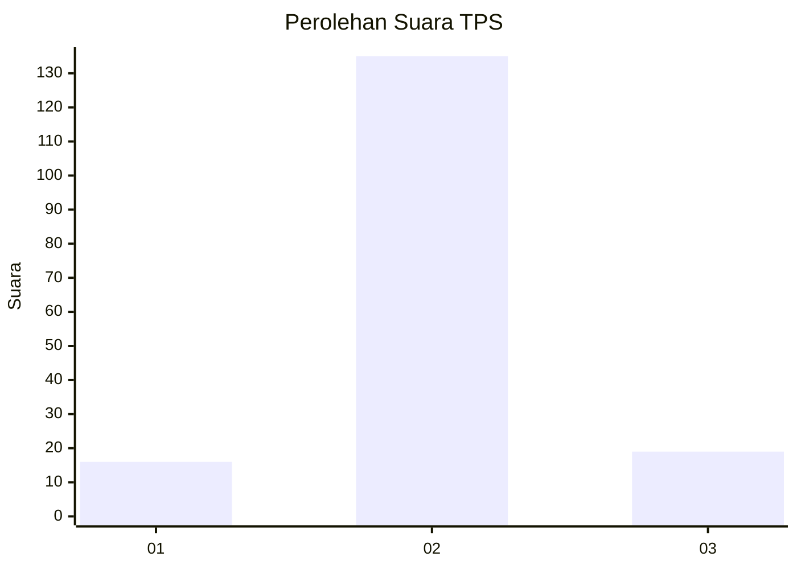
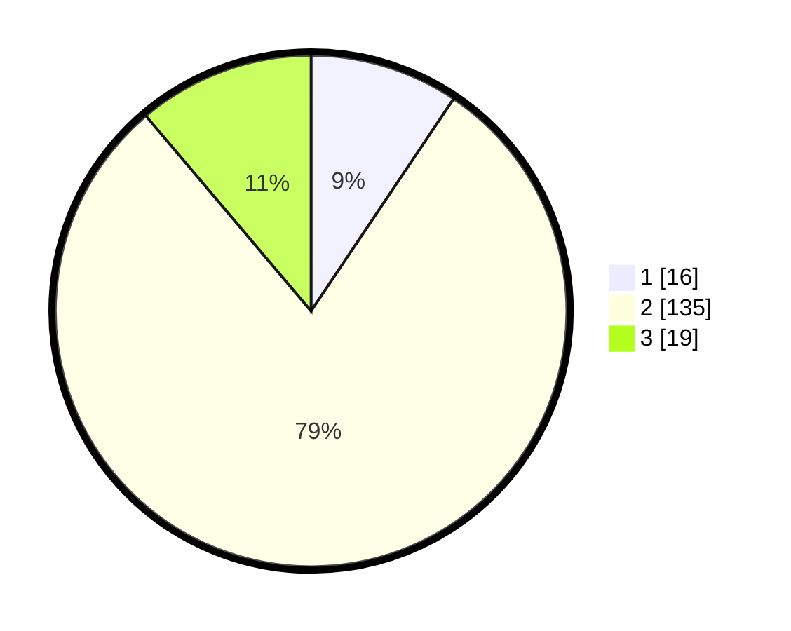

# Hasil

## Grafik

## Tabel

| No. | Nama Paslon    | Suara | Suara (raw) | Persentase |
|:--- |:-------------- | -----:| -----------:| ----------:|
| 1   | ANIES MUHAIMIN | 16    | [16][p-1]   | 9,41       |
| 2   | PRABOWO GIBRAN | 135   | [135][p-2]  | 79,41      |
| 3   | GANJAR MAHFUD  | 19    | [19][p-3]   | 11,18      |

[p-1]: https://github.com/gigit-pemilu/pemilu-2024/blob/main/pilpres/hitung-suara/sub/35-jawa-timur/sub/17-jombang/sub/10-peterongan/sub/2014-sumberagung/sub/012-tps/sub/paslon-1.txt
[p-2]: https://github.com/gigit-pemilu/pemilu-2024/blob/main/pilpres/hitung-suara/sub/35-jawa-timur/sub/17-jombang/sub/10-peterongan/sub/2014-sumberagung/sub/012-tps/sub/paslon-2.txt
[p-3]: https://github.com/gigit-pemilu/pemilu-2024/blob/main/pilpres/hitung-suara/sub/35-jawa-timur/sub/17-jombang/sub/10-peterongan/sub/2014-sumberagung/sub/012-tps/sub/paslon-3.txt

## Foto C Plano

https://sirekap-obj-formc.kpu.go.id/3df1/pemilu/ppwp/35/17/10/20/14/3517102014012-20240218-104107--31db309b-26b7-4493-b7ef-4b12571e7d18.jpg

https://sirekap-obj-formc.kpu.go.id/3df1/pemilu/ppwp/35/17/10/20/14/3517102014012-20240218-104352--f5477381-5a15-4b78-97e5-278018d80fb6.jpg

https://sirekap-obj-formc.kpu.go.id/3df1/pemilu/ppwp/35/17/10/20/14/3517102014012-20240218-104917--2fd2f2ba-cbc6-46c9-bad1-31d7d5cdecc6.jpg

## Metadata

| Key        | Value               |
| ---------- | ------------------- |
| Time Stamp | 2024-02-19 16:00:00 |

## DATA PEMILIH TETAP

Jumlah pemilih dalam DPT: **205**.
 * L: **505**.
 * P: **344**.

## DATA PENGGUNA HAK PILIH

Jumlah pengguna hak pilih dalam DPT: **686**.
 * L: **97**.
 * P: **449**.

Jumlah pengguna hak pilih dalam DPTb: **802**.
 * L: **83**.
 * P: **47**.

Jumlah pengguna hak pilih dalam DPK: **8**.
 * L: **400**.
 * P: **825**.

Jumlah pengguna hak pilih: **588**.
 * L: **898**.
 * P: **90**.

## JUMLAH SUARA SAH DAN TIDAK SAH

JUMLAH SELURUH SUARA SAH: **170**.

JUMLAH SUARA TIDAK SAH: **18**.

JUMLAH SELURUH SUARA SAH DAN SUARA TIDAK SAH: **188**.

