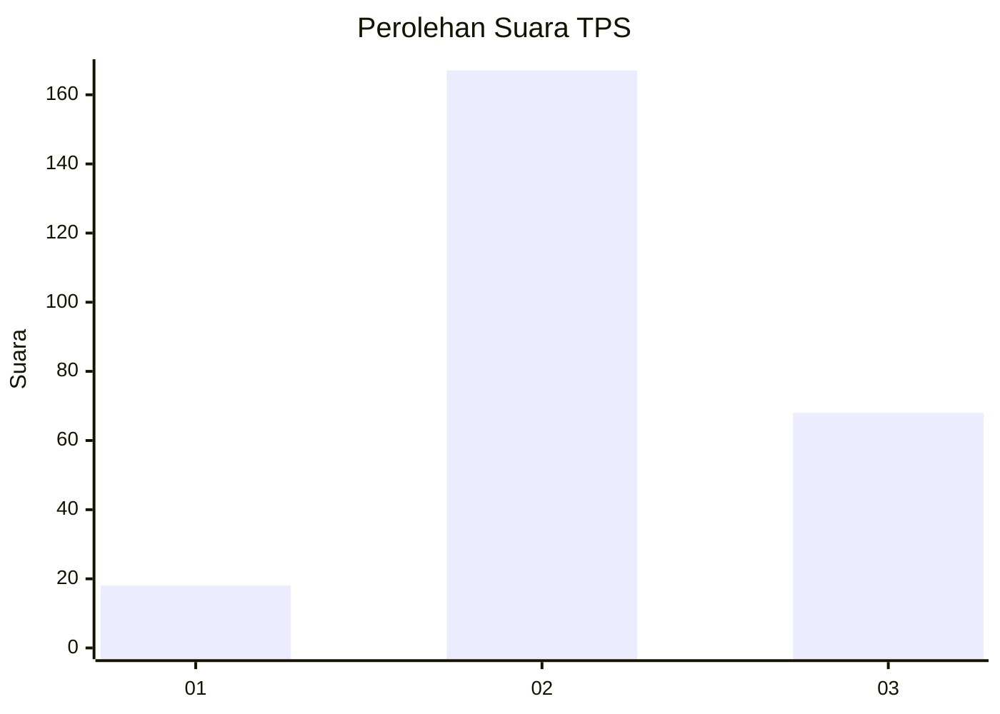

# Hasil

## Grafik

## Tabel

| No. | Nama Paslon    | Suara | Suara (raw) | Persentase |
|:--- |:-------------- | -----:| -----------:| ----------:|
| 1   | ANIES MUHAIMIN | 18    | [18][p-1]   | 7,11       |
| 2   | PRABOWO GIBRAN | 167   | [167][p-2]  | 66,01      |
| 3   | GANJAR MAHFUD  | 68    | [68][p-3]   | 26,88      |

[p-1]: https://github.com/gigit-pemilu/pemilu-2024/blob/main/pilpres/hitung-suara/sub/35-jawa-timur/sub/17-jombang/sub/11-sumobito/sub/2001-plosokerep/sub/004-tps/sub/paslon-1.txt
[p-2]: https://github.com/gigit-pemilu/pemilu-2024/blob/main/pilpres/hitung-suara/sub/35-jawa-timur/sub/17-jombang/sub/11-sumobito/sub/2001-plosokerep/sub/004-tps/sub/paslon-2.txt
[p-3]: https://github.com/gigit-pemilu/pemilu-2024/blob/main/pilpres/hitung-suara/sub/35-jawa-timur/sub/17-jombang/sub/11-sumobito/sub/2001-plosokerep/sub/004-tps/sub/paslon-3.txt

## Foto C Plano

https://sirekap-obj-formc.kpu.go.id/2257/pemilu/ppwp/35/17/11/20/01/3517112001004-20240218-055846--2400a519-e920-4a20-b987-bb016d6673ad.jpg

https://sirekap-obj-formc.kpu.go.id/2257/pemilu/ppwp/35/17/11/20/01/3517112001004-20240217-231940--770219f5-7451-4ede-b031-7597c5a0245b.jpg

https://sirekap-obj-formc.kpu.go.id/2257/pemilu/ppwp/35/17/11/20/01/3517112001004-20240217-232447--ff0106b1-e0c1-44ab-bdab-654b17d7b94b.jpg

## Metadata

| Key        | Value               |
| ---------- | ------------------- |
| Time Stamp | 2024-02-19 06:16:00 |

