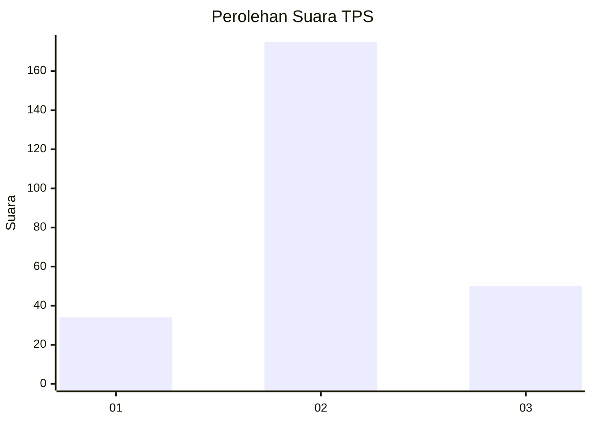
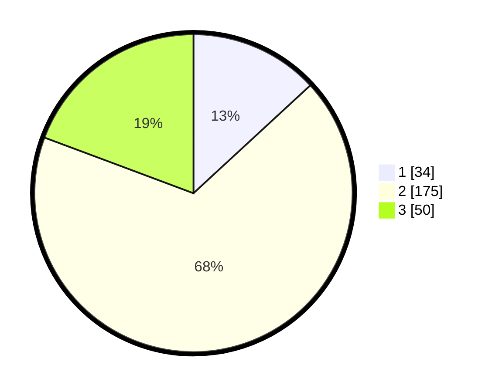

# Hasil

## Grafik

## Tabel

| No. | Nama Paslon    | Suara | Suara (raw) | Persentase |
|:--- |:-------------- | -----:| -----------:| ----------:|
| 1   | ANIES MUHAIMIN | 34    | [34][p-1]   | 13,13      |
| 2   | PRABOWO GIBRAN | 175   | [175][p-2]  | 67,57      |
| 3   | GANJAR MAHFUD  | 50    | [50][p-3]   | 19,31      |

[p-1]: https://github.com/gigit-pemilu/pemilu-2024-35-jawa-timur/blob/main/pilpres/hitung-suara/sub/35-jawa-timur/sub/17-jombang/sub/11-sumobito/sub/2007-nglele/sub/009-tps/sub/paslon-1.txt
[p-2]: https://github.com/gigit-pemilu/pemilu-2024-35-jawa-timur/blob/main/pilpres/hitung-suara/sub/35-jawa-timur/sub/17-jombang/sub/11-sumobito/sub/2007-nglele/sub/009-tps/sub/paslon-2.txt
[p-3]: https://github.com/gigit-pemilu/pemilu-2024-35-jawa-timur/blob/main/pilpres/hitung-suara/sub/35-jawa-timur/sub/17-jombang/sub/11-sumobito/sub/2007-nglele/sub/009-tps/sub/paslon-3.txt

## Foto C Plano

https://sirekap-obj-formc.kpu.go.id/fa32/pemilu/ppwp/35/17/11/20/07/3517112007009-20240214-224006--019bb755-6a04-403c-8517-fb5b6d97e36b.jpg

https://sirekap-obj-formc.kpu.go.id/fa32/pemilu/ppwp/35/17/11/20/07/3517112007009-20240214-225821--79eacc0d-b87e-4083-8be5-b5d7b4182a0a.jpg

https://sirekap-obj-formc.kpu.go.id/fa32/pemilu/ppwp/35/17/11/20/07/3517112007009-20240214-225950--437ed629-07fc-4754-aefc-b69f374c2862.jpg

## Metadata

| Key        | Value               |
| ---------- | ------------------- |
| Time Stamp | 2024-02-17 16:52:47 |

